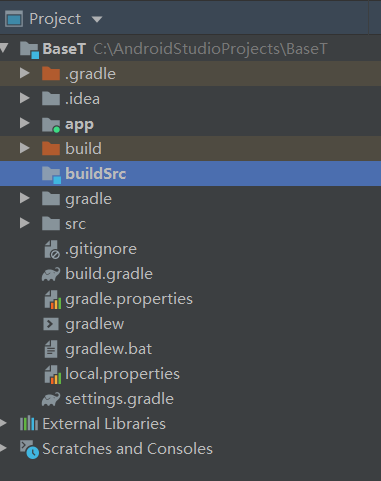
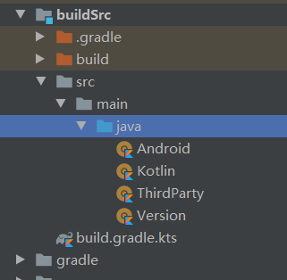

# buildSrc

buildSrc 是 Android 项目中一个比较特殊的 project，在 buildSrc 中可以编写 Groovy 语言，但是现在谷歌越来也推荐使用 Kotlin 来编写编译语句。
先在根路径下创建目录 buildSrc，结构如下：

`注意:这个工程的只能有一个，并且名字必须为 buildSrc`

创建好之后，在 buildSrc 中创建 build.gradle.kts 文件，并添加 Kotlin 插件。
    
    plugins {
        `kotlin-dsl`
    }
    
    repositories {
        mavenCentral()
        google()
        jcenter()
    }

接下来在 buildSrc 中创建 src/main/java 或者src/main/kotlin目录，gradle现在也支持kotlin

