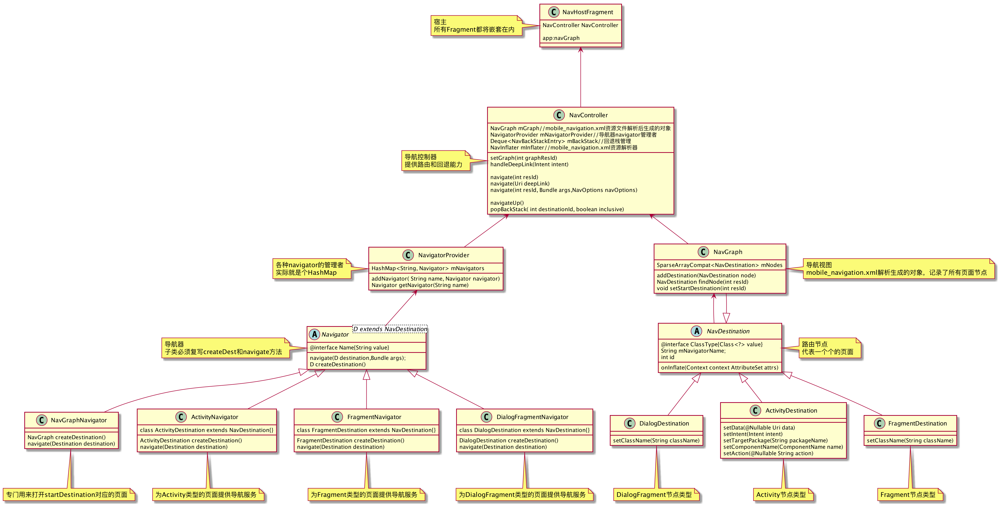

#Navigation 基本用法
添加依赖

    api 'androidx.navigation:navigation-fragment:2.2.1'
    api 'androidx.navigation:navigation-ui:2.2.1'

构建路由节点

    <navigation 
            android:id="@+id/mobile_navigation"
            app:startDestination="@id/navigation_home_fragment">
            //app:startDestination声明 首页第一个启动的页面
            //navigation标签是可以多级嵌套的，每个navigation标签都必须有app:startDestination属性
            //利用这一特性，其实可以做到小程序的概念
    
             //申明这个路由节点事fragment
            <fragment
                android:id="@+id/navigation_home_fragment"
                android:name="org.devio.as.hi.HomeFragment" >   
                  //给他指定两个action 分别是从homeFragment跳转到homeDialog以及homeActivity。
                  //每个action必须要指定id 和 destination两个属性
                  //另外也可以配置跳转的动画，参数...
                  <action
                     android:id="@+id/home_fragment_home_dialog"
                     app:destination="@id/secondFragment"
                     app:enterAnim="@anim/slide_in_right" />
                  <action
                      android:id="@+id/home_fragment_home_activity"
                      app:destination="@id/navigation_home_activity" />         
                  
                    //深度连接,别的页面或者浏览器可以使用www.mooc.com直接跳转到homeFragment
                   <deepLink   
                      android:id="@+id/deepLink"
                      app:uri="www.mooc.com" />
                      
                  </fragment>
             
             <dialog
                android:id="@+id/navigation_home_dialog"
                android:name="org.devio.as.hi.DialogFragment" />
        
             <Activity
                android:id="@+id/navigation_home_activity"
                android:name="org.devio.as.hi.HomeActivty" />
    </navigation>

​    
    //按照navigation的写法，MainActivity的布局需要如下编写
    //使用NavHostFragment承载内容区域的几个fragment的视图
    //并使用app:navGraph把路有资源文件关联起来
    //使用app:defaultNavHost关联实体返回键处理页面回退事件
    
    activity_main.xml
    .....
    <fragment
            android:id="@+id/nav_host_fragment"
            android:name="ndroidx.navigation.fragment.NavHostFragment"
            android:layout_width="match_parent"
            android:layout_height="match_parent"
            app:defaultNavHost="true"
            app:navGraph="@navigation/mobile_navigation" />
     ..... 

路由跳转

    NavController controller= NavHostFragment.findNavController()
    
    //navigate 路由到目标页，这个 id 可以写 action 的 id，也可以写目标页的 id；
    controller.navigate(@IdRes int resId, @Nullable Bundle args/*跳转参数*/, @Nullable NavOptions navOptions/*跳转动画*/)     

页面回退：

    controller.popBackStack(@IdRes int destinationId, boolean inclusive)

回退到上一页：

    navController.popBackStack()

deeplink 深度链接：

    //浏览器或者别的 APP 在拉起我们的 APP 时，如果 传递的Intent.data为某个页面的 deepLink，则会直接路由到该页面
    navController.handleDeepLink(Intent intent)

​    
##原理

