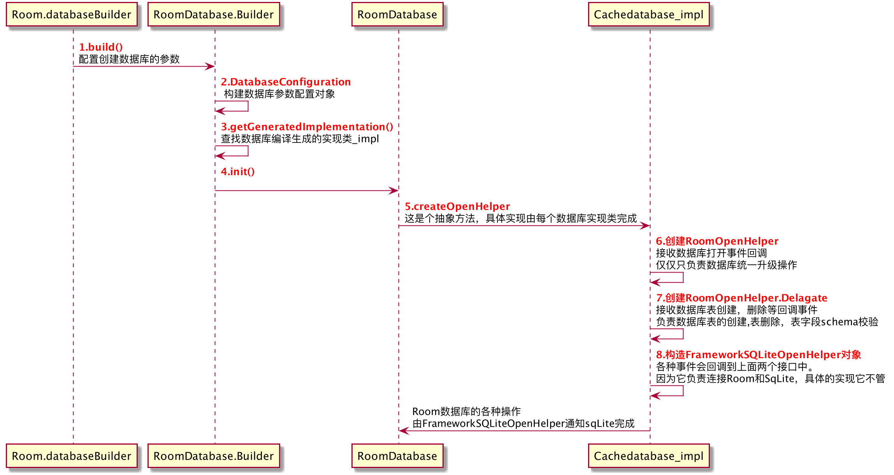

#Room数据库创建三部曲

**首先仍是添加依赖：**

	api "android.arch.persistence.room:runtime:2.2。0"
	kapt "android.arch.persistence.room:compiler:2.2.0" 

**创建 Room 数据库必备三大件**

- @Entity：表示数据库中的表；
- @DAO：数据操作对象；
- @Database数据库：必须是扩展 RoomDatabase 的抽象类。在注解中添加与数据库关联的数据表。包含使用
-  @Dao 注解标记的的类的抽象方法。

第一步，定义数据库的表

		//定义表非常简单，只需要创建一个class ,并标记上Entity注解,可以使用它的`tableName`属性声明该表的名称
	  @Entity(tableName = "table_cache")
	  class Cache {
	    //1.）对于一个表来说，他必须存在一个不为空的主键 也就是必须要标记PrimaryKey和NonNull两个注解
	    //PrimaryKey注解的`autoGenerate`属性意味该主键的值，是否由数据库自动生成
	    //由于我们这里是字符串的主键key，所以我们想要自己指定他得值，
	    //如果是Long,INT类型的主键key，可以选择由数据库自动生成
	    @PrimaryKey(autoGenerate = false) 
	    @NonNull
	    var key: String = ""
	    
	    //2.）该字段在数据库表中的列名称，不指定的默认就等于该字段的名字
	    @ColumnInfo(name="cache_data",defaultValue = "default value")
	    var data: String? = null
	    
	    //3.)如果不想让该字段映射成表的列，可以使用该注解标记
	    @Ignore
	    var timeStamp:Long?=null
	    
	    //4.) 如果想让内嵌对象中的字段也一同映射成 数据库表的字段，可以使用Embedded注解。此时User对象中所有字段也会一同出现在cache表中
	    //他又要求 User 对象必须也使用Entity注解标记，并且拥有一个不为空的主键才可以   
	    @Embedded
	    var user: User? = null
	    
	     //5.)对于一个Room数据库的表而言，还有很多其他注解和属性可以使用，诸如索引，外键，关系数据支持的特性room都支持。但对于客户端来说一般也用不到，以上这些就够用了。
	  }

第二步.定义数据库数据操作对象

	 @Dao    全称(data access object)
	  interface CacheDao {
	    //1.）如果是插入数据,只需要标记上Insert注解，并指明插入数据时如果已存在一条主键一样的数据，执行什么策略
	    //REPLACE: 直接替换老数据
	    //ABORT:终止操作，并回滚事务，也就是老数据不影响
	    //IGNORE:忽略冲突，但是会插入失败
	    @Insert(onConflict = OnConflictStrategy.REPLACE)
	    fun saveCache(cache: Cache): Long
	    
	    //2.)常规查询操作，此时还是需要你写sql语句的
	    @Query("select * from table_cache where `key`=:primaryKey")
	    fun getCache(primaryKey: String): Cache?  
	   
	     //3.) 高级查询操作，可以通过livedata 以观察者的形式获取数据库数据，可以避免不必要的npe
	         //更重要的是 他可以监听数据库表中的数据的比变化。一旦发生了 insert update delete。
	         //room会自动读取表中最新的数据，发送给UI层 刷新页面
	         //这一点是我们着重要关注的，看它背后有什么骚操作。
	    @Query("select * from table_cache")
	    fun query2(): LiveData<List<Cache>>  //rxjava observer 也是支持的
	
	   //4.）删除操作非常简单 ，也可以执行sql的删除数据
	    @Delete(entity = Cache::class)
	    fun deleteCache(key: String)
	
	    //5.) 更新操作，也非常简单，表中对应的这一行所有数据会被替换成Cache对象的字段值
	    @Update()
	     fun update(cache: Cache)
	  }

第三步. 定义数据库，并关联上表 和 数据操作实体

	// TypeConverters用以声明该数据库支持的类型转换，比如下面定义的DateConvert里面就定义Date类型的字段，存储数据库的时候会被转换成Long, 而该字段被读取的时候，会被转换成Date类型
	    @TypeConverters(DateConvert::class) 
	    @Database(entities = [Cache::class], version = 1)
	    abstract class CacheDatabase : RoomDatabase() {
	      //1）.创建内存数据库,也就是说这种数据库当中存储的数据，只会存留在内存当中，进程被杀死之后，数据随之丢失
	      
	       val database=  Room.inMemoryDatabaseBuilder(context,CacheDatabase::class.java).build()
	       //2）.创建本地持久化的数据库
	       val database =   Room.databaseBuilder(context, CacheDatabase::class.java, "howow_cache").
	                           //是否允许在主线程上操作数据库，默认false。
	                           //相比sqlite法无明文禁止即可为来说，Room给出了规范
	                          .allowMainThreadQueries()
	                          //数据库创建和打开的事件会回调到这里，可以再次操作数据库
	                          .addCallback(callback)
	                          //指定数据查询数据时候的线程池,
	                          .setQueryExecutor(cacheThreadPool)
	                          //它是用来创建supportsqliteopenhelper
	                          //可以利用它实现自定义的sqliteOpenHelper，来实现数据库的加密存储，默认是不加密的
	                         .openHelperFactory()
	                         //数据库升级 1---2
	                         .addMigrations(migration1_2)
	                         
	   //3）. 以抽象方法的形式声明数据操作对象Dao
	   kotlin  abstract val cacheDao: CacheDao
	      
	   //这里演示下数据库从version1->version2的升级过程
	   //注意，一旦数据库被创建，只要任意对象的任意字段有改动
	   //Database注解的version字段都需要升级，同时需要指定升级的行为migration。
	   val migration1_2 = object :Migration(1,2){
	            override fun migrate(database: SupportSQLiteDatabase) {
	                database.execSQL("alter table table_cache add column cache_time LONG")
	            }
	        }
	    }
	
	  class DateConvert {
	       //每个类可以拥有多个TypeConverter方法，但都必须要有返回值，可空
	       @TypeConverter
	       fun date2Long(date: Date): Long {
	             return date.time
	      }
	        @TypeConverter
	       fun long2Date(timestamp: Long): Date {
	             return Date(timestamp)
	       }
	   }

​	 
