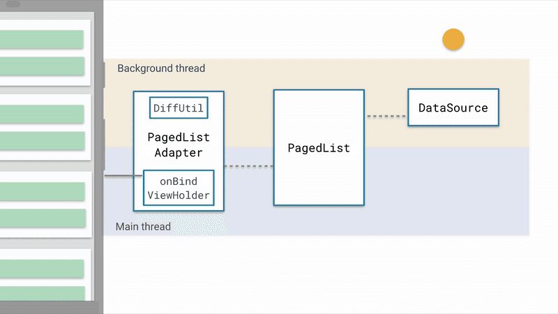

#####  Paging 架构组件

###### **Paging 工作原理图示**

**当从 DataSource 加载出页面数据数据—>把数据转交给 PagedList 准备刷新页面—> PagedListAdapter 数据差分异---->定向刷新列表 Item。**

**1.**DataSource 是数据源提供者，数据的改变会驱动列表的更新，因此数据源是很重要的。一共有 3 种

- DataSource 可选，取决于你的数据是以何种方式进行分页加载：
- ItemKeyedDataSource：基于 cursor 实现，数据容量可动态自增；
- PageKeyedDataSource：基于页码实现，数据容量可动态自增；
- PositionalDataSource：数据容量固定，基于index加载特定范围的数据。

**2.** PagedList 是核心类，它驱动Paging从数据源加载数据，同时负责页面初始化数据和分页数据在什么时候加载，以何种方式加载。

**3.** PagedListAdapter 是列表适配器，通过 DiffUtil 差分异定向更新列表数据。

#Paging 使用

**添加依赖：**

	api 'android.arch.paging:runtime:1.0.0'

**1. 构建PagedList.Config对象,用以声明以何种方式分页**

	PagedList.Config config = new PagedList.Config.Builder()
	                .setPageSize(10)指定每次分页加载的条目数量
	                .setInitialLoadSizeHint(12)指定初始化数据加载的条目数量
	                //.setPrefetchDistance(10)指定提前分页预加载的条目数量，默认和pageSize相等
	                //setMaxSize(100) 指定数据源最大可加载的条目数量
	                //setEnablePlaceholders(false)指定未加载出来的条目是否用占位符替代,必须和setMaxSize搭配使用才有效
	                .build();//最后构造出一个PagedList.Config对象,用以指定PagedList以何种方式分页

**2. 创建数据源工厂类,用来创建数据提供者**

	DataSource.Factory factory = new DataSource.Factory() {
	        @NonNull
	        @Override
	        public DataSource create() {
	           return new ItemKeyedDataSource();
	        }
	    };

**3. 构建一个能够触发加载页面初始化数据的LiveData对象**

	//把上面创建的DataSource.Factory和PagedList.Config 传递进去
	LiveData<PagedList<T>> pageData = new LivePagedListBuilder(factory, config)
	                .setInitialLoadKey(0)//设置初始化数据加载的key(任意类型)
	                //.setFetchExecutor()//指定使用哪个线程池进行异步工作
	                .setBoundaryCallback(callback)//指定pagedList的第一条、最后一条，被加载到列表之上的边界回调callback。
	                .build();//最后通过build方法 构建出LiveData对象。请注意它的 泛型是<PagedList<T>>

**4. 最后我们只需要拿到前面构建出来的 LiveData 对象注册一个 Observer 观察者,仅仅如此就可以触发页面初始化数据的加载了**

	mViewModel.getPageData().observe(this, pagedList -> submitList(pagedList));