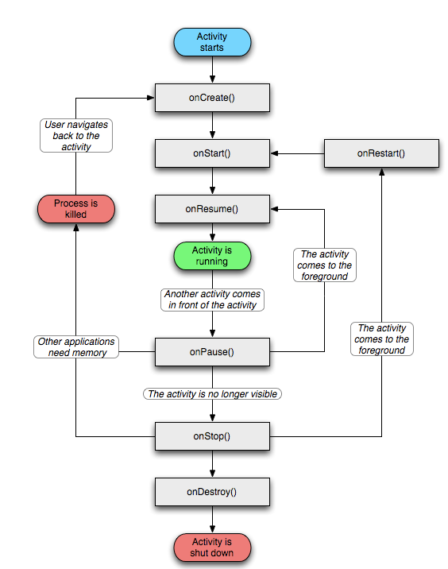
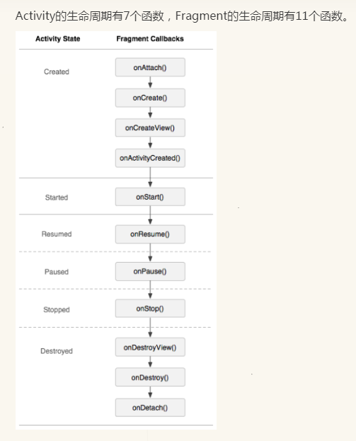

**Activity生命周期。**

> 锁屏：                    onPause()->onStop()
>
> 解锁：                    onStart()->onResume()
> 
> 启动Activity:             onCreate()—>onStart()—>onResume()，Activity进入运行状态。
>
> Activity退居后台:          onPause()—>onStop()
>
> Activity返回前台:          onRestart()—>onStart()—>onResume()，
>
> Activity退居后台内存不足：   onCreate()—>onStart()—>onResume()，Activity进入运行状态。

  

**Activity启动方式。**

> 使用android:launchMode="standard|singleInstance|singleTask|singleTop"

- **standard :** 标准模式,每次启动Activity都会创建一个新的Activity实例,并且将其压入任务栈栈顶,而不管这个Activity是否已经存在。Activity的启动三回调(onCreate()->onStart()->onResume())都会执行。

- **singleTop :** 栈顶复用模式.这种模式下,如果新Activity已经位于任务栈的栈顶,那么此Activity不会被重新创建,所以它的启动三回调就不会执行,同时Activity的onNewIntent()方法会被回调.如果Activity已经存在但是不在栈顶,那么作用与standard模式一样.

- **singleTask:** 栈内复用模式.创建这样的Activity的时候,系统会先确认它所需任务栈已经创建,否则先创建任务栈.然后放入Activity,如果栈中已经有一个Activity实例,那么这个Activity就会被调到栈顶,onNewIntent(),并且singleTask会清理在当前Activity上面的所有Activity.(clear top)

- **singleInstance :** 加强版的singleTask模式,这种模式的Activity只能单独位于一个任务栈内,由于栈内复用的特性,后续请求均不会创建新的Activity,除非这个独特的任务栈被系统销毁了	

  

> 任务栈是一种后进先出的结构。位于栈顶的Activity处于焦点状态,当按下back按钮的时候,栈内的Activity会一个一个的出栈,并且调用其onDestory()方法。如果栈内没有Activity,那么系统就会回收这个栈,每个APP默认只有一个栈,以APP的包名来命名.
> 
> Activity的堆栈管理以ActivityRecord为单位,所有的ActivityRecord都放在一个List里面.可以认为一个ActivityRecord就是一个Activity栈				

**Activity缓存方法。。**

     @Override
    protected void onCreate(Bundle savedInstanceState) {
    super.onCreate(savedInstanceState);
    setContentView(R.layout.activity_main);
    
    //这里，当Acivity第一次被创建的时候为空
    //所以我们需要判断一下
    if( savedInstanceState != null ){
    savedInstanceState.getString("anAnt");
    }
    }
    
    @Override
    protected void onSaveInstanceState(Bundle outState) {
    super.onSaveInstanceState(outState);
    
    outState.putString("anAnt","Android");
    
    }

######  一、onSaveInstanceState (Bundle outState).

> 
> 当某个activity变得“容易”被系统销毁时，该activity的onSaveInstanceState就会被执行，除非该activity是被用户主动销毁的，例如当用户按BACK键的时候。

> 1、当用户按下HOME键时。
> 
> 2、长按HOME键，选择运行其他的程序时。
> 
> 3、按下电源按键（关闭屏幕显示）时。
> 
> 4、从activity A中启动一个新的activity时。
> 
> 5、屏幕方向切换时，
> 
> 注意:
> 
> 1.布局中的每一个View默认实现了onSaveInstanceState()方法，这样的话，这个UI的任何改变都会自动地存储和在activity
> 重新创建的时候自动地恢复。但是这种情况只有在你为这个UI提供了唯一的ID之后才起作用，如果没有提供ID，app将不会存储它的状态。
> 
> 2.由于默认的onSaveInstanceState()方法的实现帮助UI存储它的状态，所以如果你需要覆盖这个方法去存储额外的状态信息，你应该在执行任
> 何代码之前都调用父类的onSaveInstanceState()方法（super.onSaveInstanceState()）。 既然有现成的可用，那么我们到底还要不要自
> 己实现onSaveInstanceState()?这得看情况了，如果你自己的派生类中有变量影响到UI，或你程序的行为，当然就要把这个变量也保存了，那么
> 就需要自己实现，否则就不需要。

###### 二、onRestoreInstanceState (Bundle outState)

> onRestoreInstanceState被调用的前提是，activity A“确实”被系统销毁了，而如果仅仅是停留在有这种可能性的情况下，
> 则该方法不会被调用，例如，当正在显示activity A的时候，用户按下HOME键回到主界面，然后用户紧接着又返回到activity A，
> 这种情况下activity A一般不会因为内存的原因被系统销毁，故activity A的onRestoreInstanceState方法不会被执行

    @Override
    public void onSaveInstanceState(Bundle savedInstanceState) {
        savedInstanceState.putBoolean("MyBoolean", true);
        savedInstanceState.putDouble("myDouble", 1.9);
        savedInstanceState.putInt("MyInt", 1);
        savedInstanceState.putString("MyString", "Welcome back to Android");
        // etc.
        super.onSaveInstanceState(savedInstanceState);
    }
    
    @Override
    public void onRestoreInstanceState(Bundle savedInstanceState) {
        super.onRestoreInstanceState(savedInstanceState);
        
        boolean myBoolean = savedInstanceState.getBoolean("MyBoolean");
        double myDouble = savedInstanceState.getDouble("myDouble");
        int myInt = savedInstanceState.getInt("MyInt");
        String myString = savedInstanceState.getString("MyString");
    }

**Activity和Fragment的生命周期**

