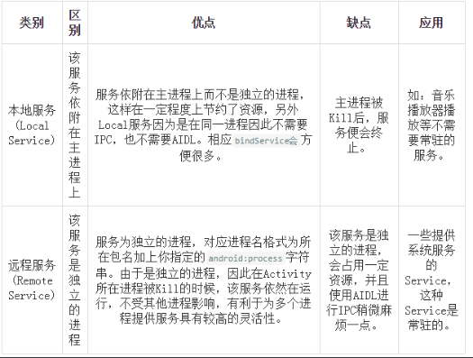
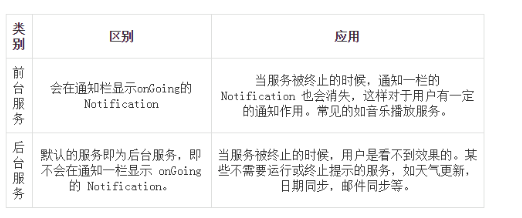
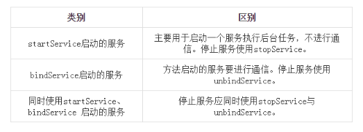
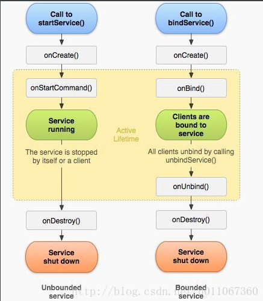

### 一、Service简介

Service是Android程序中四大基础组件之一，它和Activity一样都是Context的子类，只不过它没有UI界面，是在后台运行的组件。

Service是Android中实现程序后台运行的解决方案，它非常适用于去执行那些不需要和用户交互而且还要求长期运行的任务。Service默认并不会运行在子线程中，它也不运行在一个独立的进程中，它同样执行在UI线程中，因此，不要在Service中执行耗时的操作，除非你在Service中创建了子线程来完成耗时操作。

### 二、Service种类

**按运行地点分类：**  





**按运行类型分类：**  





**按使用方式分类：**  





### 三、Service生命周期




**OnCreate\(\)**  
系统在service第一次创建时执行此方法，来执行**只运行一次的**初始化工作。如果service已经运行，这个方法不会被调用。

**onStartCommand\(\)**  
每次客户端调用startService\(\)方法启动该Service都会回调该方法（**多次调用**）。一旦这个方法执行，service就启动并且在后台长期运行。通过调用stopSelf\(\)或stopService\(\)来停止服务。

**OnBind\(\)**  
当组件调用bindService\(\)想要绑定到service时\(比如想要执行进程间通讯\)系统调用此方法（**一次调用**，一旦绑定后，下次再调用bindService\(\)不会回调该方法）。在你的实现中，你必须提供一个返回一个IBinder来以使客户端能够使用它与service通讯，你必须总是实现这个方法，但是如果你不允许绑定，那么你应返回null。

**OnUnbind\(\)**  
当前组件调用unbindService\(\)，想要解除与service的绑定时系统调用此方法（**一次调用**，一旦解除绑定后，下次再调用unbindService\(\)会抛出异常）。

**OnDestory\(\)**  
系统在service不再被使用并要销毁时调用此方法（**一次调用**）。service应在此方法中释放资源，比如线程，已注册的侦听器，接收器等等．这是service收到的最后一个调用。

下面介绍三种不同情况下Service的生命周期情况。

#### 1.startService / stopService

生命周期顺序：onCreate-&gt;onStartCommand-&gt;onDestroy

如果一个Service被某个Activity 调用 Context.startService方法启动，那么不管是否有Activity使用bindService绑定或unbindService解除绑定到该Service，该Service都在后台运行，直到被调用stopService，或自身的stopSelf方法。当然如果系统资源不足，android系统也可能结束服务，还有一种方法可以关闭服务，在设置中，通过应用-&gt;找到自己应用-&gt;停止。

**注意点：**

①第一次 startService 会触发 onCreate 和 onStartCommand，以后在服务运行过程中，每次 startService 都只会触发 onStartCommand

②不论 startService 多少次，stopService 一次就会停止服务

#### 2.bindService / unbindService

生命周期顺序：onCreate-&gt;onBind-&gt;onUnBind-&gt;onDestroy

如果一个Service在某个Activity中被调用bindService方法启动，不论bindService被调用几次，Service的onCreate方法只会执行一次，同时onStartCommand方法始终不会调用。

当建立连接后，Service会一直运行，除非调用unbindService来接触绑定、断开连接或调用该Service的Context不存在了（如Activity被Finish——**即通过bindService启动的Service的生命周期依附于启动它的Context**），系统在这时会自动停止该Service。

**注意点：**

第一次 bindService 会触发 onCreate 和 onBind，以后在服务运行过程中，每次 bindService 都不会触发任何回调

#### 3.混合型（上面两种方式的交互）

当一个Service在被启动\(startService\)的同时又被绑定\(bindService\)，该Service将会一直在后台运行，并且不管调用几次，onCreate方法始终只会调用一次，onStartCommand的调用次数与startService调用的次数一致（使用bindService方法不会调用onStartCommand）。同时，**调用unBindService将不会停止Service，必须调用stopService或Service自身的stopSelf来停止服务。**

#### 在什么情况下使用 startService 或 bindService 或 同时使用startService 和 bindService？

①如果你只是想要启动一个后台服务长期进行某项任务那么使用 startService 便可以了。

②如果你想要与正在运行的 Service 取得联系，那么有两种方法，一种是使用 broadcast ，另外是使用 bindService ，前者的缺点是如果交流较为频繁，容易造成性能上的问题，并且 BroadcastReceiver 本身执行代码的时间是很短的（也许执行到一半，后面的代码便不会执行），而后者则没有这些问题，因此我们肯定选择使用 bindService（这个时候你便同时在使用 startService 和 bindService 了，这在 Activity 中更新 Service 的某些运行状态是相当有用的）。

③如果你的服务只是公开一个远程接口，供连接上的客服端（android 的 Service 是C/S架构）远程调用执行方法。这个时候你可以不让服务一开始就运行，而只用 bindService ，这样在第一次 bindService 的时候才会创建服务的实例运行它，这会节约很多系统资源，特别是如果你的服务是Remote Service，那么该效果会越明显（当然在 Service 创建的时候会花去一定时间，你应当注意到这点）。

### 四、Service的几种典型使用实例

#### 1.不可交互的后台服务

不可交互的后台服务即是普通的Service，通过startService\(\)方式开启。Service的生命周期很简单，分别为onCreate、onStartCommand、onDestroy这三个。

**创建服务类：**

```java
public class BackService extends Service {
    private Thread mThread;

    @Override
    public void onCreate() {
        super.onCreate();

    }

    @Nullable
    @Override
    public IBinder onBind(Intent intent) {
        System.out.println("onBind");
        return null;
    }

    @Override
    public int onStartCommand(Intent intent, int flags, int startId) {
        //执行耗时操作

        mThread = new Thread() {
            @Override
            public void run() {
                try {
                    while (true) {
                        //等待停止线程
                        if (this.isInterrupted()) {
                            throw new InterruptedException();
                        }
                        //耗时操作。
                        System.out.println("执行耗时操作");
                    }
                } catch (InterruptedException e) {
                    e.printStackTrace();
                }
            }
        };
        mThread.start();
        return super.onStartCommand(intent, flags, startId);
    }

    @Override
    public void onDestroy() {
        super.onDestroy();
        //停止线程
        mThread.interrupt();
    }
}
```

**配置服务：**

```java
<service android:name=".BackService">
</service>
```

如果想配置成远程服务，加如下代码：

```java
android:process="remote"
```

配置好Service类，只需要在前台，调用startService\(\)方法，就会启动耗时操作。

**注意：**

①不运行在一个独立的进程中，它同样执行在UI线程中，因此，在Service中创建了子线程来完成耗时操作。

②当Service关闭后，如果在onDestory\(\)方法中不关闭线程，你会发现我们的子线程进行的耗时操作是一直存在的，此时关闭该子线程的方法需要直接关闭该应用程序。因此，**在onDestory\(\)方法中要进行必要的清理工作。**

#### 2.可交互的后台服务

可交互的后台服务是指前台页面可以调用后台服务的方法，通过bindService\(\)方式开启。Service的生命周期很简单，分别为onCreate、onBind、onUnBind、onDestroy这四个。  
可交互的后台服务实现步骤是和不可交互的后台服务实现步骤是一样的，区别在于启动的方式和获得Service的代理对象。

**创建服务类**  
和普通Service不同在于这里返回一个代理对象，返回给前台进行获取，即前台可以获取该代理对象执行后台服务的方法

```java
public class BackService extends Service {

    @Override
    public void onCreate() {
        super.onCreate();

    }

    @Nullable
    @Override
    public IBinder onBind(Intent intent) {
        //返回MyBinder对象
        return new MyBinder();
    }
    //需要返回给前台的Binder类
    class MyBinder extends Binder {
        public void showTip(){
            System.out.println("我是来此服务的提示");
        }
    }
    @Override
    public void onDestroy() {
        super.onDestroy();

    }
}
```

**前台调用**  
通过以下方式绑定服务：

```java
bindService(mIntent,con,BIND_AUTO_CREATE);
```

其中第二个参数：

```java
private ServiceConnection con = new ServiceConnection() {
        @Override
        public void onServiceConnected(ComponentName name, IBinder service) {
            BackService.MyBinder myBinder = (BackService.MyBinder) service;
            myBinder.showTip();
        }

        @Override
        public void onServiceDisconnected(ComponentName name) {

        }
    };
```

当建立绑定后，onServiceConnected中的service便是Service类中onBind的返回值。如此便可以调用后台服务类的方法，实现交互。

当调用unbindService\(\)停止服务，同时要在onDestory\(\)方法中做好清理工作。

**注意：通过bindService启动的Service的生命周期依附于启动它的Context。因此当前台调用bindService的Context销毁后，那么服务会自动停止。**

#### 3.混合型后台服务

将上面两种启动方式结合起来就是混合性交互的后台服务了，即可以单独运行后台服务，也可以运行后台服务中提供的方法，其完整的生命周期是：onCreate-&gt;onStartCommand-&gt;onBind-&gt;onUnBind-&gt;onDestroy

#### 4.前台服务

所谓前台服务只不是通过一定的方式将服务所在的进程级别提升了。前台服务会一直有一个正在运行的图标在系统的状态栏显示，非常类似于通知的效果。

由于后台服务优先级相对比较低，当系统出现内存不足的情况下，它就有可能会被回收掉，所以前台服务就是来弥补这个缺点的，它可以一直保持运行状态而不被系统回收。

**创建服务类**

前台服务创建很简单，其实就在Service的基础上创建一个Notification，然后使用Service的startForeground\(\)方法即可启动为前台服务。

```java
public class ForeService extends Service{
    @Nullable
    @Override
    public IBinder onBind(Intent intent) {
        return null;
    }

    @Override
    public void onCreate() {
        super.onCreate();
        beginForeService();
    }

    private void beginForeService() {
        //创建通知
        Notification.Builder mBuilder = new Notification.Builder(this)
                .setSmallIcon(R.mipmap.ic_launcher)
                .setContentText("2017-2-27")
                .setContentText("您有一条未读短信...");
        //创建点跳转的Intent(这个跳转是跳转到通知详情页)
        Intent intent = new Intent(this,NotificationShow.class);
        //创建通知详情页的栈
        TaskStackBuilder stackBulider = TaskStackBuilder.create(this);
        //为其添加父栈 当从通知详情页回退时，将退到添加的父栈中
        stackBulider.addParentStack(NotificationShow.class);
        PendingIntent pendingIntent = stackBulider.getPendingIntent(0,PendingIntent.FLAG_UPDATE_CURRENT);
        //设置跳转Intent到通知中
        mBuilder.setContentIntent(pendingIntent);
        //获取通知服务
        NotificationManager nm = (NotificationManager) getSystemService(Context.NOTIFICATION_SERVICE);
        //构建通知
        Notification notification = mBuilder.build();
        //显示通知
        nm.notify(0,notification);
        //启动前台服务
        startForeground(0,notification);
    }
}
```

**启动前台服务**

```java
startService(new Intent(this, ForeService.class));
```

关于TaskStackBuilder 这一段，可能不是看的很明白，下面详细介绍。

##### TaskStackBuilder在Notification通知栏中的使用

首先是用一般的PendingIntent来进行跳转

```java
mBuilder = new NotificationCompat.Builder(this).setContent(view)
        .setSmallIcon(R.drawable.icon).setTicker("新资讯")
        .setWhen(System.currentTimeMillis())
        .setOngoing(false)
        .setAutoCancel(true);
Intent intent = new Intent(this, NotificationShow.class);
PendingIntent pendingIntent = PendingIntent.getActivity(this, 0, intent, PendingIntent.FLAG_UPDATE_CURRENT);
mBuilder.setContentIntent(pendingIntent);
```

这里是直接用PendingIntent来跳转到NotificationShow。

在运行效果上来看，首先发送了一条Notification到通知栏上，然后这时，退出程序，即MainActivity已经不存在了，回到home主菜单，看到Notification仍然存在，当然，我们还没有点击或者cancel它，现在去点击Notification，跳转到NotificationShow界面，然后我们按下Back键，发现直接回到home菜单了。现在大多数android应用都是在通知栏中如果有Notification通知的话，点击它，然后会直接跳转到对应的应用程序的某个界面，这时如果回退，即按下Back键，会返回到该应用程序的主界面，而不是系统的home菜单。所以用上面这种PendingIntent的做法达不到目的。这里我们使用TaskStackBuilder来做。

```java
mBuilder = new NotificationCompat.Builder(this)
        .setContent(view)
        .setSmallIcon(R.drawable.icon).setTicker("新资讯")
        .setWhen(System.currentTimeMillis())
        .setOngoing(false)
        .setAutoCancel(true);
Intent intent = new Intent(this, NotificationShow.class);
TaskStackBuilder stackBuilder = TaskStackBuilder.create(this);
stackBuilder.addParentStack(NotificationShow.class);
stackBuilder.addNextIntent(intent);
PendingIntent pendingIntent = stackBuilder.getPendingIntent(0, PendingIntent.FLAG_UPDATE_CURRENT);
//PendingIntent pendingIntent = PendingIntent.getActivity(this, 0, intent, PendingIntent.FLAG_UPDATE_CURRENT);
mBuilder.setContentIntent(pendingIntent);
```

显示用TaskStackBuilder.create\(this\)创建一个stackBuilder实例，接下来addParentStack\(\);

关于这个方法，我们查一下官方API文档：

> Add the activity parent chain as specified by the parentActivityName attribute of the activity \(or activity-alias\) element in the application's manifest to the task stack builder

这句话意思是：为跳转后的activity添加一个父activity，在activity中的manifest中添加parentActivityName即可。

那么我们就在manifest文件中添加这个属性

```java
<activity
    android:name="com.lvr.service.NotificationShow"  
    android:parentActivityName=".MainActivity" >
</activity>
```

这里我让它的parentActivity为MainActivity，也就是说在NotificationShow这个界面点击回退时，会跳转到MainActivity这个界面，而不是像上面一样直接回到了home菜单。

**注意：通过 stopForeground\(\)方法可以取消通知，即将前台服务降为后台服务。此时服务依然没有停止。通过stopService\(\)可以把前台服务停止。**

##### startService 和 bindService 特点
- 启动方式：Context.startService

- 启动方式：Context.bindService 

- 停止方式：Context.stopService 或者 Service.stopSelf

- 停止方式：Context.unbindService

- 多次启动只会多次执行 onStartCommand 方法，只要调用一次 stopService 服务就会销毁

- 多次启动 onBind  一般只执行一次（特殊情况可以多次执行），当所有绑定者都与service 解绑时，service 会自行销毁，其中单独某一个绑定者解绑，service 不会销毁

- 生命周期：onCreate --> onStartCommand --> onDestory

- 生命周期：onCreate --> onBind--> onUnbind--> onDestory

- 服务启动后执行单一的操作并且不会向调用者返回结果，无法通信

- 服务启动后允许组件与服务进行交互、发送请求、获取结果，甚至是利用进程间通信 (IPC) 跨进程执行这些操作

- 调用者退出后，Service 仍然存在

- 调用者退出后，Service（只有一个绑定者时） 随着调用者销毁

- 启动一次服务，多次调用 stopService 只有第一次有效，不会抛出异常

- 启动一次服务，多次调用 unbindService 会抛出异常（IllegalArgumentException：Service not registered）
注意：
>不论哪种方式启动服务，onCreate 只会执行一次，只有当服务销毁（onDestory）后再次启动服务时，又会重新调用 onCreate

>Service与Activity一样都存在于当前进程的主线程，所以，一些阻塞UI的操作，比如耗时操作不能放在service里进行

>bindService 启动服务，绑定者在销毁（onDestory）前需要先解绑，
否则出 *** has leaked ServiceConnection 等错误日志，
意思就是服务连接泄露（因为在关闭Acitivity的时候没有释放链接），
这个错误就好像我们启动了一个对话框，此时我们没有关闭对话框，
如果直接关闭了启动对话框的Activity，也会出现类似的错误，
这个时候我们只需要在Acitivity销毁时释放链接就可以了

    @Override  
    protected void onDestroy() {     
        super.onDestroy();      
        unbindService(connection);  
    }

>同一个绑定者多次绑定服务，解绑一次（unbindService ）即可完成解绑，解绑后在未重新绑定时再次调用 unbindService 会抛出异常。

>bindService 方式启动服务，如果服务 onBind 方法返回 NULL , ServiceConnection.onServiceConnected 方法不会执行。

**分类**
启动本地服务用的是显式启动； 

    //java代码直接指明启动的service：
    Intent intent = new Intent(this, TestService.class);
    startService(intent);
    
    //AndroidManifest代码不需要特殊配置：
    <service
                android:name="com.example.testservices.TestService"
                android:enabled="true"
                android:exported="true">
            </service>
远程服务的启动要用到隐式启动。

        //component代码需要添加包名和service名：
     Intent intent = new Intent();
                ComponentName componentName = new ComponentName(getPackageName(), "com.example.testservices.TestService");
                intent.setComponent(componentName);
                startService(intent)


​                
        //对应的manifes代码，需要添加action：
       <service
                  android:name="com.example.testservices.TestService"
                  android:enabled="true"
                  android:exported="true">
       
                  <intent-filter>
                      <action android:name="xixixi.buder" />
                  </intent-filter>
       
              </service>

**IntentService 介绍**
>IntentService 是 Service 的一个子类，它可以自己处理异步请求，
>在它内部有一个工作线程来处理耗时请求，可以启动 IntentService 多次，
>每个耗时操作会以队列的方式在 onHandlerIntent 方法中回调处理，
>每次只会执行一个工作线程，全部处理完，IntentService 会自动结束，不需要开发者去结束。

- IntentService 的工作线程不在主线程，每次 IntentService 结束后再 startService 都会开启一个与上次不同的线程去处理请求。

- onHandleIntent 中任务结束后就会执行 onDestory，不需要手动调用 stopService，所以 IntentService 是任务结束就自动销毁。

- 如果第一次启动后，onHandleIntent 没处理完，继续 startService，不会再重新实例化这个 Service 实例，而是将请求放到请求队列里，等待第一个处理完再处理第二个。

**前台运行服务**

    Notification notification = new Notification(R.drawable.icon, getText(R.string.ticker_text),
            System.currentTimeMillis());
    Intent notificationIntent = new Intent(this, ExampleActivity.class);
    PendingIntent pendingIntent = PendingIntent.getActivity(this, 0, notificationIntent, 0);
    notification.setLatestEventInfo(this, getText(R.string.notification_title),
            getText(R.string.notification_message), pendingIntent);
    startForeground(ONGOING_NOTIFICATION_ID, notification);
    //指示是否也删除状态栏通知。 此方法绝对不会停止服务。 但是，如果您在服务正在前台运行时将其停止，则通知也会被删除。
    stopForeground()

