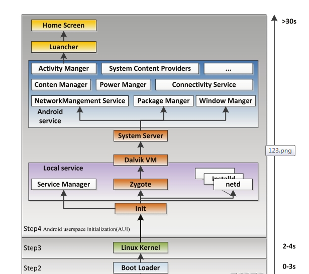

启动前几步
我们首先需要了解系统启动流程的前几步。

**1.** 电源及系统的启动

当电源按下时，引导芯片代码开始从预定义的地方（固化在ROM）开始执行。加载引导程序Bootloader到RAM，然后执行。

**2.** 引导程序Bootloader

引导程序是Android系统开始运行前的一个小程序，它可以把系统OS拉起并运行。

**3.** Linux内核启动

内核启动时，会通过设置缓存、被保护存储器、计划列表，加载驱动等等过程。当内核完成系统设置，它首先在系统文件中寻找”init”文件，然后启动root进程或者系统的第一个进程。

**4.** 启动init进程

第四步就是开始启动我们此处讲到的init进程了。

init入口函数
init进程的入口函数为main函数，使用C++编写。位于system/core/init/init.cpp

