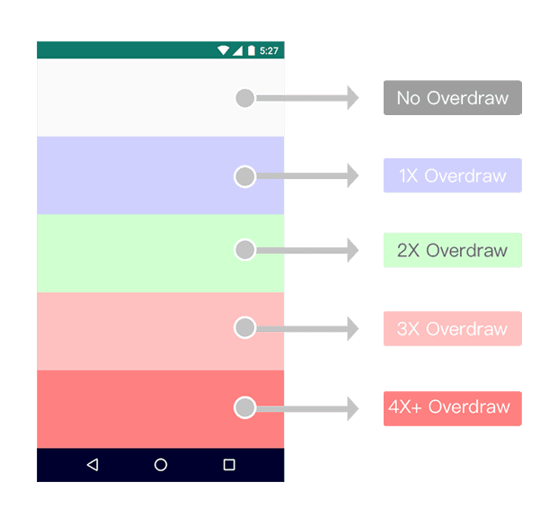
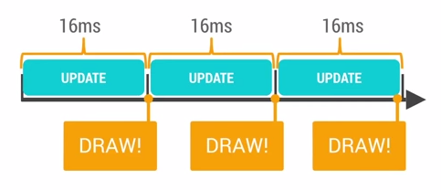
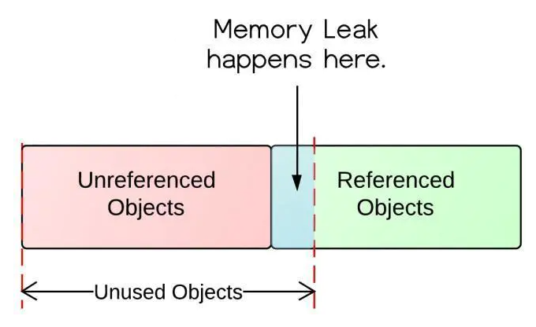
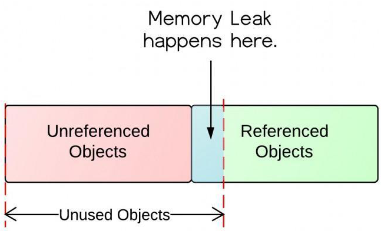
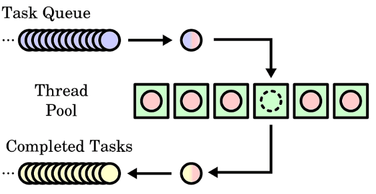

## 一、Android性能优化的方面

针对Android的性能优化，主要有以下几个有效的优化方法：

1.布局优化

2.绘制优化

3.内存泄漏优化

4.响应速度优化

5.ListView/RecycleView及Bitmap优化

6.线程优化

7.其他性能优化的建议

下面我们具体来介绍关于以上这几个方面优化的具体思路及解决方案。

## 二、布局优化

关于布局优化的思想很简单，就是**尽量减少布局文件的层级**。这个道理很浅显，布局中的层级少了，就意味着Android绘制时的工作量少了，那么程序的性能自然就提高了。

### 如何进行布局优化？

**①删除布局中无用的控件和层次，其次有选择地使用性能比较低的ViewGroup。**

关于有选择地使用性能比较低的ViewGroup,这就需要我们开发就实际灵活选择了。

例如：如果布局中既可以使用LinearLayout也可以使用RelativeLayout，那么就采用LinearLayout，这是因为RelativeLayout的功能比较复杂，它的布局过程需要花费更多的CPU时间。FrameLayout和LinearLayout一样都是一种简单高效的ViewGroup，因此可以考虑使用它们，但是**很多时候单纯通过一个LinearLayout或者FrameLayout无法实现产品效果，需要通过嵌套的方式来完成。这种情况下还是建议采用RelativeLayout,因为ViewGroup的嵌套就相当于增加了布局的层级，同样会降低程序的性能。**

**②采用<include>标签,<merge>标签,ViewStub。**

<include>标签主要用于布局重用。

<merge>标签一般和<include>配合使用，可以降低减少布局的层级。

ViewStub提供了按需加载的功能，当需要时才会将ViewStub中的布局加载到内存，提高了程序初始化效率。

**③避免多度绘制**

过度绘制（Overdraw）描述的是屏幕上的某个像素在同一帧的时间内被绘制了多次。在多层次重叠的 UI 结构里面，如果不可见的 UI 也在做绘制的操作，会导致某些像素区域被绘制了多次，同时也会浪费大量的 CPU 以及 GPU 资源。

如下所示，有些部分在布局时，会被重复绘制。

关于过度绘制产生的一般场景及解决方案，参考：[Android 过度绘制优化](http://jaeger.itscoder.com/android/2016/09/29/android-performance-overdraw.html)

## 三、绘制优化

绘制优化是指**View的onDraw方法要避免执行大量的操作，**这主要体现在两个方面：

**①onDraw中不要创建新的局部对象。**

因为onDraw方法可能会被频繁调用，这样就会在一瞬间产生大量的临时对象，这不仅占用了过多的内存而且还会导致系统更加频繁gc，降低了程序的执行效率。

**②onDraw方法中不要做耗时的任务，也不能执行成千上万次的循环操作，尽管每次循环都很轻量级，但是大量的循环仍然十分抢占CPU的时间片，这会造成View的绘制过程不流畅。**

按照Google官方给出的性能优化典范中的标准，View的绘制频率保证60fps是最佳的，这就要求每帧绘制时间不超过16ms(16ms = 1000/60)，虽然程序很难保证16ms这个时间，但是尽量降低onDraw方法中的复杂度总是切实有效的。

## 四、内存泄漏优化

内存泄漏是开发过程中的一个需要重视的问题，但是由于内存泄露问题对开发人员的经验和开发意识有较高的要求，因此也是开发人员最容易犯的错误之一。

内存泄露的优化分为两个方面：

**①在开发过程中避免写出有内存泄漏的代码**

**②通过一些分析工具比如MAT来找出潜在的内存泄露，然后解决。**

对应于两种不同情况，一个是了解内存泄漏的可能场景以及如何规避，二是怎么查找内存泄漏。

### 1.那么我们就先了解什么是内存泄漏?这样我们才能知道如何避免。

大家都知道，java是有垃圾回收机制的，这使得java程序员比C++程序员轻松了许多，存储申请了，不用心心念念要加一句释放，java虚拟机会派出一些回收线程兢兢业业不定时地回收那些不再被需要的内存空间（注意回收的不是对象本身，而是对象占据的内存空间）。

**Q1：什么叫不再被需要的内存空间？**

**答：**Java没有指针，全凭引用来和对象进行关联，通过引用来操作对象。如果一个对象没有与任何引用关联，那么这个对象也就不太可能被使用到了，回收器便是把这些“无任何引用的对象”作为目标，回收了它们占据的内存空间。

**Q2：如何分辨为对象无引用？**

**答：**2种方法

**引用计数法**直接计数，简单高效，Python便是采用该方法。但是如果出现 两个对象相互引用，即使它们都无法被外界访问到，计数器不为0它们也始终不会被回收。为了解决该问题，java采用的是b方法。

**可达性分析法**这个方法设置了一系列的“GC Roots”对象作为索引起点，如果一个对象 与起点对象之间均无可达路径，那么这个不可达的对象就会成为回收对象。这种方法处理 两个对象相互引用的问题，如果两个对象均没有外部引用，会被判断为不可达对象进而被回收（如下图）。

**Q3：有了回收机制，放心大胆用不会有内存泄漏？**

**答：**答案当然是No！

虽然垃圾回收器会帮我们干掉大部分无用的内存空间，但是对于还保持着引用，但逻辑上已经不会再用到的对象，垃圾回收器不会回收它们。这些对象积累在内存中，直到程序结束，就是我们所说的“内存泄漏”。
当然了，用户对单次的内存泄漏并没有什么感知，但当泄漏积累到内存都被消耗完，就会导致卡顿，崩溃。

下面这张图可以帮助我们更好地理解对象的状态，以及内存泄漏的情况

左边未引用的对象是会被GC回收的，右边被引用的对象不会被GC回收，但是未使用的对象中除了未引用的对象，还包括已被引用的一部分对象，那么内存泄漏久发生这部分已被引用但未使用的对象。

### 2.Android一般在什么情况下会出现内存泄漏？

①集合类泄漏
②单例/静态变量造成的内存泄漏
③匿名内部类/非静态内部类
④资源未关闭造成的内存泄漏

大概可以分为以上几类，还有一些经常会听到的Hanlder,AsyncTask引起内存泄漏，都属于上述③中的情况。

那么上述四种情况是怎么造成的内存泄漏，具体是什么原因，以及Android中一些知名的引起内存泄漏的原因，以及解决方法是怎么样的？

### 3.Android怎么分析内存泄漏？

上面介绍了内存泄漏的场景，对应的有一些解决方案。

那么在内存泄漏已经发生的情况下，我们该如何解决呢？

我们可以通过MAT(Memory Analyzer Tool)，或者 LeakCanary来检测Android中的内存泄漏。

## 五、响应速度优化

响应速度优化的核心思想就是**避免在主线程中做耗时操作**。

如果有耗时操作，可以开启子线程执行，即采用异步的方式来执行耗时操作。

如果在主线程中做太多事情，会导致Activity启动时出现黑屏现象，甚至ANR。

**Android规定，Activity如果5秒钟之内无法响应屏幕触摸事件或者键盘输入事件就会出现ANR，而BroadcastReceiver如果10秒钟之内还未执行完操作也会出现ANR。**

为了避免ANR，可以开启子线程执行耗时操作，但是子线程不能更新UI，所以需要子线程与主线程进行通信来解决子线程执行耗时任务后，通知主线程更新UI的场景。关于这部分，需要掌握Handler消息机制，AsyncTask，IntentService等内容。

然而，在实际开发中，ANR仍然不可避免的发生了，而且很难从代码上发现，这时候就要用到ANR日志分析。当一个进程发生了ANR之后，系统会在/data/anr目录下创建一个文件traces.txt，通过分析这个文件就能定位出ANR的原因。

## 六、ListView/RecycleView及Bitmap优化

**ListView/RecycleView的优化思想主要从以下几个方面入手：**

①使用ViewHolder模式来提高效率

②异步加载：耗时的操作放在异步线程中

③ListView/RecycleView的滑动时停止加载和分页加载

具体优化建议及详情，参考：[ListView的优化](http://www.jianshu.com/p/f0408a0f0610)

**Bitmap优化**

主要是对加载图片进行压缩，避免加载图片多大导致OOM出现。

## 七、线程优化

线程优化的思想就是**采用线程池，避免程序中存在大量的Thread。**线程池可以重用内部的线程，从而避免了线程的创建和销毁锁带来的性能开销，同时线程池还能有效地控制线程池的最大并法术，避免大量的线程因互相抢占系统资源从而导致阻塞现象的发生。因此在实际开发中，尽量采用线程池，而不是每次都要创建一个Thread对象。

## 八、其他性能优化建议

①避免过度的创建对象

②不要过度使用枚举，枚举占用的内存空间要比整型大

③常量请使用static final来修饰

④使用一些Android特有的数据结构，比如SparseArray和Pair等

⑤适当采用软引用和弱引用

⑥采用内存缓存和磁盘缓存

⑦尽量采用静态内部类，这样可以避免潜在的由于内部类而导致的内存泄漏。

以上是关于Android性能优化方面，我们一些入手点。从这些方面，我们可以在平时的开发中注意，避免类似错误，提高Android程序的性能，但是其中一些方面的要求则需要我们不断的学习，以及平时良好的意识与习惯。由于自己开发经验几乎为0，没办法根据实际经验来说明，只能写下这篇文章来提醒自己以后开发的时候需要注意和培养的地方。
