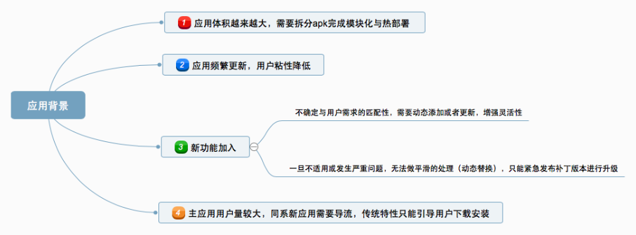
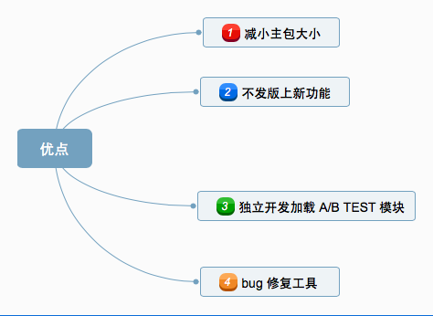
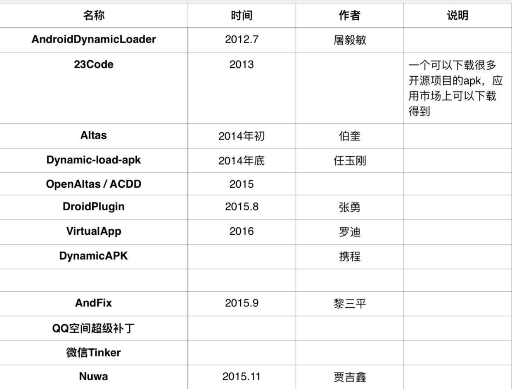

## 一、Android插件化介绍

### 1.含义

所谓插件化，就是让我们的应用**不必再像原来一样把所有的内容都放在一个apk中**，可以把一些功能和逻辑单独抽出来放在插件apk中，然后主apk做到［按需调用］，这样的好处是一来可以减少主apk的体积，让应用更轻便，二来可以做到热插拔，更加动态化。

### 2.背景

### 3.优点

## 二、Android插件化基础

### 1.插件化的特点

1) 应用在运行的时候通过加载一些本地不存在的可执行文件实现一些特定的功能;

2) 这些可执行文件是可以替换的;

3) 更换静态资源（比如换启动图、换主题、或者用服务器参数开关控制广告的隐藏现实等）不属于动态加载;

4) Android中动态加载的核心思想是动态调用外部的 dex文件，极端的情况下，Android APK自身带有的Dex文件只是一个程序的入口（或者说空壳），所有的功能都通过从服务器下载最新的Dex文件完成;

### 2.需要解决的问题

#### 代码加载

类的加载可以使用Java的ClassLoader机制，但是对于Android来说，并不是说类加载进来就可以用了，很多组件都是有“生命”的；因此对于这些有血有肉的类，必须给它们注入活力，也就是所谓的组件生命周期管理；

#### 资源加载

资源加载方案大家使用的原理都差不多，都是用AssetManager的隐藏方法addAssetPath。

### 3.插件化必备基础

#### ①ClassLoader类加载器

要想实现加载外部dex文件（即插件）来实现热部署，那么必然要把其中的class文件加载到内存中。

其中涉及到两种ClassLoader:DexClassLoader和PathClassLoader。而DexClassLoader可以加载外部的jar,dex等文件，正是我们需要的。

关于ClassLoader详解，见[ClassLoader完全解析](http://blog.csdn.net/u012124438/article/details/53235848)。

#### ②Java反射

因为插件apk与宿主apk不在一个apk内，那么一些类的访问必然要通过反射进行获取。所以了解反射对插件化的学习是必须的。

关于Java反射，见[Java反射详解](http://www.jianshu.com/p/779b3e27b26d)。

#### ③插件资源访问

res里的每一个资源都会在R.java里生成一个对应的Integer类型的id，APP启动时会先把R.java注册到当前的上下文环境，我们在代码里以R文件的方式使用资源时正是通过使用这些id访问res资源，然而插件的R.java并没有注册到当前的上下文环境，所以插件的res资源也就无法通过id使用了。

查看源码，通过“addAssetPath”方法重新生成一个新的Resource对象来保存插件中的资源，避免冲突。

关于插件资源访问，见[使用插件中的R资源](http://blog.csdn.net/u012124438/article/details/53236723)。

#### ④代理模式

插件化实现的过程主要靠欺上瞒下，坑蒙拐骗来实现。想想虽然加载进来了Activity等组件，但也仅仅是最为一个对象而存在，并没有在AndroidManifest中注册，没有生命周期的回调，并不能实现我们想要的效果。因此无论是dynamic_load_apk通过代理activity来操控插件activity的方式，还是DroidPlugin通过hook activity启动过程来启动插件activity的方式，都是对代理模式的应用。

关于代理模式，见[静态代理与动态代理](http://www.jianshu.com/p/27b255a6f479)。

至此，通过ClassLoader加载，然后通过代理模式让Activity等组件具有生命周期实现真正的功能，并且解决了资源访问问题。可能插件化已经可以简单的实现一些初步的功能，然而插件化绝不止于此。更多的内容仍需要进一步探索，不过以上知识是基础中的基础，必备之必备。

## 三、Android插件化开源项目

介绍一下其中比较重要的两个，实现思想不同，也是入门插件化可以学习的两个。

#### Dynamic-load-apk

Dynamic-Load-Apk简称DL，这个开源框架作者是任玉刚，他的实现方式是，在宿主中埋一个代理Activity，更改ClassLoader后找到加载插件中的Activity，使用宿主中的Activity作为代理，回调给插件中Activity所以对应的生命周期。这个思路与AndroidDynamicLoader有点像，都是做一个代理，只不过Dynamic-load-apk加载的插件中的Activity。
项目地址：<https://github.com/singwhatiwanna/dynamic-load-apk>

#### DroidPlugin

DroidPlugin是张勇实现的一套插件化方案，它的原理是Hook客户端一侧的系统Api。
项目地址：<https://github.com/DroidPluginTeam/DroidPlugin>

既然着重介绍了两个项目，必然要学起来，怎么学习呢？

好在已经有前人把自己的学习经验分享出来，那么我们只需要结合源码进行学习即可。

## 四、Dynamic-load-apk详解

[Android插件化学习之路（一）之动态加载综述](http://blog.csdn.net/u012124438/article/details/53234223)

[Android插件化学习之路（二）之ClassLoader完全解析](http://blog.csdn.net/u012124438/article/details/53235848)

[Android插件化学习之路（三）之调用外部.dex文件中的代码](http://blog.csdn.net/u012124438/article/details/53236472)

[Android插件化学习之路（四）之使用插件中的R资源](http://blog.csdn.net/u012124438/article/details/53236723)

[Android插件化学习之路（五）之代理Activity](http://blog.csdn.net/u012124438/article/details/53239370)

[Android插件化学习之路（六）之动态创建Activity](http://blog.csdn.net/u012124438/article/details/53239497)

[Android插件化学习之路（七）之DL插件开发该注意的坑](http://blog.csdn.net/u012124438/article/details/53240585)

[Android插件化学习之路（八）之DynamicLoadApk 源码解析（上）](http://blog.csdn.net/u012124438/article/details/53241755)

 [Android插件化学习之路（九）之DynamicLoadApk 源码解析（下）](http://blog.csdn.net/u012124438/article/details/53242838)

## 五、DroidPlugin详解

[Hook机制之动态代理](http://weishu.me/2016/01/28/understand-plugin-framework-proxy-hook/)

[Hook机制之Binder Hook](http://weishu.me/2016/02/16/understand-plugin-framework-binder-hook/)

[Hook机制之AMS&PMS](http://weishu.me/2016/03/07/understand-plugin-framework-ams-pms-hook/)

[Activity生命周期管理](http://weishu.me/2016/03/21/understand-plugin-framework-activity-management/)

[插件加载机制](http://weishu.me/2016/04/05/understand-plugin-framework-classloader/)

[广播的管理](http://weishu.me/2016/04/12/understand-plugin-framework-receiver/)

[Service的插件化](http://weishu.me/2016/05/11/understand-plugin-framework-service/)

[ContentProvider的插件化](http://weishu.me/2016/07/12/understand-plugin-framework-content-provider/)
