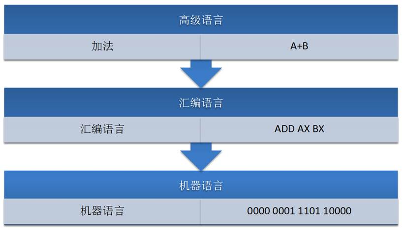
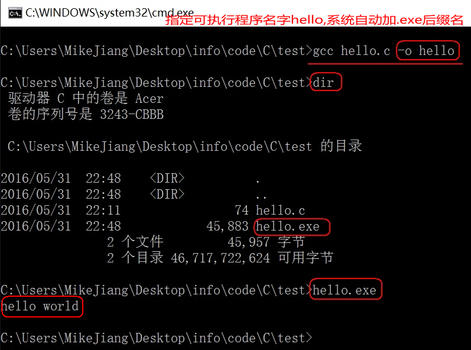

### 1.  C语言概述

#### 1.1 什么是C语言

 

一提到语言这个词语，自然会想到的是像英语、汉语等这样的自然语言，因为它是人和人交换信息不可缺少的工具。

而今天计算机遍布了我们生活的每一个角落，除了人和人的相互交流之外，我们必须和计算机角落。

用什么的什么样的方式和计算机做最直接的交流呢？人们自然想到的是最古老也最方便的方式——语言，而C语言就是人和计算机交流的一种语言。

语言是用来交流沟通的。有一方说，有另一方听，必须有两方参与，这是语言最重要的功能：

- 说的一方传递信息，听的一方接收信息；

- 说的一方下达指令，听的一方遵循命令做事情。


语言是人和人交流，C语言是人和机器交流。只是，人可以不听另外一个人，但是，计算机是无条件服从。

语言有独特的语法规则和定义，双方必须遵循这些规则和定义才能实现真正的交流。

 

#### 1.2 计算机介绍

##### 1.2.1 计算机结构组成


##### 1.2.2 计算机系统组成


##### 1.2.3 程序和指令

- 指令是对计算机进行程序控制的最小单位。
- 所有的指令的集合称为计算机的指令系统。
- 程序是为完成一项特定任务而用某种语言编写的一组指令序列。

 


 

#### 1.3 语言发展历程

##### 1.3.1 机器语言

计算机的大脑或者说心脏就是CPU，它控制着整个计算机的运作。每种CPU，都有自己的指令系统。这个指令系统，就是该CPU的机器语言。

 

机器语言是一组由0和1系列组成的指令码，这些指令码，是CPU制作厂商规定出来的，然后发布出来，请程序员遵守。

 

要让计算机干活，就得用机器语言(二级制数)去命令它。这样的命令，不是一条两条，而是上百条。而且不同型号的计算机其机器语言是不相通的，按着一种计算机的机器指令编制的程序，不能在另一种计算机上执行。

 

##### 1.3.2 汇编语言和编译器

机器语言编程是不是很令人烦恼呢，终于出现了汇编语言，就是一些标识符取代0与1。一门人类可以比较轻松认识的编程语言。

 

只是这门语言计算机并不认识，所以人类还不能用这门语言命令计算机做事情。这正如如何才能让中国人说的话美国人明白呢？——翻译！

 

所以，有一类专门的程序，既认识机器语言，又认识汇编语言，也就是编译器，将标识符换成0与1，知道怎么把汇编语言翻译成机器语言。

 

##### 1.3.3 高级语言

汇编语言和机器语言都是面向机器的，机器不同，语言也不同。既然有办法让汇编语言翻译成机器语言，难道就不能把其他更人性化的语言翻译成机器语言？

 

1954年，Fortran语言出现了，其后相继出现了其他的类似语言。这批语言，使程序员摆脱了计算机硬件的限制，把主要精力放在了程序设计上，不在关注低层的计算机硬件。这类语言，称为高级语言。

 

同样的，高级语言要被计算机执行，也需要一个翻译程序将其翻译成机器语言，这就是编译程序，简称编译器。

这类高级语言解决问题的方法是分析出解决问题所需要的步骤，把程序看作是数据被加工的过程。基于这类方法的程序设计语言成为面向过程的语言。C语言就是这种面向过程的程序设计语言。

 

##### 1.3.4 语言的层次



 

##### 1.3.5 语言进化史


 

#### 1.4 为什么要学习C语言

##### 1.4.1 C语言特点

######  1) 优点

-  代码量小
-  执行速度快
-  功能强大
-  编程自由

 

######  2) 缺点

-  写代码实现周期长
-  可移植性较差
-  过于自由，经验不足易出错
-  对平台库依赖较多

 

##### 1.4.2 学习C语言理由


##### 1.4.3 C语言应用领域

C语言的应用极其广泛，从网站后台，到底层操作系统，从多媒体应用到大型网络游戏，均可使用C语言来开发：

- C语言可以写网站后台程序
- C语言可以专门针对某个主题写出功能强大的程序库
- C语言可以写出大型游戏的引擎
- C语言可以写出另一个语言来
- C语言可以写操作系统和驱动程序，并且只能用C语言编写
- 任何设备只要配置了微处理器，就都支持C语言。从微波炉到手机，都是由C语言技术来推动的


##### 1.4.4 C语言的简洁

C语言仅有32个关键字，9种控制语句，34种运算符，却能完成无数的功能：


 


 


 

##### 1.4.5 学习C语言的常见困惑


 

#### 1.5 第一个C语言程序：HelloWorld

##### 1.5.1 编写C语言代码：hello.c


```c
#include <stdio.h>

int main()
{
	//这是第一个C语言代码
	printf("hello world\n");

	return 0;
}

```


C语言的源代码文件是一个普通的文本文件，但扩展名必须是.c。

 

##### 1.5.2 通过gcc编译C代码

######  1) gcc编译器介绍

编辑器(如vi、记事本)是指我用它来写程序的（编辑代码），而我们写的代码语句，电脑是不懂的，我们需要把它转成电脑能懂的语句，编译器就是这样的转化工具。就是说，我们用编辑器编写程序，由编译器编译后才可以运行！

编译器是将易于编写、阅读和维护的高级计算机语言翻译为计算机能解读、运行的低级机器语言的程序。

gcc（GNU Compiler Collection，GNU 编译器套件），是由 GNU 开发的编程语言编译器。gcc原本作为GNU操作系统的官方编译器，现已被大多数类Unix操作系统（如Linux、BSD、Mac OS X等）采纳为标准的编译器，gcc同样适用于微软的Windows。

 

gcc最初用于编译C语言，随着项目的发展gcc已经成为了能够编译C、C++、Java、Ada、fortran、Object C、Object C++、Go语言的编译器大家族。

 

编译命令格式：

gcc [-option1] ... <filename>

g++ [-option1] ... <filename>

命令、选项和源文件之间使用空格分隔

一行命令中可以有零个、一个或多个选项

文件名可以包含文件的绝对路径，也可以使用相对路径

如果命令中不包含输出可执行文件的文件名，可执行文件的文件名会自动生成一个默认名，Linux平台为a.out，Windows平台为a.exe

 

gcc、g++编译常用选项说明：

| **选项** | **含义**                   |
| -------- | -------------------------- |
| -o file  | 指定生成的输出文件名为file |
| -E       | 只进行预处理               |
| -S(大写) | 只进行预处理和编译         |
| -c(小写) | 只进行预处理、编译和汇编   |

 

######  2) Linux平台下编译代码


 

- gcc warning的意思是警告，是有问题，但不影响编译

- error是错误，如果遇到error，那么就不能编译了


######  3) Windows平台下gcc环境配置

windows命令行界面下，默认是没有gcc编译器，我们需要配置一下环境。由于我们安装了Qt，Qt是一个集成开发环境，内部集成gcc编译器，配置一下环境变量即可使用gcc。

 

a)进入Qt安装目录：


 

b)拷贝gcc所在的路径（不同安装目录有所差异）

C:\Qt\Qt5.5.0\Tools\mingw492_32\bin


 

c) 设置windows环境变量

计算机（右击）－> 属性：


 

如果是win7，双击Path后，把拷贝的路径追加到后面，路径之间需要英文” **;** ”分隔：


如果是win10，界面做得友好一下，新建添加路径即可：


 

d)测试gcc命令：


 

######  4) Windows平台下编译代码


 



 

######  5) 注意事项

Linux编译后的可执行程序只能在Linux运行，Windows编译后的程序只能在Windows下运行。

 

64位的Linux编译后的程序只能在64位Linux下运行，32位Linux编译后的程序只能在32位的Linux运行。

 

64位的Windows编译后的程序只能在64位Windows下运行，32位Windows编译后的程序可以在64位的Windows运行。

 

##### 1.5.3 代码分析

######  1) include头文件包含

- #include的意思是头文件包含，#include <stdio.h>代表包含stdio.h这个头文件

- 使用C语言库函数需要提前包含库函数对应的头文件，如这里使用了printf()函数，需要包含stdio.h头文件

- 可以通过man 3 printf查看printf所需的头文件


\#include< > 与 #include ""的区别：

< > 表示系统直接按系统指定的目录检索

"" 表示系统先在 "" 指定的路径(没写路径代表当前路径)查找头文件，如果找不到，再按系统指定的目录检索

 

stdio.h是在操作系统的系统目录下：


 

######  2) main函数

- 一个完整的C语言程序，是由一个、且只能有一个main()函数(又称主函数，必须有)和若干个其他函数结合而成（可选）。

- main函数是C语言程序的入口，程序是从main函数开始执行。


######  3) {} 括号，程序体和代码块

- {}叫代码块，一个代码块内部可以有一条或者多条语句

- C语言每句可执行代码都是"**;**"分号结尾

- 所有的#开头的行，都代表预编译指令，预编译指令行结尾是没有分号的

- 所有的可执行语句必须是在代码块里面


######   4) 注释

- //叫行注释，注释的内容编译器是忽略的，注释主要的作用是在代码中加一些说明和解释，这样有利于代码的阅读

- /**/叫块注释

- 块注释是C语言标准的注释方法

- 行注释是从C++语言借鉴过来的


######   5) printf函数

- printf是C语言库函数，功能是向标准输出设备输出一个字符串

- printf(“hello world\n”);//\n的意思是回车换行


######   6) return语句

- return代表函数执行完毕，返回return代表函数的终止

- 如果main定义的时候前面是int，那么return后面就需要写一个整数；如果main定义的时候前面是void，那么return后面什么也不需要写

- 在main函数中return 0代表程序执行成功，return -1代表程序执行失败

- int main()和void main()在C语言中是一样的，但C++只接受int main这种定义方式


#### 1.6 system函数

##### 1.6.1 system函数的使用

```
#include <stdlib.h>
int system(const char *command);
功能：在已经运行的程序中执行另外一个外部程序
参数：外部可执行程序名字
返回值：
成功：不同系统返回值不一样
失败：通常是 - 1
```

 

示例代码：

```
#include <stdio.h>
#include <stdlib.h>

int main()
{
	//system("calc"); //windows平台
	system("ls"); //Linux平台, 需要头文件#include <stdlib.h>

	return 0;
}
```

 

##### 1.6.2 system返回值不同系统结果不一样

C语言所有的库函数调用，只能保证语法是一致的，但不能保证执行结果是一致的，同样的库函数在不同的操作系统下执行结果可能是一样的，也可能是不一样的。

 

在学习Linux发展史时，我们得知Linux的发展离不开POSIX标准，只要符合这个标准的函数，在不同的系统下执行的结果就可以一致。

 

Unix和linux很多库函数都是支持POSIX的，但Windows支持的比较差。

如果将Unix代码移植到Linux一般代价很小，如果把Windows代码移植到Unix或者Linux就比较麻烦。

 

##### 1.6.3 Qt图形界面调用system


 

```c
void Widget::on_pushButton_clicked()
{
    //system("calc"); //需要头文件：#include <stdlib.h>
    WinExec("calc", SW_NORMAL); //需要头文件：#include <windows.h>
}
 
void Widget::on_pushButton_2_clicked()
{
    system("notepad");
}
 
void Widget::on_pushButton_3_clicked()
{
    system("mmc");
}
```

 

##### 1.6.4 MFC图形界面调用system


 

```
void CvssystemDlg::OnBnClickedButton1()
{
	// TODO:  在此添加控件通知处理程序代码
	//WinExec("calc", SW_NORMAL); 需要头文件：#include <windows.h>
	system("calc"); //需要头文件：#include <stdlib.h>
}

void CvssystemDlg::OnBnClickedButton2()
{
	// TODO:  在此添加控件通知处理程序代码
	//WinExec("notepad", SW_NORMAL);
	system("notepad");
}

```

 

 

#### 1.7 C语言编译过程

##### 1.7.1 C程序编译步骤

C代码编译成可执行程序经过4步：

```
1. 预处理：宏定义展开、头文件展开、条件编译等，同时将代码中的注释删除，这里并不会检查语法
2. 编译：检查语法，将预处理后文件编译生成汇编文件
3. 汇编：将汇编文件生成目标文件(二进制文件)
4. 链接：C语言写的程序是需要依赖各种库的，所以编译之后还需要把库链接到最终的可执行程序中去
```


 


##### 1.7.2 gcc编译过程

######   1) 分步编译

```
预处理：gcc -E hello.c -o hello.i

编 译：gcc -S hello.i -o hello.s

汇 编：gcc -c hello.s -o hello.o

链 接：gcc  hello.o -o hello_elf
```

 

| **选项** | **含义**                    |
| -------- | --------------------------- |
| -E       | 只进行预处理                |
| -S(大写) | 只进行预处理和编译          |
| -c(小写) | 只进行预处理、编译和汇编    |
| -o file  | 指定生成的输出文件名为 file |

 

| **文件后缀** | **含义**              |
| ------------ | --------------------- |
| .c           | C 语言文件            |
| .i           | 预处理后的 C 语言文件 |
| .s           | 编译后的汇编文件      |
| .o           | 编译后的目标文件      |

 


 

 

######   2) 一步编译

gcc hello.c -o demo（还是经过：预处理、编译、汇编、链接的过程）：

 


 

##### 1.7.3 查找程序所依赖的动态库

1）Linux平台下，ldd(“l”为字母) 可执行程序：


 

2）Windows平台下，需要相应软件(Depends.exe)：


 

#### 1.8 CPU内部结构与寄存器(了解)

##### 1.8.1 64位和32位系统区别

- 寄存器是CPU内部最基本的存储单元

- CPU对外是通过总线(地址、控制、数据)来和外部设备交互的，总线的宽度是8位，同时CPU的寄存器也是8位，那么这个CPU就叫8位CPU

- 如果总线是32位，寄存器也是32位的，那么这个CPU就是32位CPU

- 有一种CPU内部的寄存器是32位的，但总线是16位，准32位CPU

- 所有的64位CPU兼容32位的指令，32位要兼容16位的指令，所以在64位的CPU上是可以识别32位的指令

- 在64位的CPU构架上运行了64位的软件操作系统，那么这个系统是64位

- 在64位的CPU构架上，运行了32位的软件操作系统，那么这个系统就是32位

- 64位的软件不能运行在32位的CPU之上

  

##### 1.8.2 寄存器名字(了解)

| **8位** | **16位** | **32位** | **64位** |
| ------- | -------- | -------- | -------- |
| A       | AX       | EAX      | RAX      |
| B       | BX       | EBX      | RBX      |
| C       | CX       | ECX      | RCX      |
| D       | DX       | EDX      | RDX      |

 

##### 1.8.3 寄存器、缓存、内存三者关系

按与CPU远近来分，离得最近的是寄存器，然后缓存(CPU缓存)，最后内存。

CPU计算时，先预先把要用的数据从硬盘读到内存，然后再把即将要用的数据读到寄存器。于是 CPU<--->寄存器<--->内存，这就是它们之间的信息交换。

那为什么有缓存呢？因为如果老是操作内存中的同一址地的数据，就会影响速度。于是就在寄存器与内存之间设置一个缓存。 

因为从缓存提取的速度远高于内存。当然缓存的价格肯定远远高于内存，不然的话，机器里就没有内存的存在。

由此可以看出，从远近来看：CPU〈---〉寄存器〈---> 缓存 <---> 内存。

 

#### 1.9 汇编语言

##### 1.9.1 VS中C语言嵌套汇编代码(了解)

```
#include <stdio.h>

int main()
{
	//定义整型变量a, b, c
	int a;
	int b;
	int c;

	__asm
	{
		mov a, 3	//3的值放在a对应内存的位置
		mov b, 4	//4的值放在a对应内存的位置
		mov eax, a	//把a内存的值放在eax寄存器
		add eax, b	//eax和b相加，结果放在eax
		mov c, eax	//eax的值放在c中
	}
	
	printf("%d\n",  c);//把c的值输出

	return 0;//成功完成
}

```

 

##### 1.9.2 VS反汇编

```
#include <stdio.h>

int main()
{
	//定义整型变量a, b, c
	int a;
	int b;
	int c;

	a = 3;
	b = 4;
	c = a + b;
	
	printf("%d\n",  c);//把c的值输出

	return 0;//成功完成
}

```

 

###### 1)设置断点F9


 

###### 2)选择反汇编按钮


###### 3)根据汇编代码分析程序


 

#### 1.10 集成开发环境IDE

集成开发环境（IDE，Integrated Development Environment ）是用于提供程序开发环境的应用程序，一般包括代码编辑器、编译器、调试器和图形用户界面工具。集成了代码编写功能、分析功能、编译功能、调试功能等一体化的开发软件服务套。所有具备这一特性的软件或者软件套（组）都可以叫集成开发环境。

 

##### 1.10.1 Qt Creator

Qt Creator是跨平台的 Qt IDE， Qt Creator 是 Qt 被 Nokia 收购后推出的一款新的轻量级集成开发环境（IDE）。此 IDE 能够跨平台运行，支持的系统包括 Linux（32 位及 64 位）、Mac OS X 以及 Windows。根据官方描述，Qt Creator 的设计目标是使开发人员能够利用 Qt 这个应用程序框架更加快速及轻易的完成开发任务。

 

| **快捷键**  | **含义**                   |
| ----------- | -------------------------- |
| Ctrl + i    | 自动格式化代码             |
| Ctrl + /    | 注释/取消注释              |
| Alt + Enter | 自动完成类函数定义         |
| F4          | .h 文件和对应.cpp 文件切换 |
| F9          | 设置断点                   |
| F5          | 调试运行                   |
| Ctrl + r    | 编译，但不调试运行         |
| Ctrl + b    | 编译，不运行               |
| F10         | next调试                   |
| F11         | step调试                   |

 

##### 1.10.2 Microsoft Visual Studio

Microsoft Visual Studio（简称VS）是美国微软公司的开发工具包系列产品。VS是一个基本完整的开发工具集，它包括了整个软件生命周期中所需要的大部分工具，如UML工具、代码管控工具、集成开发环境(IDE)等等,所写的目标代码适用于微软支持的所有平台。Visual Studio是目前最流行的Windows平台应用程序的集成开发环境。

 

######   1) VS常用快捷键

| **快捷键**        | **含义**       |
| ----------------- | -------------- |
| Ctrl + k,Ctrl + f | 自动格式化代码 |
| Ctrl + k,Ctrl + c | 注释代码       |
| Ctrl + k,Ctrl + u | 取消注释代码   |
| F9                | 设置断点       |
| F5                | 调试运行       |
| Ctrl + F5         | 不调试运行     |
| Ctrl + Shift + b  | 编译，不运行   |
| F10               | next调试       |
| F11               | step调试       |

 

######   2) VS2013的C4996错误

由于微软在VS2013中不建议再使用C的传统库函数scanf,strcpy,sprintf等，所以直接使用这些库函数会提示C4996错误：


 

VS建议采用带_s的函数，如scanf_s、strcpy_s，但这些并不是标准C函数。

 

要想继续使用此函数，需要在源文件中添加以下指令就可以避免这个错误提示：

```
#define _CRT_SECURE_NO_WARNINGS     //这个宏定义最好要放到.c文件的第一行
#pragma warning(disable:4996)	//或者使用这个
```

