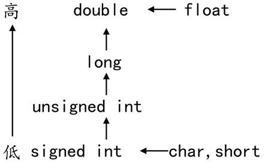

###   3. 运算符与表达式

#### 3.1 常用运算符分类

| **运算符类型** | **作用**                               |
| -------------- | -------------------------------------- |
| 算术运算符     | 用于处理四则运算                       |
| 赋值运算符     | 用于将表达式的值赋给变量               |
| 比较运算符     | 用于表达式的比较，并返回一个真值或假值 |
| 逻辑运算符     | 用于根据表达式的值返回真值或假值       |
| 位运算符       | 用于处理数据的位运算                   |
| sizeof运算符   | 用于求字节数长度                       |

 

#### 3.2 算术运算符

| **运算符** | **术语**   | **示例**    | **结果**  |
| ---------- | ---------- | ----------- | --------- |
| +          | 正号       | +3          | 3         |
| -          | 负号       | -3          | -3        |
| +          | 加         | 10 + 5      | 15        |
| -          | 减         | 10 - 5      | 5         |
| *          | 乘         | 10 * 5      | 50        |
| /          | 除         | 10 / 5      | 2         |
| %          | 取模(取余) | 10 % 3      | 1         |
| ++         | 前自增     | a=2; b=++a; | a=3; b=3; |
| ++         | 后自增     | a=2; b=a++; | a=3; b=2; |
| --         | 前自减     | a=2; b=--a; | a=1; b=1; |
| --         | 后自减     | a=2; b=a--; | a=1; b=2; |

 

#### 3.3 赋值运算符

| **运算符** | **术语** | **示例**   | **结果**  |
| ---------- | -------- | ---------- | --------- |
| =          | 赋值     | a=2; b=3;  | a=2; b=3; |
| +=         | 加等于   | a=0; a+=2; | a=2;      |
| -=         | 减等于   | a=5; a-=3; | a=2;      |
| *=         | 乘等于   | a=2; a*=2; | a=4;      |
| /=         | 除等于   | a=4; a/=2; | a=2;      |
| %=         | 模等于   | a=3; a%2;  | a=1;      |

 

#### 3.4 比较运算符

C 语言的比较运算中， “真”用数字“1”来表示， “假”用数字“0”来表示。 

| **运算符** | **术语** | **示例** | **结果** |
| ---------- | -------- | -------- | -------- |
| ==         | 相等于   | 4 == 3   | 0        |
| !=         | 不等于   | 4 != 3   | 1        |
| <          | 小于     | 4 < 3    | 0        |
| >          | 大于     | 4 > 3    | 1        |
| <=         | 小于等于 | 4 <= 3   | 0        |
| >=         | 大于等于 | 4 >= 1   | 1        |

 

#### 3.5 逻辑运算符

| **运算符** | **术语** | **示例** | **结果**                                                 |
| ---------- | -------- | -------- | -------------------------------------------------------- |
| !          | 非       | !a       | 如果a为假，则!a为真；  如果a为真，则!a为假。             |
| &&         | 与       | a && b   | 如果a和b都为真，则结果为真，否则为假。                   |
| \|\|       | 或       | a \|\| b | 如果a和b有一个为真，则结果为真，二者都为假时，结果为假。 |

 

#### 3.6 运算符优先级

| **优先级** | **运算符**       | **名称或含义**           | **使用形式**                | **结合方向** | **说明**   |
| ---------- | ---------------- | ------------------------ | --------------------------- | ------------ | ---------- |
| **1**      | **[]**           | 数组下标                 | 数组名[常量表达式]          | 左到右       | --         |
| **()**     | 圆括号           | (表达式）/函数名(形参表) | --                          |              |            |
| **.**      | 成员选择（对象） | 对象.成员名              | --                          |              |            |
| **->**     | 成员选择（指针） | 对象指针->成员名         | --                          |              |            |
| **2**      | **-**            | 负号运算符               | -表达式                     | **右到左**   | 单目运算符 |
| **~**      | 按位取反运算符   | ~表达式                  |                             |              |            |
| **++**     | 自增运算符       | ++变量名/变量名++        |                             |              |            |
| **--**     | 自减运算符       | --变量名/变量名--        |                             |              |            |
| *****      | 取值运算符       | *指针变量                |                             |              |            |
| **&**      | 取地址运算符     | &变量名                  |                             |              |            |
| **!**      | 逻辑非运算符     | !表达式                  |                             |              |            |
| **(类型)** | 强制类型转换     | (数据类型)表达式         | --                          |              |            |
| **sizeof** | 长度运算符       | sizeof(表达式)           | --                          |              |            |
| **3**      | **/**            | 除                       | 表达式/表达式               | 左到右       | 双目运算符 |
| *****      | 乘               | 表达式*表达式            |                             |              |            |
| **%**      | 余数（取模）     | 整型表达式%整型表达式    |                             |              |            |
| **4**      | **+**            | 加                       | 表达式+表达式               | 左到右       | 双目运算符 |
| **-**      | 减               | 表达式-表达式            |                             |              |            |
| **5**      | **<<**           | 左移                     | 变量<<表达式                | 左到右       | 双目运算符 |
| **>>**     | 右移             | 变量>>表达式             |                             |              |            |
| **6**      | **>**            | 大于                     | 表达式>表达式               | 左到右       | 双目运算符 |
| **>=**     | 大于等于         | 表达式>=表达式           |                             |              |            |
| **<**      | 小于             | 表达式<表达式            |                             |              |            |
| **<=**     | 小于等于         | 表达式<=表达式           |                             |              |            |
| **7**      | **==**           | 等于                     | 表达式==表达式              | 左到右       | 双目运算符 |
| **!=**     | 不等于           | 表达式!=  表达式         |                             |              |            |
| **8**      | **&**            | 按位与                   | 表达式&表达式               | 左到右       | 双目运算符 |
| **9**      | **^**            | 按位异或                 | 表达式^表达式               | 左到右       | 双目运算符 |
| **10**     | **\|**           | 按位或                   | 表达式\|表达式              | 左到右       | 双目运算符 |
| **11**     | **&&**           | 逻辑与                   | 表达式&&表达式              | 左到右       | 双目运算符 |
| **12**     | **\|\|**         | 逻辑或                   | 表达式\|\|表达式            | 左到右       | 双目运算符 |
| **13**     | **?:**           | 条件运算符               | 表达式1?  表达式2:  表达式3 | **右到左**   | 三目运算符 |
| **14**     | **=**            | 赋值运算符               | 变量=表达式                 | **右到左**   | --         |
| **/=**     | 除后赋值         | 变量/=表达式             | --                          |              |            |
| ***=**     | 乘后赋值         | 变量*=表达式             | --                          |              |            |
| **%=**     | 取模后赋值       | 变量%=表达式             | --                          |              |            |
| **+=**     | 加后赋值         | 变量+=表达式             | --                          |              |            |
| **-=**     | 减后赋值         | 变量-=表达式             | --                          |              |            |
| **<<=**    | 左移后赋值       | 变量<<=表达式            | --                          |              |            |
| **>>=**    | 右移后赋值       | 变量>>=表达式            | --                          |              |            |
| **&=**     | 按位与后赋值     | 变量&=表达式             | --                          |              |            |
| **^=**     | 按位异或后赋值   | 变量^=表达式             | --                          |              |            |
| **\|=**    | 按位或后赋值     | 变量\|=表达式            | --                          |              |            |
| **15**     | **，**           | 逗号运算符               | 表达式,表达式,…             | 左到右       | --         |

 

#### 3.7 类型转换

数据有不同的类型，不同类型数据之间进行混合运算时必然涉及到类型的转换问题。

转换的方法有两种：

-  自动转换(隐式转换)：遵循一定的规则,由编译系统自动完成。

-  强制类型转换：把表达式的运算结果强制转换成所需的数据类型。


类型转换的原则：占用内存字节数少(值域小)的类型，向占用内存字节数多(值域大)的类型转换，以保证精度不降低。



##### 3.7.1 隐式转换

```
#include <stdio.h>

int main()
{
	int num = 5;
	printf("s1=%d\n", num / 2);
	printf("s2=%lf\n", num / 2.0);

	return 0;
}

```

##### 3.7.2 强制转换

强制类型转换指的是使用强制类型转换运算符，将一个变量或表达式转化成所需的类型，其基本语法格式如下所示：

```
(类型说明符) (表达式)
```

 

```
#include <stdio.h>

int main()
{
	float x = 0;
	int i = 0;
	x = 3.6f;

	i = x;			//x为实型, i为整型，直接赋值会有警告
	i = (int)x;		//使用强制类型转换

	printf("x=%f, i=%d\n", x, i);

	return 0;
}

```

 