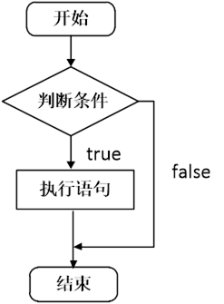
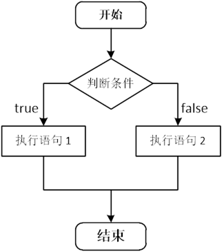
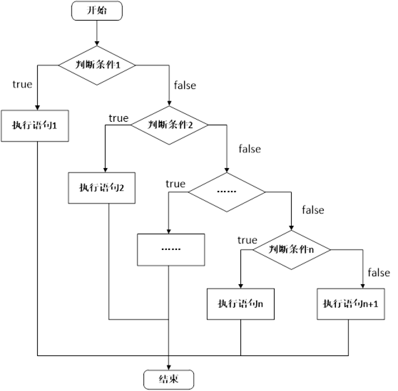
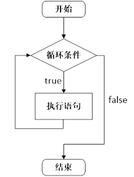
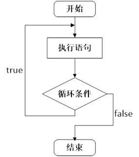

###   4. 程序流程结构

#### 4.1 概述

C语言支持最基本的三种程序运行结构：顺序结构、选择结构、循环结构。

-  顺序结构：程序按顺序执行，不发生跳转。

-  选择结构：依据是否满足条件，有选择的执行相应功能。

-  循环结构：依据条件是否满足，循环多次执行某段代码。


#### 4.2 选择结构

##### 4.2.1 if语句



 

```
#include <stdio.h>

int main()
{
	int a = 1;
	int b = 2;

	if (a > b)
	{
		printf("%d\n", a);
	}

	return 0;
} 

```

 

 

##### 4.2.2 if…else语句

 



 

```
#include <stdio.h>
int main()
{
	int a = 1;
	int b = 2;

	if (a > b)
	{
		printf("%d\n", a);
	}
	else
	{
		printf("%d\n", b);
	}
	return 0;
}

```

##### 4.2.3 if…else if…else语句



 

```
#include <stdio.h>

int main()
{
	unsigned int a;
	scanf("%u", &a);

	if (a < 10)
	{
		printf("个位\n");
	}
	else if (a < 100)
	{
		printf("十位\n");
	}
	else if (a < 1000)
	{
		printf("百位\n");
	}
	else
	{
		printf("很大\n");
	}

	return 0;
}

```

 

##### 4.2.4 三目运算符

```
#include <stdio.h>

int main()
{
	int a = 10;
	int b = 20;
	int c;

	if (a > b){
		c = a;
	}else{
		c = b;
	}
	printf("c1 = %d\n", c);

	a = 1;
	b = 2;
	c = ( a > b ? a : b );
	printf("c2 = %d\n", c);

	return 0;
}

```

 

4.2.5 switch语句

```
#include <stdio.h>

int main()
{
	char c;
	c = getchar();

	switch (c) //参数只能是整型变量
	{
	case '1':
		printf("OK\n");
		break;//switch遇到break就中断了
	case '2':
		printf("not OK\n");
		break;
	default://如果上面的条件都不满足，那么执行default
		printf("are u ok?\n");
	}
	return 0;
}

```

#### 4.3 循环结构

##### 4.3.1 while语句



 

```
#include <stdio.h>

int main()
{
	int a = 20;
	while (a > 10)
	{
		scanf("%d", &a);
		printf("a = %d\n", a);
	}

	return 0;
}

```

 

##### 4.3.2 do…while语句



 

```
#include <stdio.h>

int main()
{
	int a = 1;
	do
	{
		a++;
		printf("a = %d\n", a);
	} while (a < 10);

	return 0;
}

```

 

##### 4.3.3 for语句

```
#include <stdio.h>

int main()
{
	int i;
	int sum = 0;
	for (i = 0; i <= 100; i++)
	{
		sum += i;

	}

	printf("sum = %d\n", sum);

	return 0;
}

```

 

##### 4.3.4 嵌套循环

循环语句之间可以相互嵌套：

```
#include <stdio.h>

int main()
{
	int num = 0;
	int i, j, k;
	for (i = 0; i < 10; i++)
	{
		for (j = 0; j < 10; j++)
		{
			for (k = 0; k < 10; k++)
			{
				printf("hello world\n");
				num++;
			}
		}
	}

	printf("num = %d\n", num);

	return 0;
}

```

 

#### 4.4 跳转语句break、continue、goto

##### 4.3.1 break语句

在switch条件语句和循环语句中都可以使用break语句：

-  当它出现在switch条件语句中时，作用是终止某个case并跳出switch结构。

-  当它出现在循环语句中，作用是跳出当前内循环语句，执行后面的代码。

-  当它出现在嵌套循环语句中，跳出最近的内循环语句，执行后面的代码。


```
#include <stdio.h>

int main()
{
	int i = 0;
	while (1)
	{
		i++;
		printf("i = %d\n", i);

		if (i == 10)
		{
			break; //跳出while循环
		}
	}

	int flag = 0;
	int m = 0;
	int n = 0;

	for (m = 0; m < 10; m++)
	{
		for (n = 0; n < 10; n++)
		{
			if (n == 5)
			{
				flag = 1;
				break; //跳出for (n = 0; n < 10; n++)
			}
		}

		if (flag == 1)
		{
			break; //跳出for (m = 0; m < 10; m++)
		}
	}

	return 0;
}

```

##### 4.3.2 continue语句

在循环语句中，如果希望立即终止本次循环，并执行下一次循环，此时就需要使用continue语句。

```
#include<stdio.h>

int main()
{
	int sum = 0;           //定义变量sum

	for (int i = 1; i <= 100; i++)
	{
		if (i % 2 == 0)   //如果i是一个偶数，执行if语句中的代码
		{
			continue;      //结束本次循环
		}
		sum += i;          //实现sum和i的累加
	}

	printf("sum = %d\n", sum);

	return 0;
}

```

 

4.3.3 goto语句(无条件跳转，尽量少用)

```
#include <stdio.h>

int main()
{
	goto End; //无条件跳转到End的标识
	printf("aaaaaaaaa\n");

End:
	printf("bbbbbbbb\n");

	return 0;
}

```

 