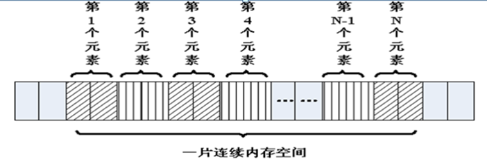
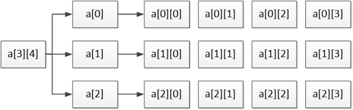

###   5. 数组和字符串

#### 5.1 概述

在程序设计中，为了方便处理数据把具有相同类型的若干变量按有序形式组织起来——称为数组。

 

数组就是在内存中连续的相同类型的变量空间。同一个数组所有的成员都是相同的数据类型，同时所有的成员在内存中的地址是连续的。

 



 

数组属于构造数据类型：

-  一个数组可以分解为多个数组元素：这些数组元素可以是基本数据类型或构造类型。


```
int a[10]; 

struct Stu boy[10];
```

 

-  按数组元素类型的不同，数组可分为：数值数组、字符数组、指针数组、结构数组等类别。


```
int a[10];

char s[10];

char *p[10];
```

 

通常情况下，数组元素下标的个数也称为维数，根据维数的不同，可将数组分为一维数组、二维数组、三维数组、四维数组等。通常情况下，我们将二维及以上的数组称为多维数组。

 

#### 5.2 一维数组

##### 5.2.1 一维数组的定义和使用

-  数组名字符合标识符的书写规定(数字、英文字母、下划线)

-  数组名不能与其它变量名相同，同一作用域内是唯一的

-  方括号[]中常量表达式表示数组元素的个数


int a[3]表示数组a有3个元素

其下标从0开始计算，因此3个元素分别为a[0],a[1],a[2]

-  定义数组时[]内最好是常量，使用数组时[]内即可是常量，也可以是变量


```
#include <stdio.h>

int main()
{
	int a[10];//定义了一个数组，名字叫a，有10个成员，每个成员都是int类型
	//a[0]…… a[9]，没有a[10]
	//没有a这个变量，a是数组的名字，但不是变量名，它是常量
	a[0] = 0;
	//……
	a[9] = 9;

	int i = 0;
	for (i = 0; i < 10; i++)
	{
		a[i] = i; //给数组赋值
	}

	//遍历数组，并输出每个成员的值
	for (i = 0; i < 10; i++)
	{
		printf("%d ", a[i]);
	}
	printf("\n");

	return 0;
}

```

##### 5.2.2 一维数组的初始化

在定义数组的同时进行赋值，称为初始化。全局数组若不初始化，编译器将其初始化为零。局部数组若不初始化，内容为随机值。

```
	int a[10] = { 1, 2, 3, 4, 5, 6, 7, 8, 9, 10 };//定义一个数组，同时初始化所有成员变量
	int a[10] = { 1, 2, 3 };//初始化前三个成员，后面所有元素都设置为0
	int a[10] = { 0 };//所有的成员都设置为0

	 //[]中不定义元素个数，定义时必须初始化
	   int a[] = { 1, 2, 3, 4, 5 };//定义了一个数组，有5个成员

```

 

##### 5.2.3 数组名

数组名是一个地址的常量，代表数组中首元素的地址。

```
#include <stdio.h>

int main()
{
	int a[10] = { 1, 2, 3, 4, 5, 6, 7, 8, 9, 10 };//定义一个数组，同时初始化所有成员变量

	printf("a = %p\n", a);
	printf("&a[0] = %p\n", &a[0]);

	int n = sizeof(a); //数组占用内存的大小，10个int类型，10 * 4  = 40
	int n0 = sizeof(a[0]);//数组第0个元素占用内存大小，第0个元素为int，4

	int i = 0;
	for (i = 0; i < sizeof(a) / sizeof(a[0]); i++)
	{
		printf("%d ", a[i]);
	}
	printf("\n");

	return 0;
}

```

 

##### 5.2.4 强化训练

######   1) 一维数组的最值

```
#include <stdio.h>

int main()
{
	int a[] = {  1, -2, 3,- 4, 5, -6, 7, -8, -9, 10 };//定义一个数组，同时初始化所有成员变量

	int i = 0;
	int max = a[0];
	for (i = 0; i < sizeof(a) / sizeof(a[0]); i++)
	{
		if (a[i] > max)
		{
			max = a[i];
		}
	}
	printf("数组中最大值为：%d\n", max);

	return 0;
}

```

 

######   2) 一维数组的逆置

```
#include <stdio.h>

int main()
{
	int a[] = {  1, -2, 3,- 4, 5, -6, 7, -8, -9, 10 };//定义一个数组，同时初始化所有成员变量

	int i = 0;
	int j = sizeof(a) / sizeof(a[0]) -1;
	int tmp;

	while (i < j)
	{
		tmp = a[i];
		a[i] = a[j];
		a[j] = tmp;
		i++;
		j--;
	}

	for (i = 0; i < sizeof(a) / sizeof(a[0]); i++)
	{
		printf("%d ", a[i]);
	}
	printf("\n");

	return 0;
}

```

 

######   3) 冒泡法排序

```
#include <stdio.h>

int main()
{
	int a[] = {  1, -2, 3,- 4, 5, -6, 7, -8, -9, 10 };//定义一个数组，同时初始化所有成员变量

	int i = 0;
	int j = 0;
	int n = sizeof(a) / sizeof(a[0]);
	int tmp;

	//1、流程
	//2、试数
	for (i = 0; i < n-1; i++)
	{
		for (j = 0; j < n - i -1 ; j++)//内循环的目的是比较相邻的元素，把大的放到后面
		{
			if (a[j]  > a[j + 1])
			{
				tmp = a[j];
				a[j] = a[j+1];
				a[j+1] = tmp;
			}
		}
	}

	for (i = 0; i < n; i++)
	{
		printf("%d ", a[i]);
	}
	printf("\n");

	return 0;
}

```

 

#### 5.3二维数组

##### 5.3.1 二维数组的定义和使用

二维数组定义的一般形式是：

```
类型说明符 数组名[常量表达式1][常量表达式2]
```

其中常量表达式1表示第一维下标的长度，常量表达式2 表示第二维下标的长度。

```
int a[3][4];
```

-  命名规则同一维数组


-  定义了一个三行四列的数组，数组名为a其元素类型为整型，该数组的元素个数为3×4个，即：




二维数组a是按行进行存放的，先存放a[0]行，再存放a[1]行、a[2]行，并且每行有四个元素，也是依次存放的。

-  二维数组在概念上是二维的：其下标在两个方向上变化，对其访问一般需要两个下标。

-  在内存中并并存在二维数组，二维数组实际的硬件存储器是连续编址的，也就是说内存中只有一维数组，即放完一行之后顺次放入第二行，和一维数组存放方式是一样的。


```
#include <stdio.h>

int main()
{
	//定义了一个二维数组，名字叫a
	//由3个一维数组组成，这个一维数组是int [4]
	//这3个一维数组的数组名分别为a[0],a[1],a[2]
	int a[3][4];

	a[0][0] = 0;
	//……
	a[2][3] = 12;

	//给数组每个元素赋值
	int i = 0;
	int j = 0;
	int num = 0;
	for (i = 0; i < 3; i++)
	{
		for (j = 0; j < 4; j++)
		{
			a[i][j] = num++;
		}
	}

	//遍历数组，并输出每个成员的值
	for (i = 0; i < 3; i++)
	{
		for (j = 0; j < 4; j++)
		{
			printf("%d, ", a[i][j]);
		}
		printf("\n");
	}

	return 0;
}

```

##### 5.3.2 二维数组的初始化

```
	//分段赋值 	
	int a[3][4] = {{ 1, 2, 3, 4 },{ 5, 6, 7, 8, },{ 9, 10, 11, 12 }};
	int a[3][4] = 
	{ 
		{ 1, 2, 3, 4 },
		{ 5, 6, 7, 8, },
		{ 9, 10, 11, 12 }
	};

	//连续赋值
	int a[3][4] = { 1, 2, 3, 4 , 5, 6, 7, 8, 9, 10, 11, 12  };

	//可以只给部分元素赋初值，未初始化则为0
	int a[3][4] = { 1, 2, 3, 4  };

	//所有的成员都设置为0
	int a[3][4] = {0};

	//[]中不定义元素个数，定义时必须初始化
	int a[][4] = { 1, 2, 3, 4, 5, 6, 7, 8};

```

##### 5.3.3 数组名

数组名是一个地址的常量，代表数组中首元素的地址。

```
#include <stdio.h>

int main()
{
	//定义了一个二维数组，名字叫a
	//二维数组是本质上还是一维数组，此一维数组有3个元素
//每个元素又是一个一维数组int[4]
	int a[3][4] = { 1, 2, 3, 4 , 5, 6, 7, 8, 9, 10, 11, 12  };

	//数组名为数组首元素地址，二维数组的第0个元素为一维数组
	//第0个一维数组的数组名为a[0]
	printf("a = %p\n", a);
	printf("a[0] = %p\n", a[0]);
	
	//测二维数组所占内存空间，有3个一维数组，每个一维数组的空间为4*4
	//sizeof(a) = 3 * 4 * 4 = 48
	printf("sizeof(a) = %d\n", sizeof(a));

	//测第0个元素所占内存空间，a[0]为第0个一维数组int[4]的数组名，4*4=16
	printf("sizeof(a[0]) = %d\n", sizeof(a[0]) );

	//测第0行0列元素所占内存空间，第0行0列元素为一个int类型，4字节
	printf("sizeof(a[0][0]) = %d\n", sizeof(a[0][0]));

	//求二维数组行数
	printf("i = %d\n", sizeof(a) / sizeof(a[0]));

	// 求二维数组列数
	printf("j = %d\n", sizeof(a[0]) / sizeof(a[0][0]));

	//求二维数组行*列总数
	printf("n = %d\n", sizeof(a) / sizeof(a[0][0]));

	return 0;
}

```

 

##### 5.3.4 强化训练

```
#include <stdio.h>

int main()
{
	//二维数组：  五行、三列
	//行代表人：  老大到老五
	//列代表科目：语、数、外
	float a[5][3] = { { 80, 75, 56 }, { 59, 65, 71 }, { 59, 63, 70 }, { 85, 45, 90 }, { 76, 77, 45 } };

	int i, j, person_low[3] = { 0 };
	float s = 0, lesson_aver[3] = { 0 };

	for (i = 0; i < 3; i++)
	{
		for (j = 0; j < 5; j++)
		{
			s = s + a[j][i];
			if (a[j][i] < 60)
			{
				person_low[i]++;
			}
		}

		lesson_aver[i] = s / 5;
		s = 0;
	}

	printf("各科的平均成绩:\n");
	for (i = 0; i < 3; i++)
	{
		printf("%.2f\n", lesson_aver[i]);
	}
		
	printf("各科不及格的人数:\n");
	for (i = 0; i < 3; i++)
	{
		printf("%d\n", person_low[i]);
	}
		
	return 0;
}

```

 

#### 5.4多维数组(了解)

多维数组的定义与二维数组类似，其语法格式具体如下：

```
数组类型修饰符 数组名 [n1][n2]…[nn];
```

```
int a[3][4][5];
```

定义了一个三维数组，数组的名字是a，数组的长度为3，每个数组的元素又是一个二维数组，这个二维数组的长度是4，并且这个二维数组中的每个元素又是一个一维数组，这个一维数组的长度是5，元素类型是int。

 

```
#include <stdio.h>

int main()
{
	//int a[3][4][5] ;//定义了一个三维数组，有3个二维数组int[4][5]
	int a[3][4][5] = { { { 1, 2, 3, 4, 5 }, { 6, 7, 8, 9, 10 }, { 0 }, { 0 } }, { { 0 }, { 0 }, { 0 }, { 0 } }, { { 0 }, { 0 }, { 0 }, { 0 } } };

	int i, j, k;
	for (i = 0; i < 3; i++)
	{
		for (j = 0; j < 4; j++)
		{
			for (k = 0; k < 5; k++)
			{
				//添加访问元素代码
				printf("%d, ", a[i][j][k]);
			}
			printf("\n");
		}
	}
	return 0;
}

```

#### 5.5 字符数组与字符串

##### 5.5.1 字符数组与字符串区别

-  C语言中没有字符串这种数据类型，可以通过char的数组来替代；

-  字符串一定是一个char的数组，但char的数组未必是字符串；

-  数字0(和字符‘\0’等价)结尾的char数组就是一个字符串，但如果char数组没有以数字0结尾，那么就不是一个字符串，只是普通字符数组，所以字符串是一种特殊的char的数组。


```
#include <stdio.h>

int main()
{
	char c1[] = { 'c', ' ', 'p', 'r', 'o', 'g' }; //普通字符数组
	printf("c1 = %s\n", c1); //乱码，因为没有’\0’结束符

	//以‘\0’(‘\0’就是数字0)结尾的字符数组是字符串
	char c2[] = { 'c', ' ', 'p', 'r', 'o', 'g', '\0'}; 
	printf("c2 = %s\n", c2);

	//字符串处理以‘\0’(数字0)作为结束符，后面的'h', 'l', 'l', 'e', 'o'不会输出
	char c3[] = { 'c', ' ', 'p', 'r', 'o', 'g', '\0', 'h', 'l', 'l', 'e', 'o', '\0'};
	printf("c3 = %s\n", c3);

	return 0;
}

```

 

##### 5.5.2 字符串的初始化

```
#include <stdio.h>

// C语言没有字符串类型，通过字符数组模拟
// C语言字符串，以字符‘\0’, 数字0
int main()
{
	//不指定长度, 没有0结束符，有多少个元素就有多长
	char buf[] = { 'a', 'b', 'c' };
	printf("buf = %s\n", buf);	//乱码

	//指定长度，后面没有赋值的元素，自动补0
	char buf2[100] = { 'a', 'b', 'c' };
	printf("buf2 = %s\n", buf2);

	//所有元素赋值为0
	char buf3[100] = { 0 };

	//char buf4[2] = { '1', '2', '3' };//数组越界

	char buf5[50] = { '1', 'a', 'b', '0', '7' };
	printf("buf5 = %s\n", buf5);

	char buf6[50] = { '1', 'a', 'b', 0, '7' };
	printf("buf6 = %s\n", buf6);

	char buf7[50] = { '1', 'a', 'b', '\0', '7' };
	printf("buf7 = %s\n", buf7);

	//使用字符串初始化，编译器自动在后面补0，常用
	char buf8[] = "agjdslgjlsdjg";

	//'\0'后面最好不要连着数字，有可能几个数字连起来刚好是一个转义字符
	//'\ddd'八进制字义字符，'\xdd'十六进制转移字符
	// \012相当于\n
	char str[] = "\012abc";
	printf("str == %s\n", str);

	return 0;
}

```

 

##### 5.5.3 字符串的输入输出

由于字符串采用了'\0'标志，字符串的输入输出将变得简单方便。

```
#include <stdio.h>

int main()
{
	char str[100];
   
	printf("input string1 : \n");
	scanf("%s", str);//scanf(“%s”,str)默认以空格分隔
	printf("output:%s\n", str);

	return 0;
}

```

 

##### 5.5.4 强化训练：字符串追加

```
#include <stdio.h>

int main()
{
	char str1[] = "abcdef";
	char str2[] = "123456";
	char dst[100];

	int i = 0;
	while (str1[i] != 0)
	{
		dst[i] = str1[i];
		i++;
	}

	int j = 0;
	while (str2[j] != 0)
	{
		dst[i + j] = str2[j];
		j++;
	}
	dst[i + j] = 0; //字符串结束符

	printf("dst = %s\n", dst);

	return 0;
}

```

 

##### 5.5.5 函数的调用：产生随机数

当调用函数时，需要关心5要素：

-  头文件：包含指定的头文件

-  函数名字：函数名字必须和头文件声明的名字一样

-  功能：需要知道此函数能干嘛后才调用

-  参数：参数类型要匹配

-  返回值：根据需要接收返回值


```
#include <time.h>
time_t time(time_t *t);
功能：获取当前系统时间
参数：常设置为NULL
返回值：当前系统时间, time_t 相当于long类型，单位为毫秒

#include <stdlib.h>
void srand(unsigned int seed);
功能：用来设置rand()产生随机数时的随机种子
参数：如果每次seed相等，rand()产生随机数相等
返回值：无

#include <stdlib.h>
int rand(void);
功能：返回一个随机数值
参数：无
返回值：随机数

```

 

```
#include <stdio.h>
#include <time.h>
#include <stdlib.h>

int main()
{
	time_t tm = time(NULL);//得到系统时间
	srand((unsigned int)tm);//随机种子只需要设置一次即可

	int r = rand();
	printf("r = %d\n", r);

	return 0;
}

```

 

##### 5.5.6 字符串处理函数

######   1) gets()

```
#include <stdio.h>
char *gets(char *s);
功能：从标准输入读入字符，并保存到s指定的内存空间，直到出现换行符或读到文件结尾为止。
参数：
	s：字符串首地址
返回值：
	成功：读入的字符串
	失败：NULL

```

 

gets(str)与scanf(“%s”,str)的区别：

-  gets(str)允许输入的字符串含有空格

-  scanf(“%s”,str)不允许含有空格


注意：由于scanf()和gets()无法知道字符串s大小，必须遇到换行符或读到文件结尾为止才接收输入，因此容易导致字符数组越界(缓冲区溢出)的情况。

```
	char str[100];
	printf("请输入str: ");
	gets(str);
	printf("str = %s\n", str);
```

 

######   2) fgets()

```
#include <stdio.h>
char *fgets(char *s, int size, FILE *stream);
功能：从stream指定的文件内读入字符，保存到s所指定的内存空间，直到出现换行字符、读到文件结尾或是已读了size - 1个字符为止，最后会自动加上字符 '\0' 作为字符串结束。
参数：
	s：字符串
	size：指定最大读取字符串的长度（size - 1）
	stream：文件指针，如果读键盘输入的字符串，固定写为stdin
返回值：
	成功：成功读取的字符串
	读到文件尾或出错： NULL

```

 

fgets()在读取一个用户通过键盘输入的字符串的时候，同时把用户输入的回车也做为字符串的一部分。通过scanf和gets输入一个字符串的时候，不包含结尾的“\n”，但通过fgets结尾多了“\n”。fgets()函数是安全的，不存在缓冲区溢出的问题。

 

```
	char str[100];
	printf("请输入str: ");
	fgets(str, sizeof(str), stdin);
	printf("str = \"%s\"\n", str);
```

 

######   3) puts()

```
#include <stdio.h>
int puts(const char *s);
功能：标准设备输出s字符串，在输出完成后自动输出一个'\n'。
参数：
	s：字符串首地址
返回值：
	成功：非负数
	失败：-1
```

 

```
#include <stdio.h>

int main()
{
	printf("hello world");
	puts("hello world");

	return 0;
}

```

 

######  4) fputs()

```
#include <stdio.h>
int fputs(const char * str, FILE * stream);
功能：将str所指定的字符串写入到stream指定的文件中， 字符串结束符 '\0'  不写入文件。 
参数：
	str：字符串
	stream：文件指针，如果把字符串输出到屏幕，固定写为stdout
返回值：
	成功：0
	失败：-1

```

 

fputs()是puts()的文件操作版本，但fputs()不会自动输出一个'\n'。

 

```
	printf("hello world");
	puts("hello world");
	fputs("hello world", stdout);
```

 

######  5) strlen()

```
#include <string.h>
size_t strlen(const char *s);
功能：计算指定指定字符串s的长度，不包含字符串结束符‘\0’
参数：
s：字符串首地址
返回值：字符串s的长度，size_t为unsigned int类型

```

 

```
	char str[] = "abcdefg";
	int n = strlen(str);
	printf("n = %d\n", n);
```

 

######  6) strcpy()

```
#include <string.h>
char *strcpy(char *dest, const char *src);
功能：把src所指向的字符串复制到dest所指向的空间中，'\0'也会拷贝过去
参数：
	dest：目的字符串首地址
	src：源字符首地址
返回值：
	成功：返回dest字符串的首地址
	失败：NULL

```

 

注意：如果参数dest所指的内存空间不够大，可能会造成缓冲溢出的错误情况。

 

```
	char dest[20] = "123456789";
	char src[] = "hello world";
	strcpy(dest, src);
	printf("%s\n", dest);
```

 

######  7) strncpy()

```
#include <string.h>
char *strncpy(char *dest, const char *src, size_t n);
功能：把src指向字符串的前n个字符复制到dest所指向的空间中，是否拷贝结束符看指定的长度是否包含'\0'。
参数：
	dest：目的字符串首地址
	src：源字符首地址
	n：指定需要拷贝字符串个数
返回值：
	成功：返回dest字符串的首地址
	失败：NULL

```


```
	char dest[20] ;
	char src[] = "hello world";

	strncpy(dest, src, 5);
	printf("%s\n", dest);

	dest[5] = '\0';
	printf("%s\n", dest);
```

 

######  8) strcat()

```
#include <string.h>
char *strcat(char *dest, const char *src);
功能：将src字符串连接到dest的尾部，‘\0’也会追加过去
参数：
	dest：目的字符串首地址
	src：源字符首地址
返回值：
	成功：返回dest字符串的首地址
	失败：NULL
```

 

```
	char str[20] = "123";
	char *src = "hello world";
	printf("%s\n", strcat(str, src));
```

 

######  9) strncat()

```
#include <string.h>
char *strncat(char *dest, const char *src, size_t n);
功能：将src字符串前n个字符连接到dest的尾部，‘\0’也会追加过去
参数：
	dest：目的字符串首地址
	src：源字符首地址
	n：指定需要追加字符串个数
返回值：
	成功：返回dest字符串的首地址
	失败：NULL

```

 

```
	char str[20] = "123";
	char *src = "hello world";
	printf("%s\n", strncat(str, src, 5));
```

 

######  10) strcmp()

```
#include <string.h>
int strcmp(const char *s1, const char *s2);
功能：比较 s1 和 s2 的大小，比较的是字符ASCII码大小。
参数：
	s1：字符串1首地址
	s2：字符串2首地址
返回值：
	相等：0
	大于：>0
	小于：<0

```

​    

```
char *str1 = "hello world";
	char *str2 = "hello mike";

	if (strcmp(str1, str2) == 0)
	{
		printf("str1==str2\n");
	}
	else if (strcmp(str1, str2) > 0)
	{
		printf("str1>str2\n");
	}	
	else
	{
		printf("str1<str2\n");
	}

```

 

######  11) strncmp()

```
#include <string.h>
int strncmp(const char *s1, const char *s2, size_t n);
功能：比较 s1 和 s2 前n个字符的大小，比较的是字符ASCII码大小。
参数：
	s1：字符串1首地址
	s2：字符串2首地址
	n：指定比较字符串的数量
返回值：
	相等：0
	大于： > 0
	小于： < 0

```

​    

```
char *str1 = "hello world";
	char *str2 = "hello mike";

	if (strncmp(str1, str2, 5) == 0)
	{
		printf("str1==str2\n");
	}
	else if (strcmp(str1, "hello world") > 0)
	{
		printf("str1>str2\n");
	}
	else
	{
		printf("str1<str2\n");
	}

```

 

######  12) sprintf()

```
#include <stdio.h>
int sprintf(char *_CRT_SECURE_NO_WARNINGS, const char *format, ...);
功能：根据参数format字符串来转换并格式化数据，然后将结果输出到str指定的空间中，直到出现字符串结束符 '\0'  为止。
参数：
	str：字符串首地址
	format：字符串格式，用法和printf()一样
返回值：
	成功：实际格式化的字符个数
	失败： - 1

```

 

```
	char dst[100] = { 0 };
	int a = 10;
	char src[] = "hello world";
	printf("a = %d, src = %s", a, src);
	printf("\n");

	int len = sprintf(dst, "a = %d, src = %s", a, src);
	printf("dst = \" %s\"\n", dst);
	printf("len = %d\n", len);

```

 

######   13) sscanf()

```
#include <stdio.h>
int sscanf(const char *str, const char *format, ...);
功能：从str指定的字符串读取数据，并根据参数format字符串来转换并格式化数据。
参数：
	str：指定的字符串首地址
	format：字符串格式，用法和scanf()一样
返回值：
	成功：参数数目，成功转换的值的个数
	失败： - 1

```

 

```
	char src[] = "a=10, b=20";
	int a;
	int b;
	sscanf(src, "a=%d,  b=%d", &a, &b);
	printf("a:%d, b:%d\n", a, b);

```

 

######   14) strchr()

```
#include <string.h>
char *strchr(const char *s, int c);
功能：在字符串s中查找字母c出现的位置
参数：
	s：字符串首地址
	c：匹配字母(字符)
返回值：
	成功：返回第一次出现的c地址
	失败：NULL

```

 

```
	char src[] = "ddda123abcd";
	char *p = strchr(src, 'a');
	printf("p = %s\n", p);
```

 

######   15) strstr()

```
#include <string.h>
char *strstr(const char *haystack, const char *needle);
功能：在字符串haystack中查找字符串needle出现的位置
参数：
	haystack：源字符串首地址
	needle：匹配字符串首地址
返回值：
	成功：返回第一次出现的needle地址
	失败：NULL

```

 

```
	char src[] = "ddddabcd123abcd333abcd";
	char *p = strstr(src, "abcd");
	printf("p = %s\n", p);
```

 

######   16) strtok()

```
#include <string.h>
char *strtok(char *str, const char *delim);
功能：来将字符串分割成一个个片段。当strtok()在参数s的字符串中发现参数delim中包含的分割字符时, 则会将该字符改为\0 字符，当连续出现多个时只替换第一个为\0。
参数：
	str：指向欲分割的字符串
	delim：为分割字符串中包含的所有字符
返回值：
	成功：分割后字符串首地址
	失败：NULL

```

 

-  在第一次调用时：strtok()必需给予参数s字符串

-  往后的调用则将参数s设置成NULL，每次调用成功则返回指向被分割出片段的指针


```
char a[100] = "adc*fvcv*ebcy*hghbdfg*casdert";
	char *s = strtok(a, "*");//将"*"分割的子串取出
	while (s != NULL)
	{
		printf("%s\n", s);
		s = strtok(NULL, "*");
	}

```

 

######   17) atoi()

```
#include <stdlib.h>
int atoi(const char *nptr);
功能：atoi()会扫描nptr字符串，跳过前面的空格字符，直到遇到数字或正负号才开始做转换，而遇到非数字或字符串结束符('\0')才结束转换，并将结果返回返回值。
参数：
	nptr：待转换的字符串
返回值：成功转换后整数

```

类似的函数有：

-  atof()：把一个小数形式的字符串转化为一个浮点数。

-  atol()：将一个字符串转化为long类型


```
	char str1[] = "-10";
	int num1 = atoi(str1);
	printf("num1 = %d\n", num1);

	char str2[] = "0.123";
	double num2 = atof(str2);
	printf("num2 = %lf\n", num2);

```

