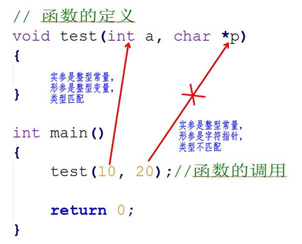
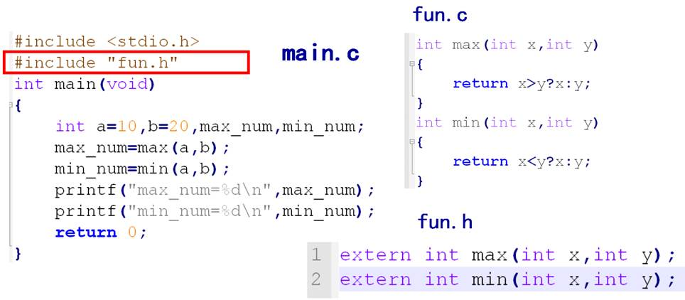

###   6. 函数

#### 6.1 概述

##### 6.1.1 函数分类

C 程序是由函数组成的，我们写的代码都是由主函数 main()开始执行的。函数是 C 程序的基本模块，是用于完成特定任务的程序代码单元。

 

从函数定义的角度看，函数可分为系统函数和用户定义函数两种：

-  系统函数，即库函数：这是由编译系统提供的，用户不必自己定义这些函数，可以直接使用它们，如我们常用的打印函数printf()。

-  用户定义函数：用以解决用户的专门需要。


##### 6.1.2 函数的作用

-  函数的使用可以省去重复代码的编写，降低代码重复率


```
// 求两数的最大值
int max(int a, int b)
{
	if (a > b){
		return a;
	}
	else{
		return b;
	}
}

int main()
{
	// 操作1 ……
	// ……
	int a1 = 10, b1 = 20, c1 = 0;
	c1 = max(a1, b1); // 调用max()

	// 操作2 ……
	// ……
	int a2 = 11, b2 = 21, c2 = 0;
	c2 = max(a2, b2); // 调用max()

	// ……

	return 0;
}

```

-  函数可以让程序更加模块化，从而有利于程序的阅读，修改和完善


假如我们编写一个实现以下功能的程序：读入一行数字；对数字进行排序；找到它们的平均值；打印出一个柱状图。如果我们把这些操作直接写在main()里，这样可能会给用户感觉代码会有点凌乱。但，假如我们使用函数，这样可以让程序更加清晰、模块化：

```
#include <stdio.h>

int main()
{
	float list[50];

	// 这里只是举例，函数还没有实现
	readlist(list, 50);
	sort(list, 50);
	average(list, 50);
	bargraph(list, 50);

	return 0;
}

```

 

这里我们可以这么理解，程序就像公司，公司是由部门组成的，这个部门就类似于C程序的函数。默认情况下，公司就是一个大部门( 只有一个部门的情况下 )，相当于C程序的main()函数。如果公司比较小( 程序比较小 )，因为任务少而简单，一个部门即可( main()函数 )胜任。但是，如果这个公司很大( 大型应用程序 )，任务多而杂，如果只是一个部门管理( 相当于没有部门，没有分工 )，我们可想而知，公司管理、运营起来会有多混乱，不是说这样不可以运营，只是这样不完美而已，如果根据公司要求分成一个个部门( 根据功能封装一个一个函数 )，招聘由行政部门负责，研发由技术部门负责等，这样就可以分工明确，结构清晰，方便管理，各部门之间还可以相互协调。

 

#### 6.2 函数的定义

##### 6.2.1 函数定义格式

函数定义的一般形式：

```
	返回类型 函数名(形式参数列表)
	{
		数据定义部分;
		执行语句部分;
	}

```

 

 


##### 6.2.2 函数名字、形参、函数体、返回值

######   1) 函数名

理论上是可以随意起名字，最好起的名字见名知意，应该让用户看到这个函数名字就知道这个函数的功能。注意，函数名的后面有个圆换号()，代表这个为函数，不是普通的变量名。

 

######   2) 形参列表

在定义函数时指定的形参，在未出现函数调用时，它们并不占内存中的存储单元，因此称它们是形式参数或虚拟参数，简称形参，表示它们并不是实际存在的数据，所以，形参里的变量不能赋值。

```
void max(int a = 10, int b = 20) // error, 形参不能赋值
{
}
```

 

在定义函数时指定的形参，必须是，类型+变量的形式：

```
//1: right, 类型+变量
void max(int a, int b)
{
}

//2: error, 只有类型，没有变量
void max(int, int)
{
}

//3: error, 只有变量，没有类型
int a, int b;
void max(a, b)
{
}

```

 

在定义函数时指定的形参，可有可无，根据函数的需要来设计，如果没有形参，圆括号内容为空，或写一个void关键字：

```
// 没形参， 圆括号内容为空
void max()
{
}

// 没形参， 圆括号内容为void关键字
void max(void)
{
}

```

 

######   3) 函数体

花括号{ }里的内容即为函数体的内容，这里为函数功能实现的过程，这和以前的写代码没太大区别，以前我们把代码写在main()函数里，现在只是把这些写到别的函数里。

 

######   4) 返回值

函数的返回值是通过函数中的return语句获得的，return后面的值也可以是一个表达式。

 

a)尽量保证return语句中表达式的值和函数返回类型是同一类型。

```
int max() // 函数的返回值为int类型
{
	int a = 10;
	return a;// 返回值a为int类型，函数返回类型也是int，匹配
}

```

 

b)如果函数返回的类型和return语句中表达式的值不一致，则以函数返回类型为准，即函数返回类型决定返回值的类型。对数值型数据，可以自动进行类型转换。

```
double max() // 函数的返回值为double类型
{
	int a = 10;
	return a;// 返回值a为int类型，它会转为double类型再返回
}

```

 

注意：如果函数返回的类型和return语句中表达式的值不一致，而它又无法自动进行类型转换，程序则会报错。

 

c)return语句的另一个作用为中断return所在的执行函数，类似于break中断循环、switch语句一样。

```
int max()
{
	return 1;// 执行到，函数已经被中断，所以下面的return 2无法被执行到
	return 2;// 没有执行
}
```

 

d)如果函数带返回值，return后面必须跟着一个值，如果函数没有返回值，函数名字的前面必须写一个void关键字，这时候，我们写代码时也可以通过return中断函数(也可以不用)，只是这时，return后面不带内容( 分号“；”除外)。

```
void max()// 最好要有void关键字
{
	return; // 中断函数，这个可有可无
}
```

 

#### 6.3 函数的调用

定义函数后，我们需要调用此函数才能执行到这个函数里的代码段。这和main()函数不一样，main()为编译器设定好自动调用的主函数，无需人为调用，我们都是在main()函数里调用别的函数，一个 C 程序里有且只有一个main()函数。

##### 6.3.1函数执行流程

```
#include <stdio.h>

void print_test()
{
	printf("this is for test\n");
}

int main()
{
	print_test();	// print_test函数的调用

	return 0;
}

```

######   1)  进入main()函数

######   2)  调用print_test()函数：

- a.  它会在main()函数的前寻找有没有一个名字叫“print_test”的函数定义；

- b.  如果找到，接着检查函数的参数，这里调用函数时没有传参，函数定义也没有形参，参数类型匹配；

- c.  开始执行print_test()函数，这时候，main()函数里面的执行会阻塞( 停 )在print_test()这一行代码，等待print_test()函数的执行。


######   3)  print_test()函数执行完( 这里打印一句话 )，main()才会继续往下执行，执行到return 0, 程序执行完毕。

 

##### 6.3.2 函数的形参和实参

-  形参出现在函数定义中，在整个函数体内都可以使用，离开该函数则不能使用。

-  实参出现在主调函数中，进入被调函数后，实参也不能使用。

-  实参变量对形参变量的数据传递是“值传递”，即单向传递，只由实参传给形参，而不能由形参传回来给实参。

-  在调用函数时，编译系统临时给形参分配存储单元。调用结束后，形参单元被释放。

-  实参单元与形参单元是不同的单元。调用结束后，形参单元被释放，函数调用结束返回主调函数后则不能再使用该形参变量。实参单元仍保留并维持原值。因此，在执行一个被调用函数时，形参的值如果发生改变，并不会改变主调函数中实参的值。


##### 6.3.3 无参函数调用

如果是调用无参函数，则不能加上“实参”，但括号不能省略。

```
// 函数的定义
void test()
{
}

int main()
{
	// 函数的调用
	test();	// right, 圆括号()不能省略
	test(250); // error, 函数定义时没有参数

return 0;
}

```

##### 6.3.4有参函数调用

a)如果实参表列包含多个实参，则各参数间用逗号隔开。

```
// 函数的定义
void test(int a, int b)
{
}

int main()
{
	int p = 10, q = 20;
	test(p, q);	// 函数的调用

	return 0;
}

```

 

b)实参与形参的个数应相等，类型应匹配(相同或赋值兼容)。实参与形参按顺序对应，一对一地传递数据。



c)实参可以是常量、变量或表达式，无论实参是何种类型的量，在进行函数调用时，它们都必须具有确定的值，以便把这些值传送给形参。所以，这里的变量是在圆括号( )外面定义好、赋好值的变量。

```
// 函数的定义
void test(int a, int b)
{
}

int main()
{
	// 函数的调用
	int p = 10, q = 20;
	test(p, q);	// right
	test(11, 30 - 10); // right

	test(int a, int b); // error, 不应该在圆括号里定义变量

	return 0;
}

```

 

##### 6.3.5 函数返回值

a）如果函数定义没有返回值，函数调用时不能写void关键字，调用函数时也不能接收函数的返回值。

```
// 函数的定义
void test()
{
}

int main()
{
	// 函数的调用
	test(); // right
	void test(); // error, void关键字只能出现在定义，不可能出现在调用的地方
	int a = test();	// error, 函数定义根本就没有返回值

	return 0;
}

```

b）如果函数定义有返回值，这个返回值我们根据用户需要可用可不用，但是，假如我们需要使用这个函数返回值，我们需要定义一个匹配类型的变量来接收。

```
// 函数的定义, 返回值为int类型
int test()
{
}

int main()
{
	// 函数的调用
	int a = test(); // right, a为int类型
	int b;
	b = test();	// right, 和上面等级

	char *p = test(); // 虽然调用成功没有意义, p为char *, 函数返回值为int, 类型不匹配

	// error, 必须定义一个匹配类型的变量来接收返回值
	// int只是类型，没有定义变量
	int = test();	
	
	// error, 必须定义一个匹配类型的变量来接收返回值
	// int只是类型，没有定义变量
	int test();
	
	return 0;
}

```

 

#### 6.4 函数的声明

如果使用用户自己定义的函数，而该函数与调用它的函数（即主调函数）不在同一文件中，或者函数定义的位置在主调函数之后，则必须在调用此函数之前对被调用的函数作声明。

 

所谓函数声明，就是在函数尚在未定义的情况下，事先将该函数的有关信息通知编译系统，相当于告诉编译器，函数在后面定义，以便使编译能正常进行。

 

注意：一个函数只能被定义一次，但可以声明多次。

 

```
#include <stdio.h>

int max(int x, int y); // 函数的声明，分号不能省略
// int max(int, int); // 另一种方式

int main()
{
	int a = 10, b = 25, num_max = 0;
	num_max = max(a, b); // 函数的调用

	printf("num_max = %d\n", num_max);

	return 0;
}

// 函数的定义
int max(int x, int y)
{
	return x > y ? x : y;
}

```

**函数定义和声明的区别：**

1）定义是指对函数功能的确立，包括指定函数名、函数类型、形参及其类型、函数体等，它是一个完整的、独立的函数单位。

2）声明的作用则是把函数的名字、函数类型以及形参的个数、类型和顺序(注意，不包括函数体)通知编译系统，以便在对包含函数调用的语句进行编译时，据此对其进行对照检查（例如函数名是否正确，实参与形参的类型和个数是否一致）。

#### 6.5 main函数与exit函数

在main函数中调用exit和return结果是一样的，但在子函数中调用return只是代表子函数终止了，在子函数中调用exit，那么程序终止。

```
#include <stdio.h>
#include <stdlib.h>

void fun()
{
	printf("fun\n");
	//return;
	exit(0);
}

int main()
{
	fun();
	while (1);

	return 0;
}

```

 

#### 6.6 多文件(分文件)编程

##### 6.6.1 分文件编程

-  把函数声明放在头文件xxx.h中，在主函数中包含相应头文件

-  在头文件对应的xxx.c中实现xxx.h声明的函数




 

##### 6.6.2 防止头文件重复包含

当一个项目比较大时，往往都是分文件，这时候有可能不小心把同一个头文件 include 多次，或者头文件嵌套包含。

 

a.h 中包含 b.h ：

```
#include "b.h"
```

 

b.h 中包含 a.h：

```
#include "a.h"
```

 

main.c 中使用其中头文件：

```
#include "a.h"

int main()
{
	return 0;
}

```

 

编译上面的例子，会出现如下错误：


 

为了避免同一个文件被include多次，C/C++中有两种方式，一种是 #ifndef 方式，一种是 #pragma once 方式。

方法一：

```
#ifndef __SOMEFILE_H__
#define __SOMEFILE_H__

// 声明语句

#endif

```

 

方法二：

```
#pragma once

// 声明语句
```

 

 