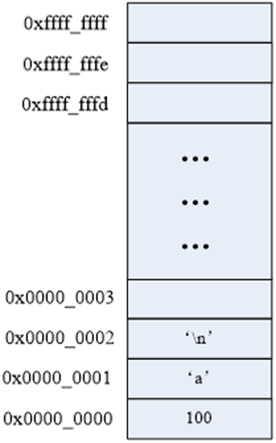
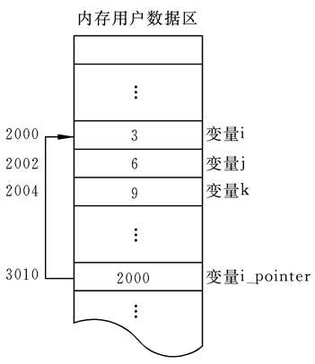
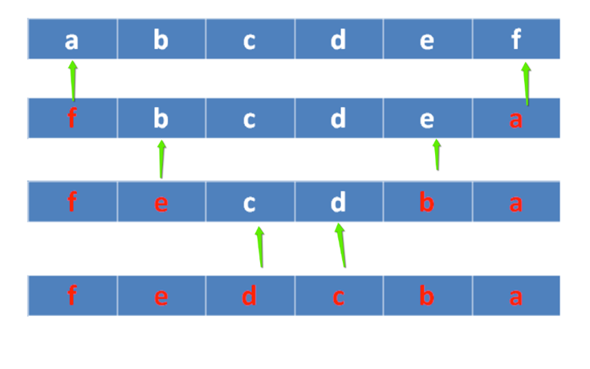

###   7. 指针

#### 7.1 概述

##### 7.1.1 内存

内存含义：

-  存储器：计算机的组成中，用来存储程序和数据，辅助CPU进行运算处理的重要部分。

-  内存：内部存贮器，暂存程序/数据——掉电丢失 SRAM、DRAM、DDR、DDR2、DDR3。

-  外存：外部存储器，长时间保存程序/数据—掉电不丢ROM、ERRROM、FLASH（NAND、NOR）、硬盘、光盘。


内存是沟通CPU与硬盘的桥梁：

-  暂存放CPU中的运算数据

-  暂存与硬盘等外部存储器交换的数据


##### 7.1.2 物理存储器和存储地址空间

有关内存的两个概念：物理存储器和存储地址空间。

 

物理存储器：实际存在的具体存储器芯片。

-  主板上装插的内存条

-  显示卡上的显示RAM芯片

-  各种适配卡上的RAM芯片和ROM芯片


存储地址空间：对存储器编码的范围。我们在软件上常说的内存是指这一层含义。

-  编码：对每个物理存储单元（一个字节）分配一个号码

-  寻址：可以根据分配的号码找到相应的存储单元，完成数据的读写


##### 7.1.3 内存地址

-  将内存抽象成一个很大的一维字符数组。

-  编码就是对内存的每一个字节分配一个32位或64位的编号（与32位或者64位处理器相关）。

-  这个内存编号我们称之为内存地址。

-  内存中的每一个数据都会分配相应的地址：

-  char:占一个字节分配一个地址

-  int: 占四个字节分配四个地址

-  float、struct、函数、数组等




 

##### 7.1.4 指针和指针变量

-  内存区的每一个字节都有一个编号，这就是“地址”。

-  如果在程序中定义了一个变量，在对程序进行编译或运行时，系统就会给这个变量分配内存单元，并确定它的内存地址(编号)

-  指针的实质就是内存“地址”。指针就是地址，地址就是指针。

-  指针是内存单元的编号，指针变量是存放地址的变量。

-  通常我们叙述时会把指针变量简称为指针，实际他们含义并不一样。




#### 7.2 指针基础知识

##### 7.2.1 指针变量的定义和使用

-  指针也是一种数据类型，指针变量也是一种变量

-  指针变量指向谁，就把谁的地址赋值给指针变量

-  “*”操作符操作的是指针变量指向的内存空间


```
#include <stdio.h>

int main()
{
	int a = 0;
	char b = 100;
	printf("%p, %p\n", &a, &b); //打印a, b的地址

	//int *代表是一种数据类型，int*指针类型，p才是变量名
	//定义了一个指针类型的变量，可以指向一个int类型变量的地址
	int *p;
	p = &a;//将a的地址赋值给变量p，p也是一个变量，值是一个内存地址编号
	printf("%d\n", *p);//p指向了a的地址，*p就是a的值

	char *p1 = &b;
	printf("%c\n", *p1);//*p1指向了b的地址，*p1就是b的值

	return 0;
}

```

 

注意：&可以取得一个变量在内存中的地址。但是，不能取寄存器变量，因为寄存器变量不在内存里，而在CPU里面，所以是没有地址的。

 

##### 7.2.2 通过指针间接修改变量的值

```
	int a = 0;
	int b = 11;
	int *p = &a;

	*p = 100;
	printf("a = %d, *p = %d\n", a, *p);

	p = &b;
	*p = 22;
	printf("b = %d, *p = %d\n", b, *p);

```

 

##### 7.2.3 指针大小

-  使用sizeof()测量指针的大小，得到的总是：4或8

-  sizeof()测的是指针变量指向存储地址的大小

-  在32位平台，所有的指针（地址）都是32位(4字节)

-  在64位平台，所有的指针（地址）都是64位(8字节)


```
	int *p1;
	int **p2;
	char *p3;
	char **p4;
	printf("sizeof(p1) = %d\n", sizeof(p1));
	printf("sizeof(p2) = %d\n", sizeof(p2));
	printf("sizeof(p3) = %d\n", sizeof(p3));
	printf("sizeof(p4) = %d\n", sizeof(p4));
	printf("sizeof(double *) = %d\n", sizeof(double *));

```

 

7.2.4 野指针和空指针

指针变量也是变量，是变量就可以任意赋值，不要越界即可（32位为4字节，64位为8字节），但是，任意数值赋值给指针变量没有意义，因为这样的指针就成了野指针，此指针指向的区域是未知(操作系统不允许操作此指针指向的内存区域)。所以，野指针不会直接引发错误，操作野指针指向的内存区域才会出问题。

 

```
	int a = 100;
	int *p;
	p = a; //把a的值赋值给指针变量p，p为野指针， ok，不会有问题，但没有意义

	p = 0x12345678; //给指针变量p赋值，p为野指针， ok，不会有问题，但没有意义

	*p = 1000;  //操作野指针指向未知区域，内存出问题，err

```

 

但是，野指针和有效指针变量保存的都是数值，为了标志此指针变量没有指向任何变量(空闲可用)，C语言中，可以把NULL赋值给此指针，这样就标志此指针为空指针，没有任何指针。

```
int *p = NULL;
```

 

NULL是一个值为0的宏常量：

```
#define NULL    ((void *)0)
```

 

##### 7.2.5万能指针void *

void *指针可以指向任意变量的内存空间：

```
	void *p = NULL;

	int a = 10;
	p = (void *)&a; //指向变量时，最好转换为void *

	//使用指针变量指向的内存时，转换为int *
	*( (int *)p ) = 11;
	printf("a = %d\n", a);

```

 

##### 7.2.6 const修饰的指针变量

   

```
	int a = 100;
	int b = 200;

//指向常量的指针
	//修饰*，指针指向内存区域不能修改，指针指向可以变
	const int *p1 = &a; //等价于int const *p1 = &a;
	//*p1 = 111; //err
	p1 = &b; //ok

//指针常量
	//修饰p1，指针指向不能变，指针指向的内存可以修改
	int * const p2 = &a;
	//p2 = &b; //err
	*p2 = 222; //ok

```

 

#### 7.3 指针和数组

##### 7.3.1 数组名

数组名字是数组的首元素地址，但它是一个常量：

```
	int a[] = { 1, 2, 3, 4, 5, 6, 7, 8, 9 };
	printf("a = %p\n", a);
	printf("&a[0] = %p\n", &a[0]);

	//a = 10; //err, 数组名只是常量，不能修改

```

 

##### 7.3.2 指针操作数组元素

```
#include <stdio.h>

int  main()
{
	int a[] = { 1, 2, 3, 4, 5, 6, 7, 8, 9 };
	int i = 0;
	int n = sizeof(a) / sizeof(a[0]);
	
	for (i = 0; i < n; i++)
	{
		//printf("%d, ", a[i]);
		printf("%d, ", *(a+i));
	}
	printf("\n");

	int *p = a; //定义一个指针变量保存a的地址
	for (i = 0; i < n; i++)
	{
		p[i] = 2 * i;
	}

	for (i = 0; i < n; i++)
	{
		printf("%d, ", *(p + i));
	}
	printf("\n");


	return 0;
}

```

 

##### 7.3.3 指针加减运算

###### 1)加法运算

-  指针计算不是简单的整数相加

-  如果是一个int *，+1的结果是增加一个int的大小

-  如果是一个char *，+1的结果是增加一个char大小


```
#include <stdio.h>

int main()
{
	int a;
	int *p = &a;
	printf("%d\n", p);
	p += 2;//移动了2个int
	printf("%d\n", p);

	char b = 0;
	char *p1 = &b;
	printf("%d\n", p1);
	p1 += 2;//移动了2个char
	printf("%d\n", p1);

	return 0;
}

```

 

通过改变指针指向操作数组元素：

```
#include <stdio.h>

int main()
{
	int a[] = { 1, 2, 3, 4, 5, 6, 7, 8, 9 };
	int i = 0;
	int n = sizeof(a) / sizeof(a[0]);

	int *p = a;
	for (i = 0; i < n; i++)
	{
		printf("%d, ", *p);
		p++;
	}
	printf("\n");
	
	return 0;
}

```

 

###### 2) 减法运算

示例1：

```
#include <stdio.h>

int main()
{
	int a[] = { 1, 2, 3, 4, 5, 6, 7, 8, 9 };
	int i = 0;
	int n = sizeof(a) / sizeof(a[0]);

	int *p = a+n-1;
	for (i = 0; i < n; i++)
	{
		printf("%d, ", *p);
		p--;
	}
	printf("\n");

	return 0;
}

```

 

示例2：

```
#include <stdio.h>

int main()
{
	int a[] = { 1, 2, 3, 4, 5, 6, 7, 8, 9 };
	int *p2 = &a[2]; //第2个元素地址
	int *p1 = &a[1]; //第1个元素地址
	printf("p1 = %p, p2 = %p\n", p1, p2);

	int n1 = p2 - p1; //n1 = 1
	int n2 = (int)p2 - (int)p1; //n2 = 4
	printf("n1 = %d, n2 = %d\n", n1, n2);
	
	return 0;
}

```

 

7.3.4 指针数组

指针数组，它是数组，数组的每个元素都是指针类型。

```
#include <stdio.h>

int main()
{
	//指针数组
	int *p[3];
	int a = 1;
	int b = 2;
	int c = 3;
	int i = 0;

	p[0] = &a;
	p[1] = &b;
	p[2] = &c;

	for (i = 0; i < sizeof(p) / sizeof(p[0]); i++ )
	{
		printf("%d, ", *(p[i]));
	}
	printf("\n");
	
	return 0;
}

```

 

7.4 多级指针 

-  C语言允许有多级指针存在，在实际的程序中一级指针最常用，其次是二级指针。

-  二级指针就是指向一个一级指针变量地址的指针。

-  三级指针基本用不着，但考试会考。


​    

```
	int a = 10;
	int *p = &a; //一级指针
	*p = 100; //*p就是a

	int **q = &p;
	//*q就是p
	//**q就是a

	int ***t = &q;
	//*t就是q
	//**t就是p
	//***t就是a

```

 

#### 7.5 指针和函数

##### 7.5.1 函数形参改变实参的值

```
#include <stdio.h>

void swap1(int x, int y)
{
	int tmp;
	tmp = x;
	x = y;
	y = tmp;
	printf("x = %d, y = %d\n", x, y);
}

void swap2(int *x, int *y)
{
	int tmp;
	tmp = *x;
	*x = *y;
	*y = tmp;
}

int main()
{
	int a = 3;
	int b = 5;
	swap1(a, b); //值传递
	printf("a = %d, b = %d\n", a, b);

	a = 3;
	b = 5;
	swap2(&a, &b); //地址传递
	printf("a2 = %d, b2 = %d\n", a, b);

	return 0;
}

```

 

##### 7.6.2 数组名做函数参数

数组名做函数参数，函数的形参会退化为指针：

```
#include <stdio.h>

//void printArrary(int a[10], int n)
//void printArrary(int a[], int n)
void printArrary(int *a, int n)
{
	int i = 0;
	for (i = 0; i < n; i++)
	{
		printf("%d, ", a[i]);
	}
	printf("\n");
}

int main()
{
	int a[] = { 1, 2, 3, 4, 5, 6, 7, 8, 9 };
	int n = sizeof(a) / sizeof(a[0]);

	//数组名做函数参数
	printArrary(a, n); 
	return 0;
}

```

##### 7.6.3 指针做为函数的返回值

```
#include <stdio.h>

int a = 10;

int *getA()
{
	return &a;
}


int main()
{
	*( getA() ) = 111;
	printf("a = %d\n", a);

	return 0;
}

```

#### 7.7 指针和字符串

##### 7.7.1 字符指针

```
#include <stdio.h>

int main()
{
	char str[] = "hello world";
	char *p = str;
	*p = 'm';
	p++;
	*p = 'i';
	printf("%s\n", str);

	p = "mike jiang";
	printf("%s\n", p);

	char *q = "test";
	printf("%s\n", q);

	return 0;
}

```

 

##### 7.7.2 字符指针做函数参数

```
#include <stdio.h>

void mystrcat(char *dest, const char *src)
{
	int len1 = 0;
	int len2 = 0;
	while (dest[len1])
	{
		len1++;
	}
	while (src[len2])
	{
		len2++;
	}

	int i;
	for (i = 0; i < len2; i++)
	{
		dest[len1 + i] = src[i];
	}
}

int main()
{
	char dst[100] = "hello mike";
	char src[] = "123456";
	
	mystrcat(dst, src);
	printf("dst = %s\n", dst);

	return 0;
}

```

 

##### 7.7.3 const修饰的指针变量

```
#include <stdio.h>
#include <stdlib.h>
#include <string.h>

int main(void)
{
	//const修饰一个变量为只读
	const int a = 10;
	//a = 100; //err

	//指针变量， 指针指向的内存， 2个不同概念
	char buf[] = "aklgjdlsgjlkds";

	//从左往右看，跳过类型，看修饰哪个字符
	//如果是*， 说明指针指向的内存不能改变
	//如果是指针变量，说明指针的指向不能改变，指针的值不能修改
	const char *p = buf;
	// 等价于上面 char const *p1 = buf;
	//p[1] = '2'; //err
	p = "agdlsjaglkdsajgl"; //ok

	char * const p2 = buf;
	p2[1] = '3';
	//p2 = "salkjgldsjaglk"; //err

	//p3为只读，指向不能变，指向的内存也不能变
	const char * const p3 = buf;

	return 0;
}

```

 

##### 7.7.4 指针数组做为main函数的形参

```
int main(int argc, char *argv[]);
```

-  main函数是操作系统调用的，第一个参数标明argv数组的成员数量，argv数组的每个成员都是char *类型

-  argv是命令行参数的字符串数组

-  argc代表命令行参数的数量，程序名字本身算一个参数


```
#include <stdio.h>

//argc: 传参数的个数（包含可执行程序）
//argv：指针数组，指向输入的参数
int main(int argc, char *argv[])
{

	//指针数组，它是数组，每个元素都是指针
	char *a[] = { "aaaaaaa", "bbbbbbbbbb", "ccccccc" };
	int i = 0;

	printf("argc = %d\n", argc);
	for (i = 0; i < argc; i++)
	{
		printf("%s\n", argv[i]);
	}
	return 0;
}

```

 

##### 7.7.5 项目开发常用字符串应用模型

######   1) strstr中的while和do-while模型

利用strstr标准库函数找出一个字符串中substr出现的个数。

a) while模型

```
#include <stdio.h>
#include <stdlib.h>
#include <string.h>

int main(void)
{
	char *p = "11abcd111122abcd333abcd3322abcd3333322qqq";
	int n = 0;

	while ((p = strstr(p, "abcd")) != NULL)
	{
		//能进来，肯定有匹配的子串
		//重新设置起点位置
		p = p + strlen("abcd");
		n++;

		if (*p == 0) //如果到结束符
		{
			break;
		}

	}

	printf("n = %d\n", n);

	return 0;
}

```

 

b) do-while模型

```
#include <stdio.h>
#include <stdlib.h>
#include <string.h>

int main(void)
{
	char *p = "11abcd111122abcd333abcd3322abcd3333322qqq";
	int n = 0;

	do
	{
		p = strstr(p, "abcd");
		if (p != NULL)
		{
			n++; //累计个数

			//重新设置查找的起点
			p = p + strlen("abcd");

		}
		else //如果没有匹配的字符串，跳出循环
		{
			break;
		}
	} while (*p != 0); //如果没有到结尾

	printf("n = %d\n", n);
	return 0;
}

```

 

######   2) 两头堵模型

求非空字符串元素的个数：

```
#include <stdio.h>
#include <stdlib.h>
#include <string.h>
#include <ctype.h>

int fun(char *p, int *n)
{
	if (p == NULL || n == NULL)
	{
		return -1;
	}

	int begin = 0;
	int end = strlen(p) - 1;

	//从左边开始
	//如果当前字符为空，而且没有结束
	while (p[begin] == ' ' && p[begin] != 0)
	{
		begin++; //位置从右移动一位
	}

	//从右往左移动
	while (p[end] == ' ' && end > 0)
	{
		end--; //往左移动
	}

	if (end == 0)
	{
		return -2;
	}

	//非空元素个数
	*n = end - begin + 1;

	return 0;
}

int main(void)
{
	char *p = "      abcddsgadsgefg      ";
	int ret = 0;
	int n = 0;

	ret = fun(p, &n);
	if (ret != 0)
	{
		return ret;
	}
	printf("非空字符串元素个数：%d\n", n);

	return 0;
}

```

 

######   3) 字符串反转模型(逆置)



```
#include <stdio.h>
#include <stdlib.h>
#include <string.h>

int inverse(char *p)
{
	if (p == NULL)
	{
		return -1;
	}
	char *str = p;
	int begin = 0;
	int end = strlen(str) - 1;
	char tmp;

	while (begin < end)
	{
		//交换元素
		tmp = str[begin];
		str[begin] = str[end];
		str[end] = tmp;

		begin++;  //往右移动位置
		end--;	    //往左移动位置
	}

	return 0;
}

int main(void)
{
	//char *str = "abcdefg"; //文件常量区，内容不允许修改
	char str[] = "abcdef";

	int ret = inverse(str);
	if (ret != 0)
	{
		return ret;
	}

	printf("str ========== %s\n", str);
	return 0;
}

```

 

#### 7.8 指针小结

| **定义**    | **说明**                                     |
| ----------- | -------------------------------------------- |
| int i       | 定义整形变量                                 |
| int *p      | 定义一个指向int的指针变量                    |
| int a[10]   | 定义一个有10个元素的数组，每个元素类型为int  |
| int *p[10]  | 定义一个有10个元素的数组，每个元素类型为int* |
| int func()  | 定义一个函数，返回值为int型                  |
| int *func() | 定义一个函数，返回值为int *型                |
| int **p     | 定义一个指向int的指针的指针，二级指针        |

 