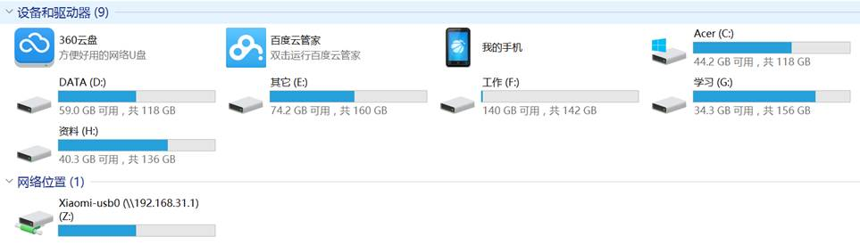
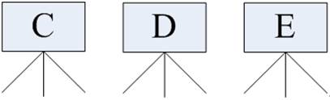
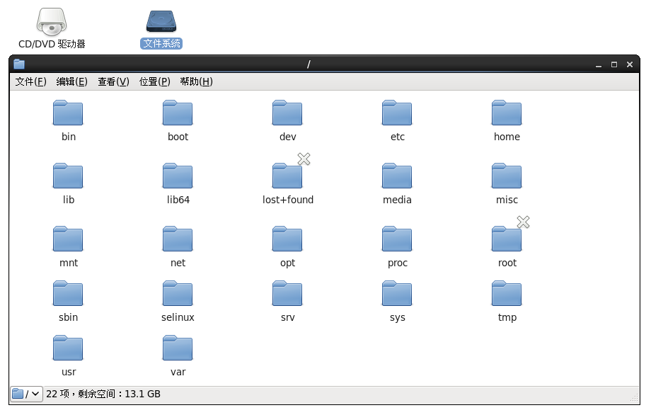
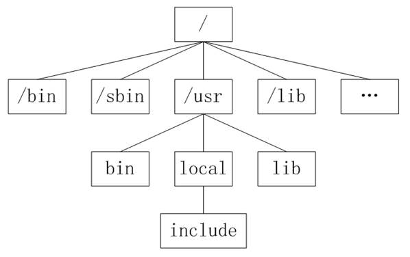
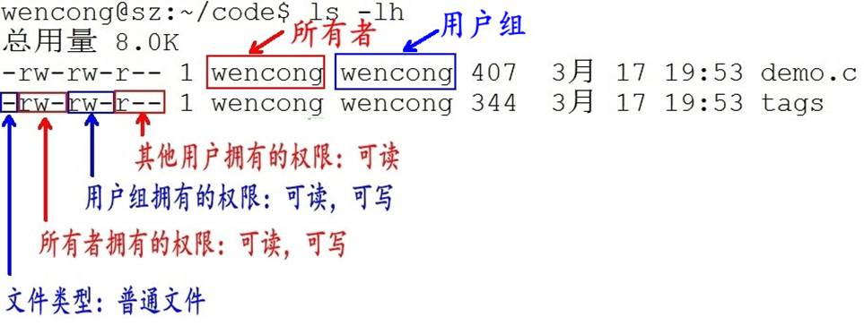

[TOC]

### 2. 文件系统

#### 2.1 目录和路径

##### 2.1.1 目录

l 目录是一组相关文件的集合。

l 一个目录下面除了可以存放文件之外还可以存放其他目录，即可包含子目录。

l 在确定文件、目录位置时，DOS和Unix/Linux都采用“路径名+文件名”的方式。路径反映的是目录与目录之间的关系。

 

##### 2.1.2 路径

Unix/Linux路径由到达定位文件的目录组成。在Unix/Linux系统中组成路径的目录分割符为斜杠“/”，而DOS则用反斜杠“\”来分割各个目录。

 

路径分为绝对路径和相对路径：

###### l 绝对路径

\1)  绝对路径是从目录树的树根“/”目录开始往下直至到达文件所经过的所有节点目录。

\2)  下级目录接在上级目录后面用“/”隔开。

\3)  注意：绝对路径都是从“/”开始的，所以第一个字符一定是“/”。

 

###### l 相对路径

\1) 相对路径是指目标目录相对于当前目录的位置。

\2) 如果不在当前目录下，则需要使用两个特殊目录“.”和“”了。目录“.”指向当前目录，而目录“..”。

 

#### 2.2 文件系统

##### 2.2.1 Windows和Linux文件系统区别

在 windows 平台下，打开“计算机”，我们看到的是一个个的驱动器盘符：

 

每个驱动器都有自己的根目录结构，这样形成了多个树并列的情形，如图所示：

 

 

 

 

在 Linux 下，我们是看不到这些驱动器盘符，我们看到的是文件夹（目录）：

RedHat

 

Ubuntu

 

在早期的 UNIX 系统中，各个厂家各自定义了自己的 UNIX 系统文件目录，比较混乱。Linux 面世不久后，对文件目录进行了标准化，于1994年对根文件目录做了统一的规范，推出 FHS ( Filesystem Hierarchy Standard ) 的 Linux 文件系统层次结构标准。FHS 标准规定了 Linux 根目录各文件夹的名称及作用，统一了Linux界命名混乱的局面。

 

和Windows操作系统类似，所有Unix/Linux的数据都是由文件系统按照树型目录结构管理的。而且Unix/Linux操作系统同样要区分文件的类型，判断文件的存取属性和可执行属性。

 

Unix/Linux也采用了树状结构的文件系统，它由目录和目录下的文件一起构成。但Unix/Linux文件系统不使用驱动器这个概念，而是使用单一的根目录结构，所有的分区都挂载到单一的“/”目录上，其结构示意图如图所示：

 

 

无论何种版本的 Linux 发行版，桌面、应用是 Linux 的外衣，文件组织、目录结构才是Linux的内心。

 

##### 2.2.2 Linux目录结构

l **/****：**根目录，一般根目录下只存放目录，在Linux下有且只有一个根目录。所有的东西都是从这里开始。当你在终端里输入“/home”，你其实是在告诉电脑，先从/（根目录）开始，再进入到home目录。

l **/bin****:** **/usr/bin****:** 可执行二进制文件的目录，如常用的命令ls、tar、mv、cat等。

l **/boot****：**放置linux系统启动时用到的一些文件，如Linux的内核文件：/boot/vmlinuz，系统引导管理器：/boot/grub。

l **/dev****：**存放linux系统下的设备文件，访问该目录下某个文件，相当于访问某个设备，常用的是挂载光驱 mount /dev/cdrom /mnt。

l **/etc**：系统配置文件存放的目录，不建议在此目录下存放可执行文件，重要的配置文件有 /etc/inittab、/etc/fstab、/etc/init.d、/etc/X11、/etc/sysconfig、/etc/xinetd.d。

l **/home****：**系统默认的用户家目录，新增用户账号时，用户的家目录都存放在此目录下，~表示当前用户的家目录，~edu 表示用户 edu 的家目录。

l **/lib****:** **/usr/lib****:** **/usr/local/lib****：**系统使用的函数库的目录，程序在执行过程中，需要调用一些额外的参数时需要函数库的协助。

l **/lost+fount****：**系统异常产生错误时，会将一些遗失的片段放置于此目录下。

l **/mnt****:** **/media****：**光盘默认挂载点，通常光盘挂载于 /mnt/cdrom 下，也不一定，可以选择任意位置进行挂载。

l **/opt****：**给主机额外安装软件所摆放的目录。

l **/proc**：此目录的数据都在内存中，如系统核心，外部设备，网络状态，由于数据都存放于内存中，所以不占用磁盘空间，比较重要的目录有 /proc/cpuinfo、/proc/interrupts、/proc/dma、/proc/ioports、/proc/net/* 等。

l **/root****：**系统管理员root的家目录。

l **/sbin****:** **/usr/sbin****:** **/usr/local/sbin****：**放置系统管理员使用的可执行命令，如fdisk、shutdown、mount 等。与 /bin 不同的是，这几个目录是给系统管理员 root使用的命令，一般用户只能"查看"而不能设置和使用。

l **/tmp****：**一般用户或正在执行的程序临时存放文件的目录，任何人都可以访问，重要数据不可放置在此目录下。

l **/srv****：**服务启动之后需要访问的数据目录，如 www 服务需要访问的网页数据存放在 /srv/www 内。

l **/usr**：应用程序存放目录，/usr/bin 存放应用程序，/usr/share 存放共享数据，/usr/lib 存放不能直接运行的，却是许多程序运行所必需的一些函数库文件。/usr/local: 存放软件升级包。/usr/share/doc: 系统说明文件存放目录。/usr/share/man: 程序说明文件存放目录。

l **/var****：**放置系统执行过程中经常变化的文件，如随时更改的日志文件 /var/log，/var/log/message：所有的登录文件存放目录，/var/spool/mail：邮件存放的目录，/var/run:程序或服务启动后，其PID存放在该目录下。

 

#### 2.3 一切皆文件

##### 2.3.1 一切皆文件

Unix/Linux对数据文件(*.mp3、*.bmp)，程序文件(*.c、*.h、*.o)，设备文件（LCD、触摸屏、鼠标），网络文件( socket ) 等的管理都抽象为文件，使用统一的方式方法管理。

 

在Unix/Linux操作系统中也必须区分文件类型，通过文件类型可以判断文件属于可执行文件、文本文件还是数据文件。在Unix/Linux系统中文件可以没有扩展名。

##### 2.3.2 文件分类

通常，Unix/Linux系统中常用的文件类型有5种：普通文件、目录文件、设备文件、管道文件和链接文件。

 

###### l 普通文件

普通文件是计算机操作系统用于存放数据、程序等信息的文件，一般都长期存放于外存储器（磁盘、磁带等）中。普通文件一般包括文本文件、数据文件、可执行的二进制程序文件等。

 

在Unix/Linux中可以通过file命令来查看文件的类型。如果file文件后面携带文件名，则查看指定文件的类型，如果携带通配符“*”，则可以查看当前目录下的所有文件的类型。

 

###### l 目录文件

Unix/Linux系统把目录看成是一种特殊的文件，利用它构成文件系统的树型结构。

 

目录文件只允许系统管理员对其进行修改，用户进程可以读取目录文件，但不能对它们进行修改。

 

每个目录文件至少包括两个条目，“..”表示上一级目录，“.”表示该目录本身。

 

###### l 设备文件

Unix/Linux系统把每个设备都映射成一个文件，这就是设备文件。它是用于向I/O设备提供连接的一种文件，分为字符设备和块设备文件。

 

字符设备的存取以一个字符为单位，块设备的存取以字符块为单位。每一种I/O设备对应一个设备文件，存放在/dev目录中，如行式打印机对应/dev/lp，第一个软盘驱动器对应/dev/fd0。

 

###### l 管道文件

管道文件也是Unix/Linux中较特殊的文件类型，这类文件多用于进程间的通信。

 

###### l 链接文件

似于 windows 下的快捷方式，链接又可以分为软链接（符号链接）和硬链接。

 

#### 2.4 文件权限

文件权限就是文件的访问控制权限，即哪些用户和组群可以访问文件以及可以执行什么样的操作。

 

Unix/Linux系统是一个典型的多用户系统，不同的用户处于不同的地位，对文件和目录有不同的访问权限。为了保护系统的安全性，Unix/Linux系统除了对用户权限作了严格的界定外，还在用户身份认证、访问控制、传输安全、文件读写权限等方面作了周密的控制。

 

在 Unix/Linux中的每一个文件或目录都包含有访问权限，这些访问权限决定了谁能访问和如何访问这些文件和目录。

##### 2.4.1 访问用户

通过设定权限可以从以下三种访问方式限制访问权限：

###### l 只允许用户自己访问（所有者）

所有者就是创建文件的用户，用户是所有用户所创建文件的所有者，用户可以允许所在的用户组能访问用户的文件。

 

###### l 允许一个预先指定的用户组中的用户访问（用户组）

用户都组合成用户组，例如，某一类或某一项目中的所有用户都能够被系统管理员归为一个用户组，一个用户能够授予所在用户组的其他成员的文件访问权限。

 

###### l 允许系统中的任何用户访问（其他用户）

用户也将自己的文件向系统内的所有用户开放，在这种情况下，系统内的所有用户都能够访问用户的目录或文件。在这种意义上，系统内的其他所有用户就是 other 用户类

 

这有点类似于 QQ 空间的访问权限：

l 这个 QQ 空间是属于我的，我相当于管理者（也就是“所有者”），我想怎么访问就怎么访问。

l 同时，我可以设置允许 QQ 好友访问，而这些 QQ 好友则类似于“用户组”。

l 当然，我可以允许所有人访问，这里的所有人则类似于“其他用户”。

 

##### 2.4.2 访问权限

用户能够控制一个给定的文件或目录的访问程度，一个文件或目录可能有读、写及执行权限：

###### l 读权限（r）

对文件而言，具有读取文件内容的权限；对目录来说，具有浏览目录的权限。

###### l 写权限（w）

对文件而言，具有新增、修改文件内容的权限；对目录来说，具有删除、移动目录内文件的权限。

###### l 可执行权限（x）

对文件而言，具有执行文件的权限；对目录了来说该用户具有进入目录的权限。

 

注意：通常，Unix/Linux系统只允许文件的属主(所有者)或超级用户改变文件的读写权限。

 

##### 2.4.3 示例说明

 

\1)  **第1个字母代表文件的类型：**“d” 代表文件夹、“-” 代表普通文件、“c” 代表硬件字符设备、“b” 代表硬件块设备、“s”表示管道文件、“l” 代表软链接文件。

\2)  **后 9 个字母分别代表三组权限：**文件所有者、用户者、其他用户拥有的权限。

 

每一个用户都有它自身的读、写和执行权限。

n 第一组权限控制访问自己的文件权限，即所有者权限。

n 第二组权限控制用户组访问其中一个用户的文件的权限。

n 第三组权限控制其他所有用户访问一个用户的文件的权限。

 

这三组权限赋予用户不同类型（即所有者、用户组和其他用户）的读、写及执行权限就构成了一个有9种类型的权限组。

 