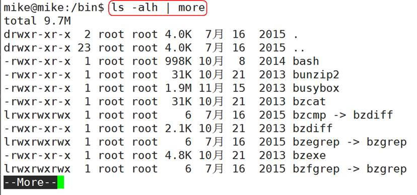
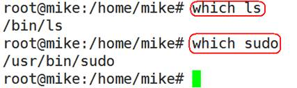
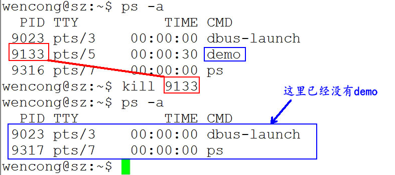
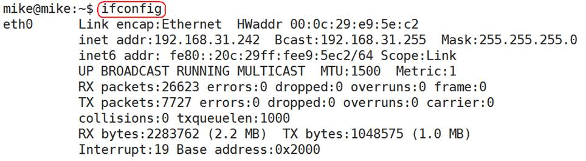

[TOC]

### 3.常用命令

#### 3.1 概述

l 很多人可能在电视或电影中看到过类似的场景，黑客面对一个黑色的屏幕，上面飘着密密麻麻的字符，梆梆一顿敲，就完成了窃取资料的任务。

l Linux 刚出世时没有什么图形界面，所有的操作全靠命令完成，就如同电视里的黑客那样，充满了神秘与晦涩。

l 近几年来，尽管 Linux 发展得非常迅速，图形界面越来越友好，但是在真正的开发过程中，Linux 命令行的应用还是占有非常重要的席位，而且许多Linux功能在命令行界面要比图形化界面下运行的快。可以说不会命令行，就不算会 Linux。

l Linux 提供了大量的命令，利用它可以有效地完成大量的工作，如磁盘操作、文件存取、目录操作、进程管理、文件权限设定等。Linux 发行版本最少的命令也有 200 多个，这里只介绍比较重要和使用频率最多的命令。

 

#### 3.2 命令使用方法

##### 3.2.1 Linux 命令格式

command [-options] [parameter1] … 

说明：

l command：命令名，相应功能的英文单词或单词的缩写

l [-options]：选项，可用来对命令进行控制，也可以省略，[]代表可选

l parameter1 …：传给命令的参数，可以是零个一个或多个

 

##### 3.2.2 查看帮助文档

###### 1) --help

一般是 Linux 命令自带的帮助信息，并不是所有命令都自带这个选项。

 

如我们想查看命令 ls 的用法：**ls --help**

 

###### 2) man(有问题找男人)

man 是 Linux 提供的一个手册，包含了绝大部分的命令、函数使用说明。

 

该手册分成很多章节（section），使用 man 时可以指定不同的章节来浏览不同的内容。

**man** **中各个 section 意义如下：**

- 1．Standard commands（标准命令）
- 2．System calls（系统调用，如open,write）
- 3．Library functions（库函数，如printf,fopen）

- 4．Special devices（设备文件的说明，/dev下各种设备）

- 5．File formats（文件格式，如passwd）
- 6．Games and toys（游戏和娱乐）

- 7．Miscellaneous（杂项、惯例与协定等，例如Linux档案系统、网络协定、ASCII 码；environ全局变量）

- 8．Administrative Commands（管理员命令，如ifconfig）

 

 

man使用格式如下：

man [选项] 命令名

 

man设置了如下的功能键：

| **功能键** | **功能**             |
| ---------- | -------------------- |
| 空格键     | 显示手册页的下一屏   |
| Enter键    | 一次滚动手册页的一行 |
| b          | 回滚一屏             |
| f          | 前滚一屏             |
| q          | 退出man命令          |
| h          | 列出所有功能键       |
| /word      | 搜索word字符串       |

 

如，我们想查看 ls 的用法：**man 1 ls** ( 1：为数字“1”，代表第 1 个 section，标准命令 )

 

实际上，我们不用指定第几个章节也用查看，如，**man ls**。但是，有这个一种情况，假如，命令的名字和函数的名字刚好重名（如：printf），它既是命令，也可以是库函数，如果，我们不指定章节号，man printf，它只查看命令的用法，不会查询函数的用法，因为 man 是按照手册的章节号的顺序进行搜索的。

 

所以，使用 man 手册时，最好指定章节号：

 

##### 3.2.3 使用技巧

###### 1) 自动补全

在敲出命令的前几个字母的同时，按下tab键，系统会自动帮我们补全命令。

 

###### 2) 历史命令

当系统执行过一些命令后，可按上下键翻看以前的命令，history将执行过的命令列举出来。

 

#### 3.3 常用命令

##### 3.3.1 文件管理

###### 1) 查看文件信息：ls

ls是英文单词list的简写，其功能为列出目录的内容，是用户最常用的命令之一，它类似于DOS下的dir命令。

 

Linux文件或者目录名称最长可以有256个字符，“.”代表当前目录，“..”代表上一级目录，以“.”开头的文件为隐藏文件，需要用 -a 参数才能显示。

 

ls常用参数：

| **参数** | **含义**                                     |
| -------- | -------------------------------------------- |
| -a       | 显示指定目录下所有子目录与文件，包括隐藏文件 |
| -l       | 以列表方式显示文件的详细信息                 |
| -h       | 配合 -l 以人性化的方式显示文件大小           |

 

 

图中列出的信息含义如下图所示：

 

与DOS下的文件操作类似，在Unix/Linux系统中，也同样允许使用特殊字符来同时引用多个文件名，这些特殊字符被称为通配符。

| **通配符** | **含义**                                                     |
| ---------- | ------------------------------------------------------------ |
| *          | 文件代表文件名中所有字符                                     |
| ls te*     | 查找以te开头的文件                                           |
| ls *html   | 查找结尾为html的文件                                         |
| ？         | 代表文件名中任意一个字符                                     |
| ls ?.c     | 只找第一个字符任意，后缀为.c的文件                           |
| ls a.?     | 只找只有3个字符，前2字符为a.，最后一个字符任意的文件         |
| []         | [”和“]”将字符组括起来，表示可以匹配字符组中的任意一个。“-”用于表示字符范围。 |
| [abc]      | 匹配a、b、c中的任意一个                                      |
| [a-f]      | 匹配从a到f范围内的的任意一个字符                             |
| ls [a-f]*  | 找到从a到f范围内的的任意一个字符开头的文件                   |
| ls a-f     | 查找文件名为a-f的文件,当“-”处于方括号之外失去通配符的作用    |
| \          | 如果要使通配符作为普通字符使用，可以在其前面加上转义字符。“?”和“*”处于方括号内时不用使用转义字符就失去通配符的作用。 |
| ls \*a     | 查找文件名为*a的文件                                         |

 

###### 2) 输出重定向命令：>

Linux允许将命令执行结果重定向到一个文件，本应显示在终端上的内容保存到指定文件中。

 

如：**ls > test.txt** ( test.txt 如果不存在，则创建，存在则覆盖其内容 )

 

**>**输出重定向会覆盖原来的内容，**>>**输出重定向则会追加到文件的尾部。

 

###### 3) 分屏显示：more

查看内容时，在信息过长无法在一屏上显示时，会出现快速滚屏，使得用户无法看清文件的内容，此时可以使用more命令，每次只显示一页，按下空格键可以显示下一页，按下q键退出显示，按下h键可以获取帮助。

 

###### 4) 管道：|

管道：一个命令的输出可以通过管道做为另一个命令的输入。

 

管道我们可以理解现实生活中的管子，管子的一头塞东西进去，另一头取出来，这里“ | ”的左右分为两端，左端塞东西(写)，右端取东西(读)。

######  5)清屏：clear 

clear作用为清除终端上的显示(类似于DOS的cls清屏功能)，也可使用快捷键：Ctrl + l ( “l” 为字母 )。

 

###### 6) 切换工作目录： cd 

在使用Unix/Linux的时候，经常需要更换工作目录。cd命令可以帮助用户切换工作目录。Linux所有的目录和文件名大小写敏感。

 

cd后面可跟绝对路径，也可以跟相对路径。如果省略目录，则默认切换到当前用户的主目录。

 

| **命令** | **含义**                                                     |
| -------- | ------------------------------------------------------------ |
| cd       | 切换到当前用户的主目录(/home/用户目录)，用户登陆的时候，默认的目录就是用户的主目录。 |
| cd ~     | 切换到当前用户的主目录(/home/用户目录)                       |
| cd .     | 切换到当前目录                                               |
| cd ..    | 切换到上级目录                                               |
| cd -     | 可进入上一个进入的目录                                       |

 

 

**注意：**如果路径是从根路径开始的，则路径的前面需要加上 “ / ”，如 “ /mnt ”，通常进入某个目录里的文件夹，前面不用加 “ / ”。

 

###### 7) 显示当前路径：pwd

使用pwd命令可以显示当前的工作目录，该命令很简单，直接输入pwd即可，后面不带参数。

 

###### 8) 创建目录：mkdir

通过mkdir命令可以创建一个新的目录。参数-p可递归创建目录。

 

 

需要注意的是新建目录的名称不能与当前目录中已有的目录或文件同名，并且目录创建者必须对当前目录具有写权限。

 

 

###### 9) 删除目录：rmdir

可使用rmdir命令删除一个目录。必须离开目录，并且目录必须为空目录，不然提示删除失败。

 

###### 10) 删除文件：rm

可通过rm删除文件或目录。使用rm命令要小心，因为文件删除后不能恢复。为了防止文件误删，可以在rm后使用-i参数以逐个确认要删除的文件。

 

常用参数及含义如下表所示：

| **参数** | **含义**                                         |
| -------- | ------------------------------------------------ |
| -i       | 以进行交互式方式执行                             |
| -f       | 强制删除，忽略不存在的文件，无需提示             |
| -r       | 递归地删除目录下的内容，删除文件夹时必须加此参数 |

 

 

 

###### 11) 建立链接文件：ln

l Linux链接文件类似于Windows下的快捷方式。

l 链接文件分为软链接和硬链接。

l 软链接：软链接不占用磁盘空间，源文件删除则软链接失效。

l 硬链接：硬链接只能链接普通文件，不能链接目录。

 

使用格式：

ln 源文件 链接文件

ln -s 源文件 链接文件

 

如果没有-s选项代表建立一个硬链接文件，两个文件占用相同大小的硬盘空间，即使删除了源文件，链接文件还是存在，所以-s选项是更常见的形式。

 

注意：如果软链接文件和源文件不在同一个目录，源文件要使用绝对路径，不能使用相对路径。

 

###### 12) 查看或者合并文件内容：cat

 

###### 13) 文本搜索：grep

Linux系统中grep命令是一种强大的文本搜索工具，grep允许对文本文件进行模式查找。如果找到匹配模式， grep打印包含模式的所有行。

 

grep一般格式为：

grep [-选项] ‘搜索内容串’文件名

 

在grep命令中输入字符串参数时，最好引号或双引号括起来。例如：grep‘a ’1.txt。

 

常用选项说明：

| **选项** | **含义**                                 |
| -------- | ---------------------------------------- |
| -v       | 显示不包含匹配文本的所有行（相当于求反） |
| -n       | 显示匹配行及行号                         |
| -i       | 忽略大小写                               |

 

grep搜索内容串可以是正则表达式。

 

正则表达式是对字符串操作的一种逻辑公式，就是用事先定义好的一些特定字符、及这些特定字符的组合，组成一个“规则字符串”，这个“规则字符串”用来表达对字符串的一种过滤逻辑。

 

grep常用正则表达式：

| **参数**     | **含义**                                                     |
| ------------ | ------------------------------------------------------------ |
| ^a           | 行首,搜寻以 m 开头的行  grep -n '^a' 1.txt                   |
| ke$          | 行尾,搜寻以 ke 结束的行  grep -n 'ke$' 1.txt                 |
| [Ss]igna[Ll] | 匹配 [] 里中一系列字符中的一个  搜寻匹配单词signal、signaL、Signal、SignaL的行  grep -n '[Ss]igna[Ll]' 1.txt |
| . (点)       | 匹配一个非换行符的字符  匹配 e 和 e 之间有任意一个字符，可以匹配 eee，eae，eve，但是不匹配 ee，eaae  grep -n 'e.e' 1.txt |

 

 

###### 14) 计算文件行数或字数：wc

常用选项说明：

| **选项** | **含义**                                                     |
| -------- | ------------------------------------------------------------ |
| -l       | 统计行数                                                     |
| -w       | 统计字数。一个字被定义为由空白、跳格或换行字符分隔的字符串。 |
| -c       | 统计字节数                                                   |
| -m       | 统计字符数。这个标志不能与 -c 标志一起使用。                 |

###### 15) 查找文件：find

find命令功能非常强大，通常用来在特定的目录下搜索符合条件的文件，也可以用来搜索特定用户属主的文件。

 

常用用法：

| **命令**                    | **含义**                               |
| --------------------------- | -------------------------------------- |
| find ./ -name test.sh       | 查找当前目录下所有名为test.sh的文件    |
| find ./ -name '*.sh'        | 查找当前目录下所有后缀为.sh的文件      |
| find ./ -name "[A-Z]*"      | 查找当前目录下所有以大写字母开头的文件 |
| find /tmp -size   2M        | 查找在/tmp 目录下等于2M的文件          |
| find /tmp -size   +2M       | 查找在/tmp 目录下大于2M的文件          |
| find /tmp -size   -2M       | 查找在/tmp 目录下小于2M的文件          |
| find ./ -size +4k -size -5M | 查找当前目录下大于4k，小于5M的文件     |
| find ./ -perm 0777          | 查找当前目录下权限为 777 的文件或目录  |

 

###### 16) 拷贝文件：cp

cp命令的功能是将给出的文件或目录复制到另一个文件或目录中，相当于DOS下的copy命令。

 

常用选项说明：

| **选项** | **含义**                                                     |
| -------- | ------------------------------------------------------------ |
| -a       | 该选项通常在复制目录时使用，它保留链接、文件属性，并递归地复制目录，简单而言，保持文件原有属性。 |
| -f       | 删除已经存在的目标文件而不提示                               |
| -i       | 交互式复制，在覆盖目标文件之前将给出提示要求用户确认         |
| -r       | 若给出的源文件是目录文件，则cp将递归复制该目录下的所有子目录和文件，目标文件必须为一个目录名。 |
| -v       | 显示拷贝进度                                                 |

 

**cp vim_configure/ code/ -ivr** 把文件夹 vim_configure 拷贝到 code 目录里：

 

###### 17) 移动文件：mv

用户可以使用mv命令来移动文件或目录，也可以给文件或目录重命名。

 

常用选项说明：

| **选项** | **含义**                                                     |
| -------- | ------------------------------------------------------------ |
| -f       | 禁止交互式操作，如有覆盖也不会给出提示                       |
| -i       | 确认交互方式操作，如果mv操作将导致对已存在的目标文件的覆盖，系统会询问是否重写，要求用户回答以避免误覆盖文件 |
| -v       | 显示移动进度                                                 |

 

###### 18) 获取文件类型：file

Linux系统文件类型不是根据文件扩展名分类的，通过file命令可以确认文件具体类型。

 

 

###### 19) 归档管理：tar

计算机中的数据经常需要备份，tar是Unix/Linux中最常用的备份工具，此命令可以把一系列文件归档到一个大文件中，也可以把档案文件解开以恢复数据。

 

tar使用格式

tar [参数] 打包文件名 文件

 

tar命令很特殊，其参数前面可以使用“-”，也可以不使用。

 

常用参数：

| **参数** | **含义**                                                  |
| -------- | --------------------------------------------------------- |
| -c       | 生成档案文件，创建打包文件                                |
| -v       | 列出归档解档的详细过程，显示进度                          |
| -f       | 指定档案文件名称，f后面一定是.tar文件，所以必须放选项最后 |
| -t       | 列出档案中包含的文件                                      |
| -x       | 解开档案文件                                              |

 

注意：除了f需要放在参数的最后，其它参数的顺序任意。

 

 

###### 20) 文件压缩解压：gzip

l tar与gzip命令结合使用实现文件打包、压缩。

l tar只负责打包文件，但不压缩，用gzip压缩tar打包后的文件，其扩展名一般用xxxx.tar.gz。

 

gzip使用格式如下：

gzip [选项] 被压缩文件

 

常用选项：

| **选项** | **含义**       |
| -------- | -------------- |
| -d       | 解压           |
| -r       | 压缩所有子目录 |

 

tar这个命令并没有压缩的功能，它只是一个打包的命令，但是在tar命令中增加一个选项(-z)可以调用gzip实现了一个压缩的功能，实行一个先打包后压缩的过程。

 

**压缩用法：**tar cvzf 压缩包包名 文件1 文件2 ...

| -z   | 指定压缩包的格式为：file.tar.gz |
| ---- | ------------------------------- |
|      |                                 |

 

例如：**tar zcvf test.tar.gz 1.c 2.c 3.c 4.c**把 1.c 2.c 3.c 4.c 压缩成 test.tar.gz

 

**解压用法：** tar zxvf 压缩包包名

| **参数** | **含义**                        |
| -------- | ------------------------------- |
| -z       | 指定压缩包的格式为：file.tar.gz |

 

 

**解压到指定目录：**-C （大写字母“C”）

 

例子：tar -xvf new.tar.gz -C ./test/ 将 new.tar.gz 解压到当前目录下的 test 目录下：

 

###### 21) 文件压缩解压：bzip2

l tar与bzip2命令结合使用实现文件打包、压缩(用法和gzip一样)。

l tar只负责打包文件，但不压缩，用bzip2压缩tar打包后的文件，其扩展名一般用xxxx.tar.bz2。

l 在tar命令中增加一个选项(-j)可以调用bzip2实现了一个压缩的功能，实行一个先打包后压缩的过程。

l 压缩用法：tar cjvf 压缩包包名 文件...(tar jcvf bk.tar.bz2 *.c)

l 解压用法：tar xjvf 压缩包包名 (tar jxvf bk.tar.bz2)

 

###### 22) 文件压缩解压：zip、unzip

l 通过zip压缩文件的目标文件不需要指定扩展名，默认扩展名为zip。

l 压缩文件：zip [-r] 目标文件(没有扩展名) 源文件

l 解压文件：unzip -d 解压后目录文件 压缩文件

 

###### 23) 查看命令位置：which

 

##### 3.3.2 用户、权限管理

l 用户是Unix/Linux系统工作中重要的一环，用户管理包括用户与组账号的管理。

l 在Unix/Linux系统中，不论是由本机或是远程登录系统，每个系统都必须拥有一个账号，并且对于不同的系统资源拥有不同的使用权限。

l Unix/Linux系统中的root账号通常用于系统的维护和管理，它对Unix/Linux操作系统的所有部分具有不受限制的访问权限。

l 在Unix/Linux安装的过程中，系统会自动创建许多用户账号，而这些默认的用户就称为“标准用户”。

l 在大多数版本的Unix/Linux中，都不推荐直接使用root账号登录系统。

###### 1) 查看当前用户：whoami

whoami该命令用户查看当前系统当前账号的用户名。可通过**cat /etc/passwd**查看系统用户信息。

 

由于系统管理员通常需要使用多种身份登录系统，例如通常使用普通用户登录系统，然后再以su命令切换到root身份对传统进行管理。这时候就可以使用whoami来查看当前用户的身份。

 

###### 2) 查看登录用户：who

who命令用于查看当前所有登录系统的用户信息。

 

常用选项：

| **选项**      | **含义**                                           |
| ------------- | -------------------------------------------------- |
| -m或am I      | 只显示运行who命令的用户名、登录终端和登录时间      |
| -q或--count   | 只显示用户的登录账号和登录用户的数量               |
| -u            | 在登录时间后显示该用户最后一次操作到当前的时间间隔 |
| -u或--heading | 显示列标题                                         |

 

 

###### 3) 查看登录用户：w

w命令也可以查看登录当前系统的用户信息。与who命令相比，w命令的功能更强大，它不但可以显示当前有哪些用户登录到系统，还可以显示这些用户正在进行的操作，并给出更加详细和科学的统计数据。

 

w命令的格式如下：

w [选项] [用户名]

 

如果w命令携带用户名，则只显示指定用户的信息，否则显示当前所有登录用户的信息。

 

常用选项：

| **选项** | **含义**                                       |
| -------- | ---------------------------------------------- |
| -h       | 只显示运行who命令的用户名、登录终端和登录时间  |
| -l       | 显示详细信息列表，此为预设值                   |
| -s       | 使用短列表，不显示用户登录时间、JCPU和PCPU时间 |
| -u       | 忽略执行程序的名称，以及该程序的PCPU时间       |

 

###### 4) 退出登录账户： exit

l 如果是图形界面，退出当前终端；

l 如果是使用ssh远程登录，退出登陆账户；

l 如果是切换后的登陆用户，退出则返回上一个登陆账号。

 

###### 5) 切换用户：su

可以通过su命令切换用户，su后面可以加“-”。su和su –命令不同之处在于，su -切换到对应的用户时会将当前的工作目录自动转换到切换后的用户主目录：

**注意：**如果是ubuntu平台，需要在命令前加“sudo”，如果在某些操作需要管理员才能操作，ubuntu无需切换到root用户即可操作，只需加“sudo”即可。sudo是ubuntu平台下允许系统管理员让普通用户执行一些或者全部的root命令的一个工具，减少了root 用户的登陆和管理时间，提高了安全性。

 

| **命令**      | **含义**                                   |
| ------------- | ------------------------------------------ |
| su            | 切换到root用户                             |
| su root       | 切换到root用户                             |
| su -          | 切换到root用户，同时切换目录到/root        |
| su - root     | 切换到root用户，同时切换目录到/root        |
| su 普通用户   | 切换到普通用户                             |
| su - 普通用户 | 切换到普通用户，同时切换普通用户所在的目录 |

 

###### 6) 添加、删除组账号：groupadd、groupdel

l groupadd 新建组账号

l groupdel 组账号

l cat /etc/group 查看用户组

 

###### 7) 修改用户所在组：usermod

使用方法：usermod -g 用户组 用户名

 

###### 8) 添加用户账号：useradd

在Unix/Linux中添加用户账号可以使用adduser或useradd命令，因为adduser命令是指向useradd命令的一个链接，因此，这两个命令的使用格式完全一样。

 

useradd命令的使用格式如下：

useradd [参数] 新建用户账号

 

| **参数**     | **含义**                                                     |
| ------------ | ------------------------------------------------------------ |
| -d <dirname> | 指定用户登录系统时的主目录，如果不使用该参数，系统自动在/home目录下建立与用户名同名目录为主目录 |
| -m           | 自动建立目录                                                 |
| -g           | 指定组名称                                                   |

 

相关说明：

l Linux每个用户都要有一个主目录，主目录就是第一次登陆系统，用户的默认当前目录(/home/用户)；

l 每一个用户必须有一个主目录，所以用useradd创建用户的时候，一定给用户指定一个主目录；

l 用户的主目录一般要放到根目录的home目录下，用户的主目录和用户名是相同的；

l 如果创建用户的时候，不指定组名，那么系统会自动创建一个和用户名一样的组名。

 

| **命令**                        | **含义**                                                     |
| ------------------------------- | ------------------------------------------------------------ |
| useradd -d /home/abc abc -m     | 创建abc用户，如果/home/abc目录不存在，就自动创建这个目录，同时用户属于abc组 |
| useradd -d /home/a a -g test -m | 创建一个用户名字叫a，主目录在/home/a，如果主目录不存在，就自动创建主目录，同时用户属于test组 |
| cat /etc/passwd                 | 查看系统当前用户名                                           |

 

###### 9) 设置用户密码：passwd

在Unix/Linux中，超级用户可以使用passwd命令为普通用户设置或修改用户口令。用户也可以直接使用该命令来修改自己的口令，而无需在命令后面使用用户名。

 

###### 10) 删除用户：userdel

| **命令**               | **含义**                                |
| ---------------------- | --------------------------------------- |
| userdel abc(用户名)    | 删除abc用户，但不会自动删除用户的主目录 |
| userdel -r abc(用户名) | 删除用户，同时删除用户的主目录          |

 

###### 11) 查询用户登录情况：last

不管是哪位用户从哪里登录，管理员都可以通过last命令查出，以及是否有人非法登录。

 

###### 12) 修改文件权限：chmod

chmod 修改文件权限有两种使用格式：字母法与数字法。

 

**字母法：**chmod u/g/o/a +/-/= rwx 文件

| **[   u/g/o/a ]** | **含义**                                                   |
| ----------------- | ---------------------------------------------------------- |
| u                 | user 表示该文件的所有者                                    |
| g                 | group 表示与该文件的所有者属于同一组(  group )者，即用户组 |
| o                 | other 表示其他以外的人                                     |
| a                 | all 表示这三者皆是                                         |

 

| **[ +-= ]** | **含义** |
| ----------- | -------- |
| +           | 增加权限 |
| -           | 撤销权限 |
| =           | 设定权限 |

 

| **rwx** | **含义**                                                     |
| ------- | ------------------------------------------------------------ |
| r       | read 表示可读取，对于一个目录，如果没有r权限，那么就意味着不能通过ls查看这个目录的内容。 |
| w       | write 表示可写入，对于一个目录，如果没有w权限，那么就意味着不能在目录下创建新的文件。 |
| x       | excute 表示可执行，对于一个目录，如果没有x权限，那么就意味着不能通过cd进入这个目录。 |

 

**chmod o+w file** 给文件file的其它用户增加写权限：

 

**chmod u-r file** 给文件file的拥有者减去读的权限：

 

**chmod g=x file**设置文件file的同组用户的权限为可执行，同时去除读、写权限：

**数字法：**“rwx” 这些权限也可以用数字来代替

| r    | 读取权限，数字代号为 "4"     |
| ---- | ---------------------------- |
| w    | 写入权限，数字代号为 "2"     |
| x    | 执行权限，数字代号为 "1"     |
| -    | 不具任何权限，数字代号为 "0" |

 

如执行：chmod u=rwx,g=rx,o=r filename 

就等同于：chmod u=7,g=5,o=4 filename

 

**chmod 751 file****：**

l 文件所有者：读、写、执行权限

l 同组用户：读、执行的权限

l 其它用户：执行的权限

 

chmod 777 file：所有用户拥有读、写、执行权限

 

注意：如果想递归所有目录加上相同权限，需要加上参数“ -R ”。

如：chmod 777 test/ -R 递归 test 目录下所有文件加 777 权限。

 

###### 13) 修改文件所有者：chown

使用方法：chown 用户名 文件或目录名

 

###### 14) 修改文件所属组：chgrp

使用方法：chgrp 用户组名 文件或目录名

 

##### 3.3.3 系统管理

###### 1) 查看当前日历：cal

cal命令用于查看当前日历，-y显示整年日历：

 

 

###### 2) 显示或设置时间：date

设置时间格式（需要管理员权限）：

date [MMDDhhmm[[CC]YY][.ss]] +format

 

CC为年前两位yy为年的后两位，前两位的mm为月，后两位的mm为分钟，dd为天，hh为小时，ss为秒。如： date 010203042016.55。

 

显示时间格式（date '+%y,%m,%d,%H,%M,%S'）：

| **format****格式** | **含义** |
| ------------------ | -------- |
| %Y，%y             | 年       |
| %m                 | 月       |
| %d                 | 日       |
| %H                 | 时       |
| %M                 | 分       |
| %S                 | 秒       |

 

 

###### 3) 查看进程信息：ps

进程是一个具有一定独立功能的程序，它是操作系统动态执行的基本单元。

 

ps命令可以查看进程的详细状况，常用选项(选项可以不加“-”)如下：

| **选项** | **含义**                                 |
| -------- | ---------------------------------------- |
| -a       | 显示终端上的所有进程，包括其他用户的进程 |
| -u       | 显示进程的详细状态                       |
| -x       | 显示没有控制终端的进程                   |
| -w       | 显示加宽，以便显示更多的信息             |
| -r       | 只显示正在运行的进程                     |

 

 

###### 4) 动态显示进程：top

top命令用来动态显示运行中的进程。top命令能够在运行后，在指定的时间间隔更新显示信息。可以在使用top命令时加上-d <interval>来指定显示信息更新的时间间隔。

 

在top命令执行后，可以按下按键得到对显示的结果进行排序：

| **按键** | **含义**                           |
| -------- | ---------------------------------- |
| M        | 根据内存使用量来排序               |
| P        | 根据CPU占有率来排序                |
| T        | 根据进程运行时间的长短来排序       |
| U        | 可以根据后面输入的用户名来筛选进程 |
| K        | 可以根据后面输入的PID来杀死进程。  |
| q        | 退出                               |
| h        | 获得帮助                           |

 

 

###### 5) 终止进程：kill

kill命令指定进程号的进程，需要配合 ps 使用。

 

使用格式：

kill [-signal] pid

 

信号值从0到15，其中9为绝对终止，可以处理一般信号无法终止的进程。

 

**kill 9133** ：9133 为应用程序所对应的进程号

 

有些进程不能直接杀死，这时候我们需要加一个参数“ -9 ”，“ -9 ” 代表强制结束：

 

###### 6) 后台程序：&、jobs、fg

l 用户可以将一个前台执行的程序调入后台执行，方法为：命令 &

l 如果程序已经在执行，ctrl+z可以将程序调入后台

l jobs查看后台运行程序

l fg编号（编号为通过jobs查看的编号），将后台运行程序调出到前台

 

###### 7) 关机重启：reboot、shutdown、init

| **命令**          | **含义**                                   |
| ----------------- | ------------------------------------------ |
| reboot            | 重新启动操作系统                           |
| shutdown –r now   | 重新启动操作系统，shutdown会给别的用户提示 |
| shutdown -h now   | 立刻关机，其中now相当于时间为0的状态       |
| shutdown -h 20:25 | 系统在今天的20:25 会关机                   |
| shutdown -h +10   | 系统再过十分钟后自动关机                   |
| init 0            | 关机                                       |
| init 6            | 重启                                       |

 

###### 8) 字符界面和图形界面切换

在redhat平台下，可通过命令进行切换：

| init 3 | 切换到字符界面 |
| ------ | -------------- |
| init 5 | 切换到图形界面 |

 

通过快捷键切换（适用大部分平台）：

| Ctrl + Alt + F2 | 切换到字符界面 |
| --------------- | -------------- |
| Ctrl + Alt + F7 | 切换到图形界面 |

 

###### 9) 检测磁盘空间：df

df命令用于检测文件系统的磁盘空间占用和空余情况，可以显示所有文件系统对节点和磁盘块的使用情况。

 

| **选项** | **含义**                             |
| -------- | ------------------------------------ |
| -a       | 显示所有文件系统的磁盘使用情况       |
| -m       | 以1024字节为单位显示                 |
| -t <fs>  | 显示各指定文件系统的磁盘空间使用情况 |
| -T       | 显示文件系统                         |

 

 

###### 10) 检测目录所占磁盘空间：du

du命令用于统计目录或文件所占磁盘空间的大小，该命令的执行结果与df类似，du更侧重于磁盘的使用状况。

 

du命令的使用格式如下：

du [选项] 目录或文件名

 

| **选项** | **含义**                                           |
| -------- | -------------------------------------------------- |
| -a       | 递归显示指定目录中各文件和子目录中文件占用的数据块 |
| -s       | 显示指定文件或目录占用的数据块                     |
| -b       | 以字节为单位显示磁盘占用情况                       |
| -l       | 计算所有文件大小，对硬链接文件计算多次             |

 

 

###### 11) 格式化：mkfs

mkfs命令相当于DOS/Windows系统中的格式化命令，用于创建指定的文件系统。

 

使用格式如下：

mkfs [选项] 设备文件名 [blocks]

 

| **选项** | **含义**                               |
| -------- | -------------------------------------- |
| -V       | 详细显示模式                           |
| -t <.fs> | 指定文件系统类型，默认值为 ext2        |
| -c       | 在创建文件系统的同时，进行磁盘坏块检查 |
| blocks   | 文件系统块的大小                       |

 

###### 12) 应用软件安装和卸载

在 Linux 操作系统下，几乎所有的软件均通过RPM 进行安装、卸载及管理等操作。RPM 的全称为Redhat Package Manager ，是由Redhat公司提出的，用于管理Linux下软件包的软件。它是一种软件打包发行并且实现自动安装的程序，需要用rpm程序安装的软件包，其后缀是.rpm，并可以对这种程序包进行安装、卸装和维护。

 

rpm命令的使用格式如下：

rpm  [选项] [软件包名]

 

| **选项** | **含义**                             |
| -------- | ------------------------------------ |
| -i       | 指定安装的软件包                     |
| -h       | 使用“#”显示详细的安装过程及进度      |
| -v       | 显示安装的详细信息                   |
| -q       | 查询系统是否已安装指定的软件包       |
| -a       | 查看系统已安装的所有软件包           |
| -e       | 卸载软件包                           |
| --nodeps | 配合-e参数使用，强制卸载不检查依赖项 |
| --force  | 强制操作 如强制安装删除等            |

 

如果是在ubuntu平台，软件的安装可以通过互联网在线安装，更加方便快捷：

| **命令**                 | **含义**               |
| ------------------------ | ---------------------- |
| sudo apt-get update      | 获得最新的软件包的列表 |
| sudo apt-get install xxx | 从源中安装xxx软件      |
| sudo apt-get remove xxx  | 删除xxx软件            |

 

 

###### 13) 查看或配置网卡信息：ifconfig

如果，我们只是敲：ifconfig，它会显示所有网卡的信息：

| **显示字段** | **说明**                                                     |
| ------------ | ------------------------------------------------------------ |
| eth0         | 网络接口名称                                                 |
| Link encap   | 链路封装协议                                                 |
| Hwaddr       | 网络接口的MAC地址                                            |
| Inet addr    | IP地址                                                       |
| Bcast        | 广播地址                                                     |
| Mask         | 子网掩码                                                     |
| UP           | 网络接口状态标识，UP已经启用，DOWN已经停用                   |
| BROADCAST    | 广播标识，标识网络接口是否支持广播                           |
| RUNNING      | 传输标识，标识网络接口是否已经开始传输分组数据               |
| MULTICAST    | 多播标识，标识网络接口是否支持多播                           |
| MTU，Metric  | MTU:最大传输单位，单位：字节。Metric:度量值，用于RIP建立网络路由用 |
| RX bytes     | 接收数据字节统计                                             |
| TX bytes     | 发送数据字节统计                                             |

 

我们可以通过ifconfig配置网络参数：

l 只有root才能用ifconfig配置参数，其他用户只能查看网络配置

l ifconfig 网络接口名称 [地址协议类型] [address] [参数]

l 地址协议类型如：inet(IPv4),inet6(IPv6)等

l 如:ifconfig eth0 inet 192.168.10.254 netmask 255.255.255.0 up

 

常用参数：

| **参数**           | **功能**             |
| ------------------ | -------------------- |
| -a                 | 显示所有网络接口状态 |
| inet [IP地址]      | 设置IP地址           |
| netmask [子网掩码] | 设置子网掩码         |
| up                 | 启用网络接口         |
| down               | 关闭网络接口         |

 

ifconfig配置的网络参数在内存中，计算机重新启动之后就失效了，如果需要持久有效就需要修改网络接口的配置文件：

l redhat修改/etc/sysconfig/network-scripts/ifcfg-eth0文件

IPADDR=IP地址

GATEWAY=默认网关

l ubuntu修改/etc/NetworkManager/system-connections/Wired connection 1文件

[ipv4]

method=manual

addresses1=IP地址;24;默认网关;

 

 

###### 14) 测试远程主机连通性：ping

l ping通过ICMP协议向远程主机发送ECHO_REQUEST请求，期望主机回复ECHO_REPLY消息

l 通过ping命令可以检查是否与远程主机建立了TCP/IP连接

 

使用方法：ping [参数] 远程主机IP地址

| **参数** | **功能**                                                 |
| -------- | -------------------------------------------------------- |
| -a       | 每次相应时都发出声音警示                                 |
| -A       | 表示以实际往返相应时间为间隔，连续发送消息               |
| -f       | 连续不断发送消息，不管是否收到相应                       |
| -n       | 只显示主机IP，不需要把IP解释成主机名                     |
| -c       | 发送指定次数数据报信息后停止，ping -c 5 192.168.10.254   |
| -i       | 每次发送消息时间间隔，默认一秒，ping -i 2 192.168.10.254 |
| -s       | 分组数据大小，默认56字节                                 |
| -w       | 以秒为单位的超时值，一旦超时，就立即停止                 |

 

###### 15) 网络路由设置：route

route可以增加，修改，显示路由信息，使用格式如下：

route [-v] [-A family] add default [gw 默认网关地址] [[dev interface]]

 

| **参数** | **功能**                           |
| -------- | ---------------------------------- |
| add      | 增加路由信息                       |
| del      | 删除路由信息                       |
| -v       | 显示路由信息                       |
| -A       | 指定网络协议inet(IPv4),inet6(IPv6) |
| gw       | 指定默认网关地址                   |
| dev      | 指定网络接口                       |

 

示例：route add default gw 192.168.1.1 dev eth0

 

###### 16) 监控网络状态：netstat

netstat命令监控网络状态，包括接口设置，IP路由，各种网络协议的统计，netstat输出信息说明如下：

| **字段**        | **说明**                                             |
| --------------- | ---------------------------------------------------- |
| Proto           | 协议,如：tcp,udp                                     |
| Recv-Q          | 尚未读取的数据字节数                                 |
| Send-Q          | 尚未发送的数据字节数                                 |
| Local_address   | 本地主机地址与端口号                                 |
| Foreign_address | 远程主机与端口号                                     |
| State           | 网络连接状态                                         |
| RefCnt          | 引用计数，表示加接到相应套接字的进程数量             |
| Flags           | 标志字段                                             |
| Type            | 套接字类型,如：（SOCK_DGRAM, SOCK_STREAM，SOCK_RAW） |
| State           | 套接字状态                                           |
| Path            | 套接字路径名                                         |

 

netstat常用命令参数：

| **参数** | **功能**                                                   |
| -------- | ---------------------------------------------------------- |
| -a       | 列出所有端口                                               |
| -i       | 显示网络接口列表                                           |
| -at      | 所有tcp端口                                                |
| -au      | 所有udp端口                                                |
| -l       | 所有监听端口                                               |
| -lt      | tcp监听端口                                                |
| -lu      | 指定网络接口                                               |
| -s       | 显示所有协议统计信息                                       |
| -r       | 当前路由状态                                               |
| -p       | 输出中显示 PID 和进程名称，可以与其它开关一起使用，如：-pt |

 