[TOC]

### 5. 远程操作

#### 5.1 SSH介绍

 

SSH为Secure Shell的缩写，由 IETF 的网络工作小组（Network Working Group）所制定；SSH 为建立在应用层和传输层基础上的安全协议。

 

SSH是目前较可靠，专为远程登录会话和其他网络服务提供安全性的协议。**常用于远程登录，以及用户之间进行资料拷贝**。

 

利用SSH协议可以有效防止远程管理过程中的信息泄露问题。SSH最初是 UNIX 系统上的一个程序，后来又迅速扩展到其他操作平台。SSH 在正确使用时可弥补网络中的漏洞。SSH 客户端适用于多种平台。几乎所有 UNIX 平台—包括 HP-UX、Linux、AIX、Solaris、Digital UNIX、Irix，以及其他平台，都可运行SSH。

 

使用SSH服务，需要安装相应的服务器和客户端。**客户端和服务器的关系：**如果，A机器想被B机器远程控制，那么，A机器需要安装SSH服务器，B机器需要安装SSH客户端。

 

#### 5.2 远程登录

##### 5.2.1 Linux平台相互远程

操作命令：ssh -l username hostip

| **参数** | **含义**                      |
| -------- | ----------------------------- |
| -l       | 选项， 是字母“l”，不是数字“1” |
| username | 被远程登录的用户名            |
| hostip   | 被远程登录的ip地址            |

 

注意：远程登录的两台机器必须要能ping通（平通）。

 

首先，查看需要被远程机器的ip：

 

远程登录(这里是用户 wencong ( A 机器 ) 远程登录 edu ( B 机器 ) )， 可以不用sudo ：

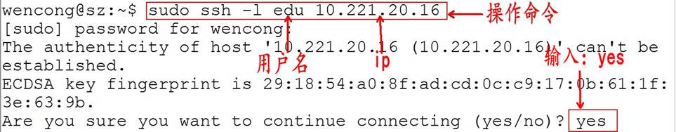

 

SSH 告知用户，这个主机不能识别，这时键入"yes"，SSH 就会将相关信息，写入" ~/.ssh/know_hosts" 中，再次访问，就不会有这些信息了。然后输入完口令,就可以登录到主机了。

 

接着，提示输入登陆密码：

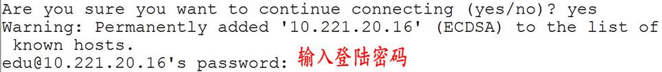

 

登陆成功：

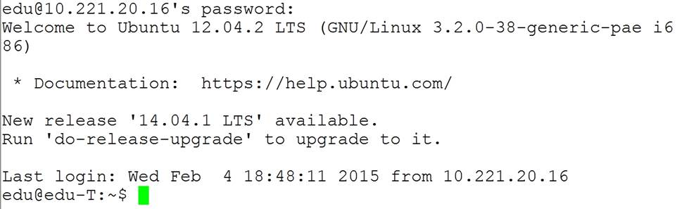

 

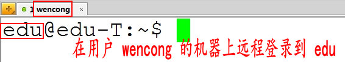

 

##### 5.2.2 Windows远程登录Linux

 

如果想在 Windows 平台下远程登录 Linux，这时候，Windows 需要安装 安装相应软件包。这里介绍是Xmanager。

 

Xmanager是一款小巧、便捷的浏览远端X窗口系统的工具。它包含Xshell、Xftp等软件：

l Xshell：是一个Windows平台下的SSH、TELNET和RLOGIN终端软件。它使得用户能轻松和安全地在Windows平台上访问Unix/Linux 主机。

l Xftp：是一个应用于 Windows 平台的 FTP 和 SFTP 文件传输程序。Xftp能安全地在Unix/Linux 和 Windows 平台之间传输文件。

 

配置Xshell，远程登录：

 

 

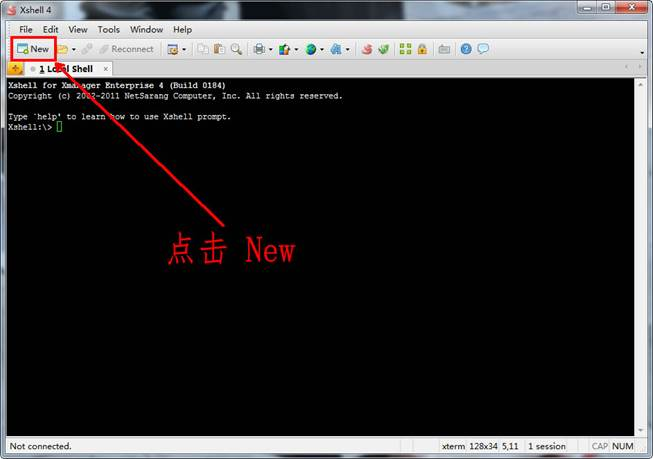

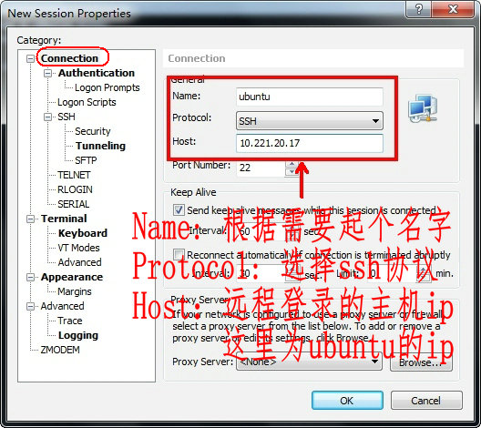

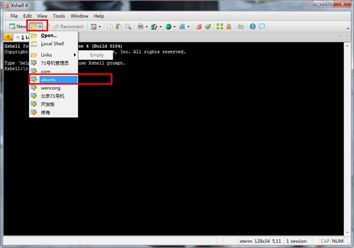

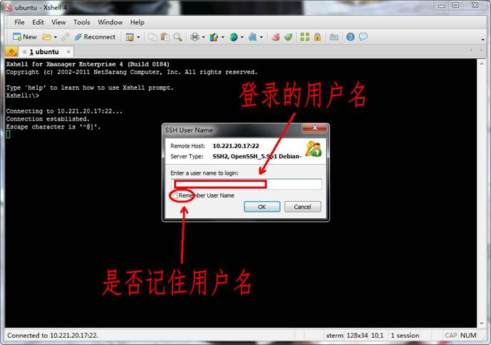

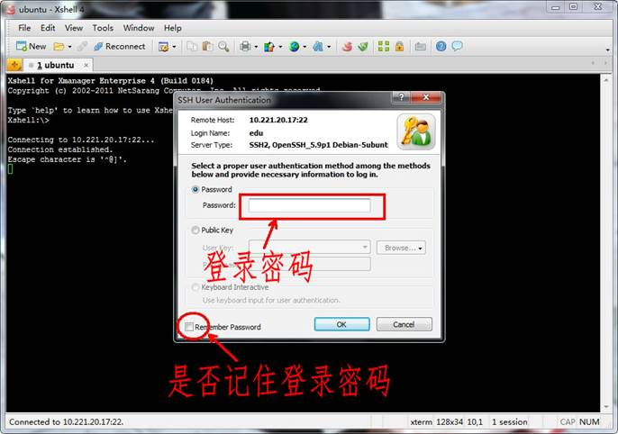

Linux默认采用的编码格式是UTF-8，Windows默认采用的编码格式是ANSI(GB2312、GBK)，所以需要设置一下相应编码：

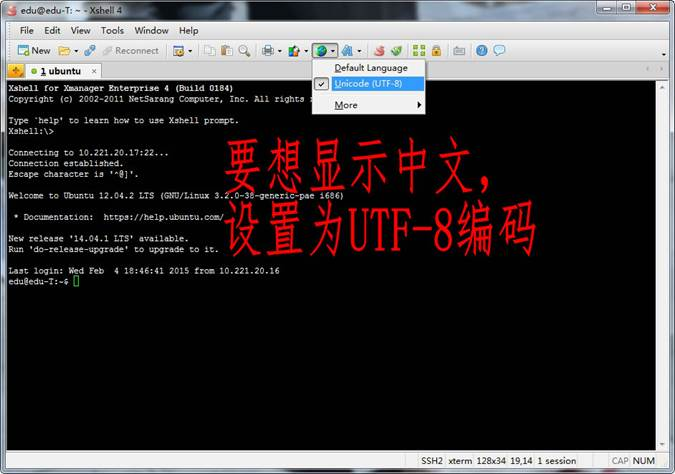

 

 

#### 5.3 远程传输文件

##### 5.3.1 Linux平台相互传输

SSH 提供了一些命令和shell用来登录远程服务器。在默认情况下，不允许用户拷贝文件，但还是提供了一个“scp”命令。

 

| **参数**       | **含义**                                               |
| -------------- | ------------------------------------------------------ |
| RemoteUserName | 远程用户名                                             |
| RemoteHostIp   | 远程ip                                                 |
| RemoteFile     | 远程文件，可带上路径                                   |
| FileName       | 拷贝到本地后的名字，可带上路径，不带路径拷贝到当前目录 |

 

本地文件复制到远程：

scp FileName RemoteUserName@RemoteHostIp:RemoteFile

scp FileName RemoteHostIp:RemoteFolder

scp FileName RemoteHostIp:RemoteFile

 

 

 

本地目录复制到远程：

scp -r FolderName RemoteUserName@RemoteHostIp:RemoteFolder

scp -r FolderName RemoteHostIp:RemoteFolder

 

远程文件复制到本地：

scp RemoteUserName@RemoteHostIp:RemoteFile FileName

scp RemoteHostIp:RemoteFolder FileName

scp RemoteHostIp:RemoteFile FileName

 

远程目录复制到本地：

scp -r RemoteUserName@RemoteHostIp:RemoteFolder FolderName

scp -r RemoteHostIp:RemoteFolder FolderName

 

**拷贝远程的文件****：**

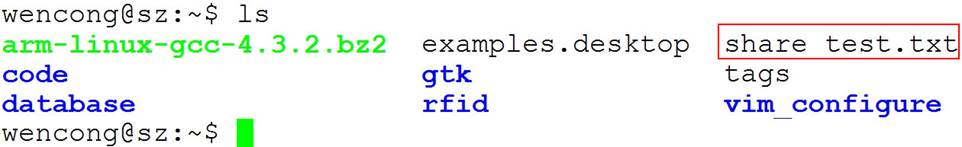

 

**拷贝远程的文件可以任意修改其名字：**

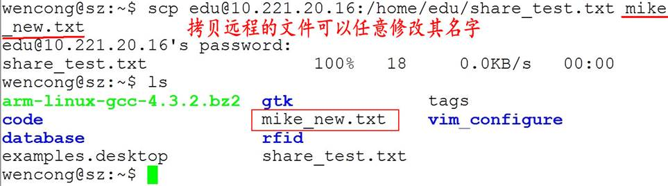

 

 

 

 

 

 

 

 

拷贝远程的文件可以指定存放路径：

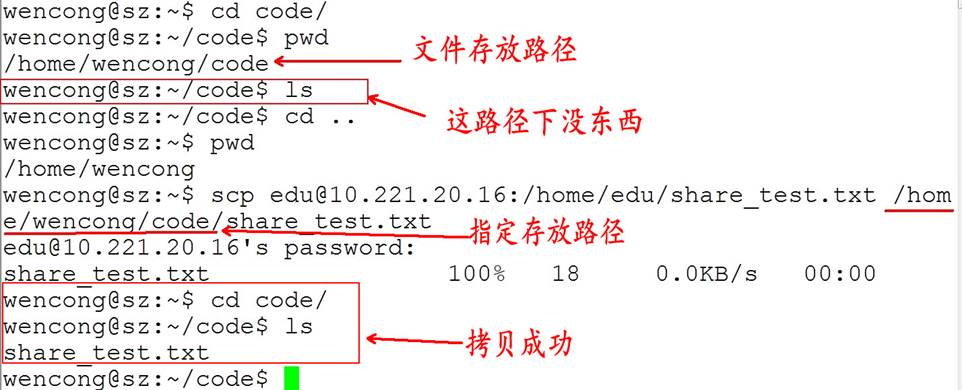

 

##### 5.3.2 Windows和Linux相互传输文件

 

Xmanager自带的Xftp是一个应用于 Windows 平台的 FTP 和 SFTP 文件传输程序。Xftp能安全地在Unix/Linux 和 Windows 平台之间传输文件。

 

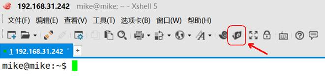

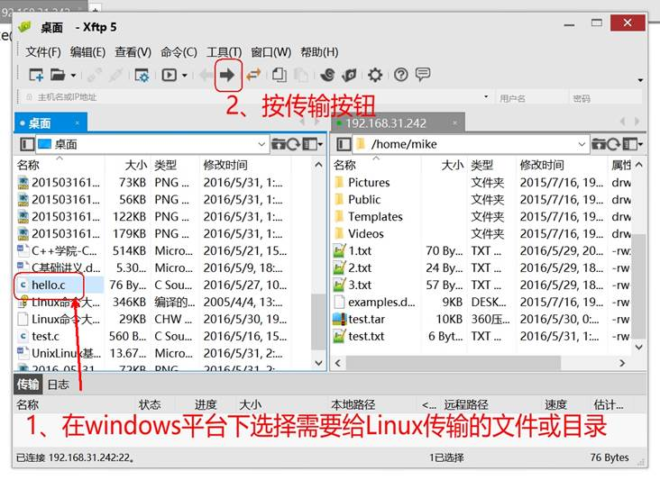

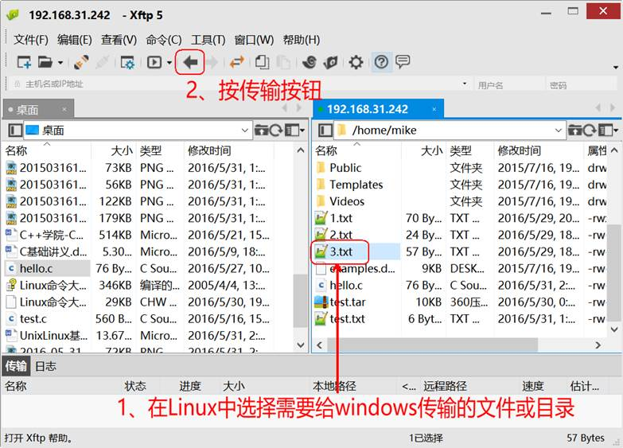

 