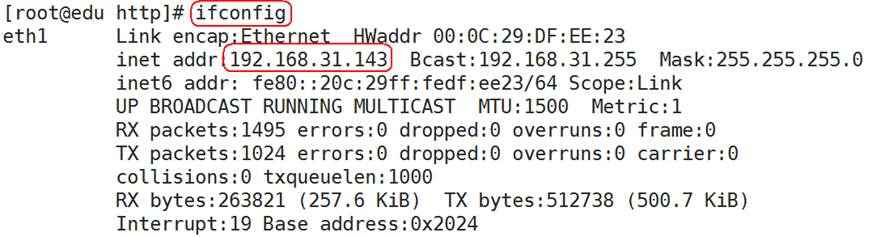

[TOC]

### 6. webserver环境搭建

#### 6.1 webserver环境搭建

 

**http.tar.gz**是用C语言编程的一个简单版webserver。

 

1)把http.tar.gz拷贝到Linux环境中：

 

2)解压压缩包：

 

3)进入解压后的目录，终端敲make编译代码：

 

4)如果是RedHat环境，需要额外配置一下防火墙：

5)root用户启动或关闭web服务：

 

6)环境测试

a)必须root用户先启动web服务：

 

b)查看web服务器所在机器的ip:

 

c)打开能平同web服务器(192.168.31.143)机器的浏览器，网址输入192.168.31.143：

#### 6.2 网页版HelloWorld

 

1)重新打开一个终端，进入web服务器所在目录：

 

2)通过vi新建hello.c文件，内容写如下代码：

\#include <stdio.h>

 

int *main*()

{

​    *printf*("hello world\n");

 

​    return 0;

}

 

3)退出保存hello.c后，通过gcc编译代码，可执行程序的后缀名(扩展名)一定是cgi：

 

l gcc是编译命令，放最开始位置

l -o参数后面一定是可执行程序名字

 

4)测试网页版helloworld,在浏览器输入：192.168.31.143/hello.cgi

5)显示中文乱码解决方法

Linux默认采用的编码格式是UTF-8，浏览器显示默认采用的编码格式是GBK，在浏览器中直接设置utf-8编码或者通过代码指定浏览器为utf-8编码。

a) 直接设置浏览器编码

 

b) 通过代码指定浏览器为utf-8编码，代码中加上头部元素信息：

<head>

<meta http - equiv = "content-type" content = "text/html;charset=utf-8">

< / head>

 

\#include <stdio.h>

 

int *main*()

{

​    *printf*("<head>");

​    *printf*("<meta http-equiv=\"content-type\" content=\"text/html;charset=utf-8\">");

​    *printf*("</head>");

​    *printf*("<html>");

​    *printf*("测试\n");

​    *printf*("</html>");

 

​    return 0;

}

 