### 7. ADB

#### 7.1 ADB简介

 

ADB的全称为Android Debug Bridge，就是起到调试桥的作用，作为一名开发者倒是常用到这个工具。

 

借助ADB工具，我们可以管理设备或手机模拟器的状态。还可以进行很多手机操作，如安装软件、卸载软件、系统升级、运行shell命令等等。

 

ADB就是连接Android手机与PC端的桥梁，可以让用户在电脑上对手机进行全面的操作。

 

 

#### 7.2 配置ADB环境变量(Windows平台)

 

1)解压“platform-tools.zip”，进入其目录，拷贝其路径：

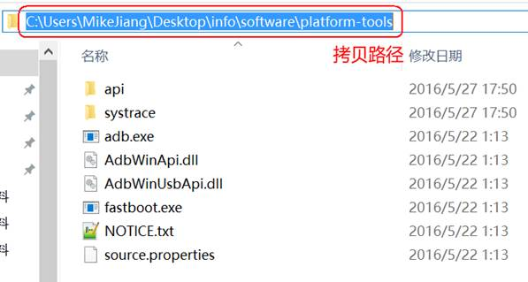

 

2)设置windows环境变量

计算机（右击）－> 属性：

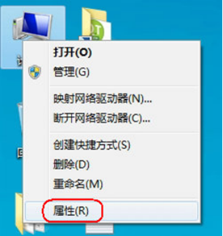

 

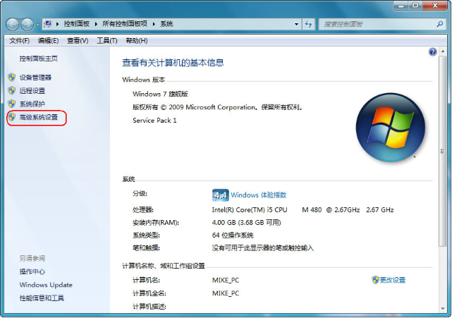

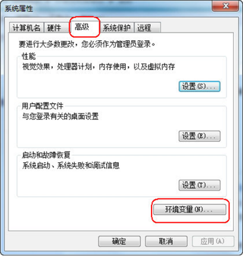

 

如果是win7，双击Path后，把拷贝的路径追加到后面，路径之间需要英文” **;** ”分隔：

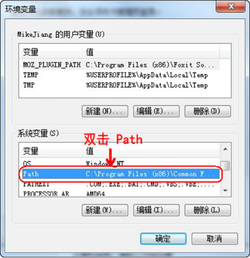

如果是win10，界面做得友好一下，新建添加路径即可：

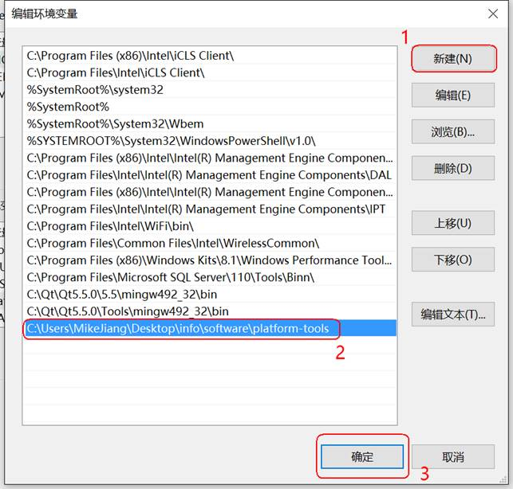

 

3)测试adb命令：

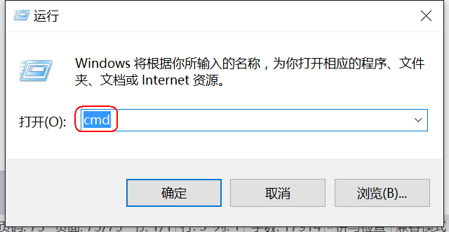

 

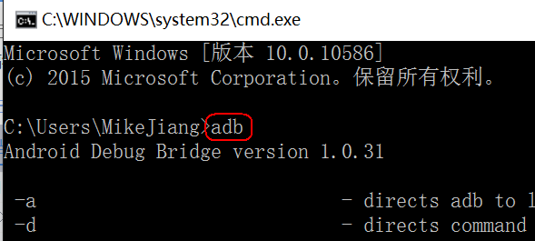

 

#### 7.3 将Android设备通过USB连接到PC

 

1)将Android设备通过USB连接到PC，安装相应驱动：

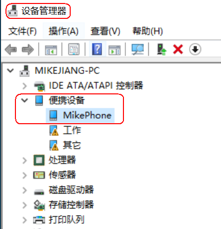

 

2)打开Android设备的“设定”功能 -> 打开“开发者选项”-> 选择USB调试，如图：

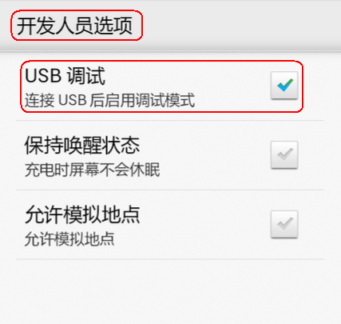

 

3)进入Windows命令行界面，查看当前设备：

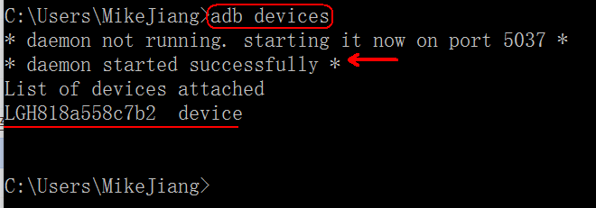

#### 7.4 ADB常用命令介绍

 

| **命令**                            | **含义**                                                     |
| ----------------------------------- | ------------------------------------------------------------ |
| adb devices                         | 查看设备                                                     |
| adb get-serialno                    | 获取设备的ID和序列号                                         |
| adb shell                           | 进入设备或者模拟器的shell，进入之后就可以执行shell命令了，比如cd、pwd、ls等。 |
| adb push <本地路径> <远程路径>      | 从电脑上发送文件到设备(手机)                                 |
| adb push a.txt /sdcard/a.txt        | 把当前文件夹下面的文件a.txt文件发送到手机的/sdcard/下面      |
| adb pull <远程路径> <本地路径>      | 从设备(手机)上下载文件到电脑                                 |
| adb pull /sdcard/DCIM/1.jpg ./1.jpg | 把手机的/sdcard/DCIM/的1.jpg文件发给电脑                     |
| adb install 文件名                  | 安装软件，adb install test.apk                               |
| adb install 包名                    | 卸载软件                                                     |

 

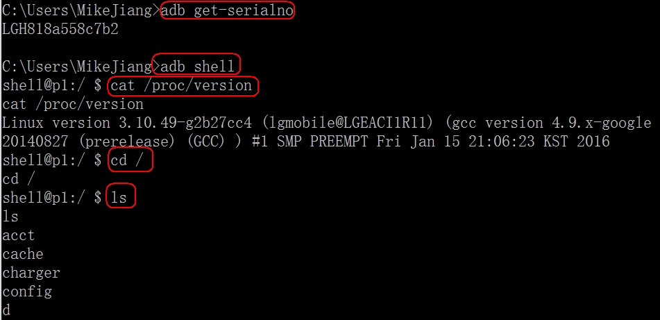