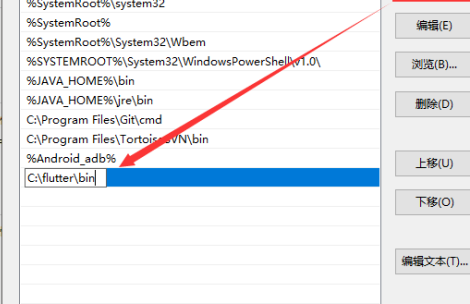
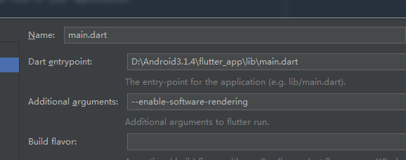

# Flutter 入门

- Android Studio 安装
  - **安装Flutter和Dart插件**
    - **需要安装两个插件**:
        - Flutter插件： 支持Flutter开发工作流 (运行、调试、热重载等).
        - Dart插件： 提供代码分析 (输入代码时进行验证、代码补全等).
    - **run**
      - 启动Android Studio.
      - 打开插件首选项 (Preferences>Plugins on macOS, File>Settings>Plugins on
        Windows & Linux).
      - 选择 Browse repositories…,
      - 选择 Flutter 插件并点击 install. 重启Android Studio后插件生效.

    - **创建新应用**
      - 选择 File>New Flutter Project
      - 选择 Flutter application 作为 project 类型, 然后点击 Next
      - 输入项目名称 (如 myapp), 然后点击 Next
      - 点击 Finish
      - 等待Android Studio安装SDK并创建项目.
      - 记得配置环境变量flutter的sdk目录下的bin文件夹

        

    - **体验热重载**
      - AndroidStudio直接ctrl+s保存代码自动热更新,或者点击闪电图标
      - 命令flutter run运行的,可以在命令提示界面按R键

      **问题1:**  
       ` 如果第一次创建项目需要下载SDK,会超级慢,可以参考镜像自己`
      [手动下载](https://mirrors.tuna.tsinghua.edu.cn/flutter/flutter_infra/releases/stable/)`创建项目的时候会下载一些库卡死,或者配置下面环境变量镜像`

            //环境变量
            PUB_HOSTED_URL=https://pub.flutter-io.cn
            FLUTTER_STORAGE_BASE_URL=https://storage.flutter-io.cn
            //上海交通大学Linux用户组
            FLUTTER_STORAGE_BASE_URL：https : //mirrors.sjtug.sjtu.edu.cn/
            PUB_HOSTED_URL：https：//dart-pub.mirrors.sjtug.sjtu.edu.cn/
            //克隆sdk
            git clone -b dev https://github.com/flutter/flutter.git

      **问题2:**

            Running Gradle task 'assembleDebug'...
           所有工作准备就绪,运行到Android模拟器,是不是发现没反应过一会报错,这是因为有依赖库下载不下来,自己用androidStudio打开flutter项目中的Android项目,等待构建完成就好了
           网上说是因为仓库访问不了的问题,需要换成阿里的仓库,我个人感觉不是,因为下载不下来的依赖库,通过别的方式是可以下载的,不过这个不重要   

      **问题3:**

            Error connecting to the service protocol: failed to connect to http://127.0.0.1:57882/JpEfnldKVSo=/
            //检查环境是否全部正常
            flutter doctor
            //logcat抓出的日志    
            [ERROR:flutter/shell/gpu/gpu_surface_gl.cc(58)] Failed to setup Skia Gr context.
            //修复 
            flutter run --enable-software-rendering       

        或者直接配置启动参数  
        
