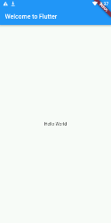
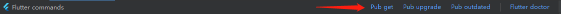

# Flutter 入门

- 创建第一个程序
  - **替换 lib/main.dart.**

            import 'package:flutter/material.dart';
            void main() => runApp(new MyApp());
            
            class MyApp extends StatelessWidget {
              @override
              Widget build(BuildContext context) {
                return new MaterialApp(
                  title: 'Welcome to Flutter',
                  home: new Scaffold(
                    appBar: new AppBar(
                      title: new Text('Welcome to Flutter'),
                    ),
                    body: new Center(
                      child: new Text('Hello World'),
                    ),
                  ),
                );
              }
            }
    

  - **pubspec.yaml配置文件**
    - pubspec文件管理Flutter应用程序的assets(资源，如图片、package等)

            version: 1.0.0+1
            environment:
              sdk: ">=2.7.0 <3.0.0"
            dependencies:
              flutter:
                sdk: flutter
            
              cupertino_icons: ^0.1.3
              english_words: ^3.1.0

    - 添加:english_words: ^3.1.0 并pub get获取外部包

        

    - 导入获取的外部包

            import 'package:english_words/english_words.dart';
    - 使用 English words 包生成文本来替换字符串“Hello World”.

            import 'package:flutter/material.dart';
            import 'package:english_words/english_words.dart';
            
            void main() => runApp(new MyApp());
            
            class MyApp extends StatelessWidget {
              @override
              Widget build(BuildContext context) {
                final wordPair = new WordPair.random();
                return new MaterialApp(
                  title: 'Welcome to Flutter',
                  home: new Scaffold(
                    appBar: new AppBar(
                      title: new Text('Welcome to Flutter'),
                    ),
                    body: new Center(
                      //child: new Text('Hello World'),
                      child: new Text(wordPair.asPascalCase),
                    ),
                  ),
                );
              }
            }

    - 添加一个 有状态的部件（Stateful widget）

