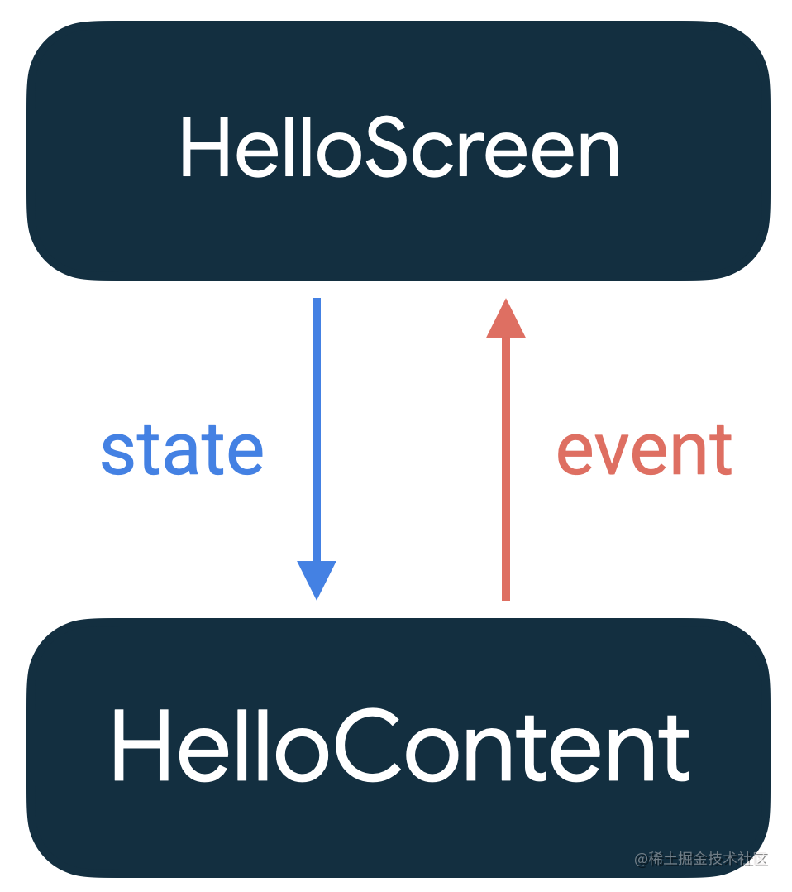

## 介绍

将Compose基本上所有的组件手撸了一遍之后，发现确实能够减少开发的代码量，因为少了各种xml，并且没有了原来那种手动写代码更新视图的繁琐流程，代码量预计少了40%，估计包的大小也能缩水一大半。

并且Compose自己实现了组件作用域的管理，基本上杜绝了原来的开发方式中诸多的内存泄漏问题，当然也可能是我没监听到，毕竟视图绘制方式和原来完全不一样了，官方貌似也没有提到过这一问题。

最让人惊讶的是Compose自带就支持了主题的无缝切换，相比于原来的切主题需要重启的方式，简直妙到家了。

当然目前Compose还存在许多不足的地方，如不支持Item动画，不支持瀑布流，某些常用的组件还没有，迁移比较繁琐，还会偶发一些奇奇怪怪的编译bug等等。

让我们一起期待吧！

## 状态更新

### 组合与状态

* 组合
  描述界面的排列方式，例如：

```kotlin
Box(){
    Text("Hello World")
    Row(){
       Text("Row row row")
    }
}
```

跟写xml构造界面类似，只不过改成了kotlin的方式。需要注意的是Compose中的组件并不是按顺序渲染的，而是系统根据组件的优先级去渲染。

```kotlin
Box(){
    Text("111111")
    Text("222222")
    Text("333333")
}
```

上面的三个Text不会按照顺序依次渲染。</br>
另外，层级之间也不一定是按顺序渲染的，如

```kotlin
Box(){
    Text("111111")
    val isRender3 = false
    Box(){
        Text("222222")
        isRender3 = true
    }
    if(isRender3){
        Text("333333")
    }
}
```

上面的第三个Text可能并不会渲染出来。

* 状态
  Compose中的一切UI更新都依赖于状态，通过界面和状态的绑定，来实现更新界面。</br>
  可以将其理解为数据和界面绑定的中介。</br>
  状态基于MutableState实现，创建一个状态有三种方式：

```kotlin
// default为默认值
val mutableState = remember { mutableStateOf(default) }
var value by remember { mutableStateOf(default) }
val (value, setValue) = remember { mutableStateOf(default) }
```

注意要使用remember，需要导入：

```kotlin
import androidx.compose.runtime.getValue
import androidx.compose.runtime.setValue
```

目前IDE不会自动导入，比较坑。

状态可以像普通值一样赋给组件，🌰

```kotlin
// 不可变状态
val text by remember{ mutableStateOf("Hello World")}
Box(){
    Text(text = text)
}
```

当text的值更改时，Text组件显示的文字也会对应改变，举个输入框的🌰

```kotlin
 // 可变状态
 var text by remember { mutableStateOf("我是默认值") }
 // 输入框
 TextField(value = text,
    onValueChange = { text = it }, 
    label = { Text("我是一个输入框") }) 
```

需要手动创建一个text状态，将TextField的value设置为text，之后监听TextField的值改变，并将得到的新值赋给text，当text的值改变了，输入框的内容也会跟着改变。</br>
如果不在onValueChange回调中设置text的值，则输入框会出现不能输入的假象，因为状态并没有改变。

### 状态下沉，事件上浮

Compose遵循状态下沉，事件上浮的规范，即状态向下一层传递，事件向上一层传递。</br>


举个小🌰

```kotlin
@Composable
fun HelloScreen() {
    var clickCountState by remember { mutableStateOf(0) }
    HelloWorldContent(clickCountState) {
        clickCountState++
    }
}

@Composable
fun HelloWorldContent(clickCount: Int, onClick: () -> Unit) {
    Button(onClick = onClick) {
        Text("我是按钮文字内容，当前点击了第${clickCount}次")
    }
}
```

当点击按钮时，点击次数状态向HelloWorldContent传递，点击事件回调向HelloScreen传递。

### 状态转换

```kotlin
val name = MutableLiveData<String>()
// LiveData转状态
val nameState = name.observeAsState("")

// Flow转状态
val number = (1,2,3).asFlow().collectAsState()
```

### 使用ViewModel

需要导入

```kotlin
implementation("androidx.compose.runtime:runtime-livedata:$latest_version")
```

在组件中使用ViewModel的方法

```kotlin
@Composable
fun HelloWorld() {
    // 直接创建即可，同一个Activity中取到的viewModel都是同一个
    val viewModel: MainViewModel = viewModel()
    val text by remember { viewModel.textState }
    Text(text = text)
}
```

如果需要传参数给ViewModel，则需要使用ViewModelProvider.Factory

```kotlin
class MainViewModel(val text: String) : ViewModel() 

val viewModel: MainViewModel = viewModel(factory = object : ViewModelProvider.Factory {
    override fun <T : ViewModel?> create(modelClass: Class<T>): T {
        return MainViewModel("hello") as T
    }
})
```

### 使用Context

```kotlin
val context = LocalContext.current
```

### 状态保存

当Activity重新创建时，可以使用rememberSaveable来保存状态，举个🌰

```kotlin
var text = rememberSaveable { mutableStateOf("Hello World")) }
```

如果需要保存序列化对象，则需要给类添加@Parcelize注解，并且类需要继承Parcelable，举个🌰

```kotlin
@Parcelize
data class User(val name:String,val age:Int): Parcelable
var user = rememberSaveable { mutableStateOf(User("王二狗", 3)) }
```

