## Android

依赖:

```
  const val compose = "1.1.0"
```

### Hello World

```kotlin
class MainActivity : ComponentActivity() {
    override fun onCreate(savedInstanceState: Bundle?) {
        super.onCreate(savedInstanceState)
        // ComponentActivity扩展方法，创建ComposeView，并设置ContentView为ComposeView,通过ComposeView渲染界面
        setContent {
            Text(text="Hello World")
        }
    }
}

```
效果就是这样

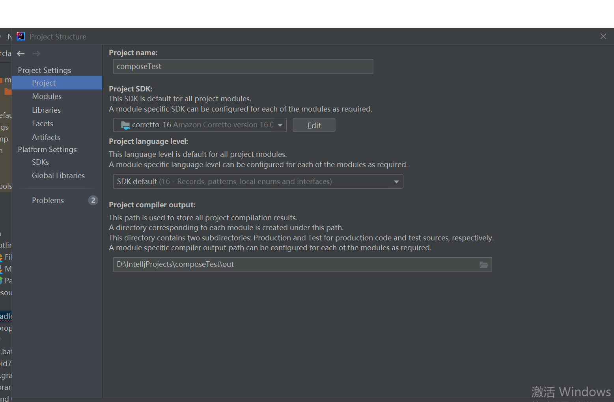

## desktop

### Hello World

```
@Composable
@Preview
fun App() {
    var text by remember { mutableStateOf("Hello, World!") }

    DesktopMaterialTheme {
        Button(onClick = {
            text = "Hello, Desktop!"
        }) {
            Text(text)
        }
    }
}

fun main() = application {
    Window(onCloseRequest = ::exitApplication) {
        App()
    }
}
```

打包需要sdk16版本否则报错


- Linux:打包deb
- 苹果:打包Dmg
- Windows:打包Msi

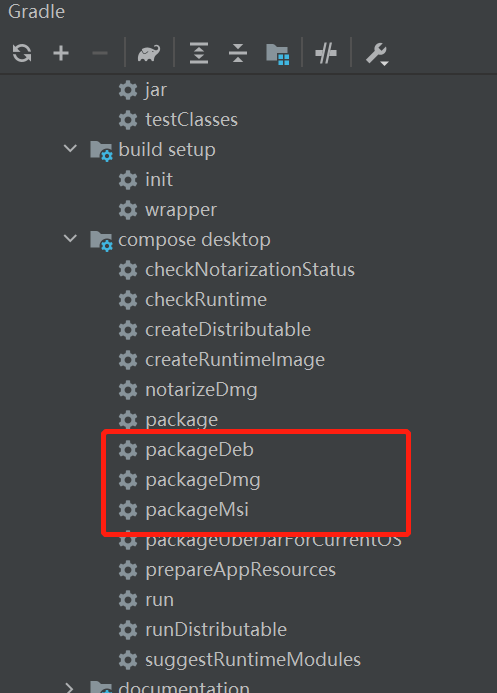

## 布局


Compose包含三种基本的布局：Row,Column,Box，此外，还可以使用Scaffold脚手架来搭建界面。
### Row
类似于水平方向的Linearlayout，参数说明：
```kotlin
@Composable
inline fun Row(
    // 基础样式配置
    modifier: Modifier = Modifier,
    // 配置水平方向对齐与item间隔
    horizontalArrangement: Arrangement.Horizontal = Arrangement.Start,
    // 配置垂直方向对齐
    verticalAlignment: Alignment.Vertical = Alignment.Top,
    // 内容
    content: @Composable RowScope.() -> Unit
) 
```
### Column
类似于垂直方向的Linearlayout，参数说明：
```kotlin
@Composable
inline fun Column(
    // 基础样式配置
    modifier: Modifier = Modifier,
    // 配置垂直方向对齐与间隔
    verticalArrangement: Arrangement.Vertical = Arrangement.Top,
    // 配置水平方向对齐
    horizontalAlignment: Alignment.Horizontal = Alignment.Start,
    // 内容
    content: @Composable ColumnScope.() -> Unit
) 
```
### Box
以一层一层堆叠的方式构造界面，参数说明：
```kotlin
@Composable
inline fun Box(
    // 基础样式配置
    modifier: Modifier = Modifier,
    // 内容对齐方式
    contentAlignment: Alignment = Alignment.TopStart,
    // 子组件是否使用父布局的最小宽高
    propagateMinConstraints: Boolean = false,
    // 内容
    content: @Composable BoxScope.() -> Unit
) 
```
### BoxWithConstraints

BoxWithConstraints 是一种类似于Box布局的布局，但它的优点是可以获得屏幕上 Composable 的最小/最大可用宽度和高度。您可以根据可用空间使用它来显示不同的内容。

在 BoxWithConstraints 范围内，您可以访问 BoxWithConstraintsScope。有了它，您可以获得dp中的minWidth、maxWidth、minHeight、maxHeight和像素中的约束。

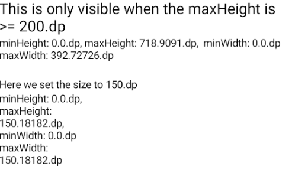

```
@Composable
fun BoxWithConstraintsDemo() {
    Column {
        Column {
            MyBoxWithConstraintsDemo()
        }

        Text("Here we set the size to 150.dp", modifier = Modifier.padding(top = 20.dp))
        Column(modifier = Modifier.size(150.dp)) {
            MyBoxWithConstraintsDemo()
        }
    }
}

@Composable
private fun MyBoxWithConstraintsDemo() {
    BoxWithConstraints {
        val boxWithConstraintsScope = this
        //You can use this scope to get the minWidth, maxWidth, minHeight, maxHeight in dp and constraints

        Column {
            if (boxWithConstraintsScope.maxHeight >= 200.dp) {
                Text(
                    "This is only visible when the maxHeight is >= 200.dp",
                    style = TextStyle(fontSize = 20.sp)
                )
            }
            Text("minHeight: ${boxWithConstraintsScope.minHeight}, maxHeight: ${boxWithConstraintsScope.maxHeight},  minWidth: ${boxWithConstraintsScope.minWidth} maxWidth: ${boxWithConstraintsScope.maxWidth}")
        }
    }
}

```

### ConstraintLayout

Compose 中的 ConstraintLayout 类似于经典 Android 视图系统中的 ConstraintLayout

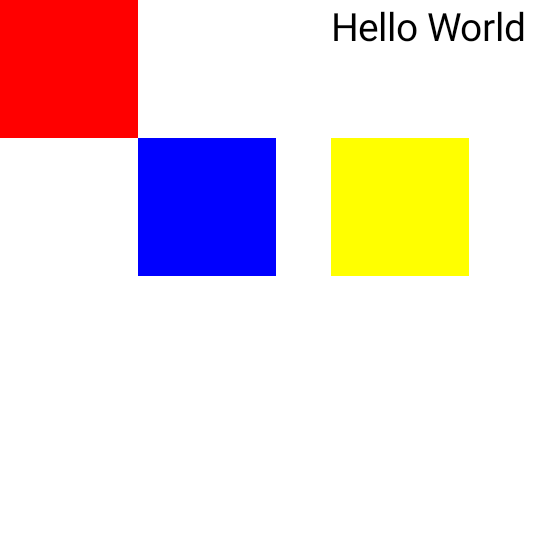

```
@Composable
fun ConstraintLayoutDemo() {
    ConstraintLayout(modifier = Modifier.size(200.dp)) {
    	//createRefs() 创建引用对象。
        val (redBox, blueBox, yellowBox, text) = createRefs()

        Box(modifier = Modifier
            .size(50.dp)
            .background(Color.Red)
            //ConstraintLayout 知道哪些引用对象属于哪个 Composable。为此，您需要在 Composable 上使用 constrainAs 修饰符
            .constrainAs(redBox) {})

        Box(modifier = Modifier
            .size(50.dp)
            .background(Color.Blue)
            //我们对蓝色框做同样的事情，但现在我们想将它链接到红色框。
            .constrainAs(blueBox) {
                top.linkTo(redBox.bottom)
                start.linkTo(redBox.end)
            })

        Box(modifier = Modifier
            .size(50.dp)
            .background(Color.Yellow)
            .constrainAs(yellowBox) {
                bottom.linkTo(blueBox.bottom)
                start.linkTo(blueBox.end, 20.dp)
            })

        Text("Hello World", modifier = Modifier.constrainAs(text) {
            top.linkTo(parent.top)
            start.linkTo(yellowBox.start)
        })

    }
}

```


### Scaffold

脚手架布局，定位界面大体的框架，包含topBar，content,bottomBar,floatingActionButtom,drawer等。参数说明：
```kotlin
@Composable
fun Scaffold(
    // 基础样式配置
    modifier: Modifier = Modifier,
    // drawer，snackbar状态控制
    scaffoldState: ScaffoldState = rememberScaffoldState(),
    // 顶部标题栏
    topBar: @Composable () -> Unit = {},
    // 底部导航栏
    bottomBar: @Composable () -> Unit = {},
    // 托管snackbar的组件
    snackbarHost: @Composable (SnackbarHostState) -> Unit = { SnackbarHost(it) },
    // 右下角的按钮
    floatingActionButton: @Composable () -> Unit = {},
    // 右下角按钮位置
    floatingActionButtonPosition: FabPosition = FabPosition.End,
    // 右下角按钮位置是否考虑有无bottomBar
    isFloatingActionButtonDocked: Boolean = false,
    // 右滑拉出的抽屉内容
    drawerContent: @Composable (ColumnScope.() -> Unit)? = null,
    // 右滑拉出的抽屉是否支持手势
    drawerGesturesEnabled: Boolean = true,
    // 抽屉形状
    drawerShape: Shape = MaterialTheme.shapes.large,
    // 抽屉层级
    drawerElevation: Dp = DrawerDefaults.Elevation,
    // 抽屉背景色
    drawerBackgroundColor: Color = MaterialTheme.colors.surface,
    // 抽屉内显示的内容的颜色
    drawerContentColor: Color = contentColorFor(drawerBackgroundColor),
    // 抽屉打开时遮挡内容的颜色
    drawerScrimColor: Color = DrawerDefaults.scrimColor,
    // 背景色
    backgroundColor: Color = MaterialTheme.colors.background,
    // 主题内容显示的颜色
    contentColor: Color = contentColorFor(backgroundColor),
    // 内容
    content: @Composable (PaddingValues) -> Unit
) 
```

### spacer

Spacer 是一个 Composable，当您想在 Composable 之间添加额外的空间时可以使用它


```
@Composable
fun SpacerDemo() {
    Column {
        Text("Hello")
        Spacer(modifier = Modifier.size(30.dp))
        Text("World")
    }
}
```


## 主题

Compose主题遵循Material设计规范，可以按照Material规范来配置主题。举个🌰
```kotlin
@Composable
// 暗黑模式颜色配置
val darkColors = darkColors(
    primary = Default200,
    primaryVariant = Default700,
    secondary = DefaultSecondary,
    background = Color.Black,
    onPrimary = DefaultOnPrimary,
    surface = Color.Black,
)

// 普通模式颜色配置
val lightColors = lightColors(
    primary = Default500,
    primaryVariant = Default700,
    secondary = DefaultSecondary,
    background = Color.White,
    onPrimary = DefaultOnPrimary,
    surface = DefaultOnPrimary
)

// 自己封装的函数 
@Composable
fun WithTheme(
    darkTheme: Boolean = isSystemInDarkTheme(),
    content: @Composable () -> Unit
) {
    val colors = if (darkTheme) darkColors else lightColors
    MaterialTheme(
        colors = colors,
        typography = Typography,
        shapes = Shapes,
        content = content
    )
}
```
使用主题时，只需要将内容传递给MaterialTheme即可：
```kotlin
class MainActivity : ComponentActivity() {
    override fun onCreate(savedInstanceState: Bundle?) {
        super.onCreate(savedInstanceState)
        // ComponentActivity扩展方法，创建ComposeView，并设置ContentView为ComposeView,通过ComposeView渲染界面
        setContent {
           // 控制暗黑模式的状态，设置为true时界面会自动更新为暗黑模式
           var darkThemeState by remember{ mutableStateOf(isSystemInDarkTheme())}
           WithTheme(darkThemeState){
               Text("Hello World")
           }
        }
    }
}
```

如果需要更改主题或者新增主题，只需要配置对应的colors即可。</br>
How to 使用主题中的颜色：
```kotlin
Text("Hello World", color = MaterialTheme.colors.primary)
```
只需要调用 MaterialTheme.colors.* 即可拿到当前主题下的颜色。

Compose Color转Android Color
```kotlin
MaterialTheme.colors.primary.toArgb()
```
## 列表


### ScroableRow
```kotlin
Row(modifier = Modifier
        .fillMaxWidth()
        .horizontalScroll(rememberScrollState())
) {
   // ...
}
```
类似于HorizontalScrollView，只需要给Row加个horizontalScroll即可，其中的rememberScrollState可以用来拿到滚动的距离等参数。
### ScroableColumn
```kotlin
 Column(modifier = Modifier
            .fillMaxSize()
            .verticalScroll(rememberScrollState())
 ) {
     // ...
 }
```
类似于ScrollView，同理只需要给Column添加个verticalScroll即可。
### LazyRow
类似于使用水平方向LinearLayoutManager的RecyclerView，参数说明
```kotlin
@Composable
fun LazyRow(
    // 基础样式配置
    modifier: Modifier = Modifier,
    // 滚动状态监听
    state: LazyListState = rememberLazyListState(),
    // 内容padding
    contentPadding: PaddingValues = PaddingValues(0.dp),
    // 是否反转内容
    reverseLayout: Boolean = false,
    // 水平方向的对齐与item间隔
    horizontalArrangement: Arrangement.Horizontal =
        if (!reverseLayout) Arrangement.Start else Arrangement.End,
        
    // 垂直方向的对齐
    verticalAlignment: Alignment.Vertical = Alignment.Top,
    // 滚动动画控制
    flingBehavior: FlingBehavior = ScrollableDefaults.flingBehavior(),
    // 内容
    content: LazyListScope.() -> Unit
)
```
使用说明：
```kotlin
 LazyColumn(verticalArrangement = Arrangement.spacedBy(15.dp)) {
        // 创建一个item
        item {
           Text("我是一个item")
        }
        // 创建多个item，viewModel.data是item对应的数据列表
        items(viewModel.data) { item ->
            Text("我是一个item")
        }
    }
```
### LazyColumn
类似于使用垂直方向LinearLayoutManager的RecyclerView，参数说明
```kotlin
@Composable
fun LazyColumn(
    // 基础样式配置
    modifier: Modifier = Modifier,
    // 可用于监听滚动状态
    state: LazyListState = rememberLazyListState(),
    // content的padding
    contentPadding: PaddingValues = PaddingValues(0.dp),
    // 内容是否反向排列
    reverseLayout: Boolean = false,
    // 垂直方向的对齐和item间隔
    verticalArrangement: Arrangement.Vertical =
        if (!reverseLayout) Arrangement.Top else Arrangement.Bottom,
    // 水平方向的对齐
    horizontalAlignment: Alignment.Horizontal = Alignment.Start,
    // 滚动动画控制
    flingBehavior: FlingBehavior = ScrollableDefaults.flingBehavior(),
    // 内容
    content: LazyListScope.() -> Unit
) 
```
使用方式同LazyRow。
### 粘性标题
类似于联系人界面的A,B,C,D,滚动后会自动吸顶，举个🌰
```kotlin
 LazyColumn(verticalArrangement = Arrangement.spacedBy(15.dp)) {
        // 创建一个item
        item {
           Text("我是一个item")
        }
        stickyHeader {
             Text("我是一个粘性标题，当滚动到屏幕顶部时会自动吸顶")
        }
        // 创建多个item，viewModel.data是item对应的数据列表
        items(viewModel.data) { item ->
            Text("我是一个item")
        }
    }
```

### 垂直GridList
类似于使用GridLayoutManager的RecyclerView,参数说明：
```
@Composable
fun LazyVerticalGrid(
    // 描述如何形成列，可通过设置count或者minSize的大小实现
    cells: GridCells,
    // 基础样式
    modifier: Modifier = Modifier,
    // 可监听滚动状态
    state: LazyListState = rememberLazyListState(),
    // content padding
    contentPadding: PaddingValues = PaddingValues(0.dp),
    // 内容
    content: LazyGridScope.() -> Unit
)
```
使用方式同LazyRow。

### lazyverticalgrid

Jetpack Compose 提供了一个用于显示网格或网格元素的 API。

要在网格中排列列表项，请`LazyVerticalGrid`提供一个单元格参数，该参数控制单元格如何组成列。以下示例显示网格中的项目，`GridCells.Adaptive`用于将每列的宽度设置为至少 128.dp：

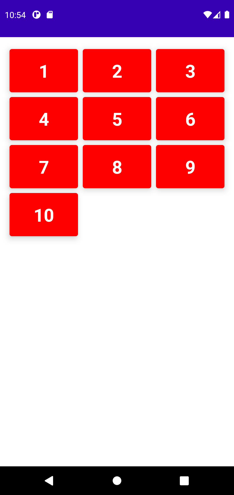

```
@Composable
fun LazyVerticalGridDemo(){
    val list = (1..10).map { it.toString() }

    LazyVerticalGrid(
        columns = GridCells.Adaptive(128.dp),

        // content padding
        contentPadding = PaddingValues(
            start = 12.dp,
            top = 16.dp,
            end = 12.dp,
            bottom = 16.dp
        ),
        content = {
            items(list.size) { index ->
                Card(
                    backgroundColor = Color.Red,
                    modifier = Modifier
                        .padding(4.dp)
                        .fillMaxWidth(),
                    elevation = 8.dp,
                ) {
                    Text(
                        text = list[index],
                        fontWeight = FontWeight.Bold,
                        fontSize = 30.sp,
                        color = Color(0xFFFFFFFF),
                        textAlign = TextAlign.Center,
                        modifier = Modifier.padding(16.dp)
                    )
                }
            }
        }
    )
}

```

除此之外，`GridCells.Adaptive`还有其他类型的单元格提供每行的列数。如下

```
colums = GridCells.Fixed(2)
```

### Important
貌似目前不支持item动画以及瀑布流。

## shape

Shape 可用于绘制特定形状的 Composable。

### 矩形

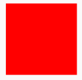

描述矩形的形状。

```
@Composable
fun RectangleShapeDemo(){
    ExampleBox(shape = RectangleShape)
}

@Composable
fun ExampleBox(shape: Shape){
    Column(modifier = Modifier.fillMaxWidth().wrapContentSize(Alignment.Center)) {
        Box(
            modifier = Modifier.size(100.dp).clip(shape).background(Color.Red)
        )
    }
}
```

### 圆形

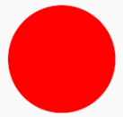

所有角的大小为形状大小的 50% 的圆形形状。

```
@Composable
fun CircleShapeDemo(){
    ExampleBox(shape = CircleShape)
}

@Composable
fun ExampleBox(shape: Shape){
    Column(modifier = Modifier.fillMaxWidth().wrapContentSize(Alignment.Center)) {
        Box(
            modifier = Modifier.size(100.dp).clip(shape).background(Color.Red)
        )
    }
}
```

### 圆角

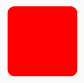

描述圆角矩形的形状。

```
@Composable
fun RoundedCornerShapeDemo(){
    ExampleBox(shape = RoundedCornerShape(10.dp))
}

@Composable
fun ExampleBox(shape: Shape){
    Column(modifier = Modifier.fillMaxWidth().wrapContentSize(Alignment.Center)) {
        Box(
            modifier = Modifier.size(100.dp).clip(shape).background(Color.Red)
        )
    }
}
```


### 切角

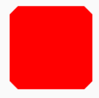

描述带有切角的矩形的形状。

```
@Composable
fun CutCornerShapeDemo(){
    ExampleBox(shape = CutCornerShape(10.dp))
}

@Composable
fun ExampleBox(shape: Shape){
    Column(modifier = Modifier.fillMaxWidth().wrapContentSize(Alignment.Center)) {
        Box(
            modifier = Modifier.size(100.dp).clip(shape).background(Color.Red)
        )
    }
}
```


## 文字

### Text
Compose重新构造了一套渲染文本的方法，原来的TextView对应Compose中的Text组件，参数说明
```kotlin
@Composable
fun Text(
    // 文字内容
    text: String,
    // 基础样式配置
    modifier: Modifier = Modifier,
    // 文字颜色
    color: Color = Color.Unspecified,
    // 字体大小
    fontSize: TextUnit = TextUnit.Unspecified,
    // 字体样式，配置斜体等
    fontStyle: FontStyle? = null,
    // 字体粗细
    fontWeight: FontWeight? = null,
    // 字体
    fontFamily: FontFamily? = null,
    // 每个文字之间的间隔
    letterSpacing: TextUnit = TextUnit.Unspecified,
    // 下划线等
    textDecoration: TextDecoration? = null,
    // 文字对齐
    textAlign: TextAlign? = null,
    // 行高
    lineHeight: TextUnit = TextUnit.Unspecified,
    // 超出内容处理方式
    overflow: TextOverflow = TextOverflow.Clip,
    // 是否自动换行
    softWrap: Boolean = true,
    // 最大行数
    maxLines: Int = Int.MAX_VALUE,
    // 文字测量时回调
    onTextLayout: (TextLayoutResult) -> Unit = {},
    // 通过style设置文字样式，优先级比上面的低
    style: TextStyle = LocalTextStyle.current
) 
```
### 富文本
富文本实现🌰
```kotlin
Text(buildAnnotatedString {
        withStyle(style = SpanStyle(MaterialTheme.colors.primary)) {
            append("试试富文本")
        }
        append("He")
        // 改字体颜色
        withStyle(style = SpanStyle(MaterialTheme.colors.secondary)) {
            append("ll")
        }
        append("o World")
        append("富文本")
        // 加粗
        withStyle(style = SpanStyle(fontWeight = FontWeight.Bold)) {
            append("富文本加个粗")
        }
    })
```

### 文本选中
* 设置支持选中
只需要用SelectionContainer将Text包起来即可，🌰
```kotlin
SelectionContainer {
    Text(text = "可以选中的文本")
}
```
* 禁止选中
可以将部分文字禁止选中，🌰
```kotlin
SelectionContainer {
    Column {
        Text(text = "可以选中的部分文本")
        Text(text = "可以选中的部分文本")
        DisableSelection {
            Text(text = "禁止选中的部分文本")
        }
        Text(text = "可以选中的部分文本")
    }
}
```
### 文本点击
* 点击监听
可以通过ClickableText监听文本的点击，从而实现类似于点击展开文本的效果
```kotlin
ClickableText(
        text = buildAnnotatedString { append("可以点击的文本") },
        style = TextStyle(color = MaterialTheme.colors.onBackground)
    ) {
        Toast.makeText(context, "第${it}个字符被点击了", Toast.LENGTH_SHORT).show()
}
```
* 深链接点击
如过需要实现类似于点击文本内容中的用户名或者主题名跳转到对应页面等功能，也可以使用，🌰
```kotlin
val annotatedText = buildAnnotatedString {
    withStyle(
        style = SpanStyle(
            color = MaterialTheme.colors.onSurface
        )
    ) {
        append("试试链接吧，点击 ")
    }
    pushStringAnnotation(
        tag = "URL",
        annotation = "https://developer.android.com"
    )
    withStyle(
        style = SpanStyle(
            color = MaterialTheme.colors.primary,
            fontWeight = FontWeight.Bold
        )
    ) {
        append("这里")
    }
    pop()
}
ClickableText(
    text = annotatedText,
    onClick = { offset ->
        annotatedText.getStringAnnotations(
            tag = "URL", start = offset,
            end = offset
        ).firstOrNull()?.let { annotation ->
                Toast.makeText(context, "点击链接${annotation.item}", Toast.LENGTH_SHORT).show()
            }
    }
)
```

### 输入框
Compose提供了两种Material风格的输入框，分别是带背景的输入框和带边框的输入框。
* 带背景输入框
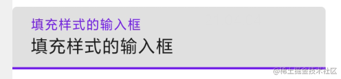

参数说明
```kotlin
@Composable
fun TextField(
    // 输入框内容
    value: String,
    // 内容更改回调
    onValueChange: (String) -> Unit,
    // 基础样式
    modifier: Modifier = Modifier,
    // 是否可编辑和聚焦
    enabled: Boolean = true,
    // 是否只读，只读状态下，不能编辑，但是可以聚焦复制内容
    readOnly: Boolean = false,
    // 文字样式
    textStyle: TextStyle = LocalTextStyle.current,
    // Material风格的Label
    label: @Composable (() -> Unit)? = null,
    // 文字为空时占位内容
    placeholder: @Composable (() -> Unit)? = null,
    // 文字前的图标
    leadingIcon: @Composable (() -> Unit)? = null,
    // 文字后的图标
    trailingIcon: @Composable (() -> Unit)? = null,
    // 当前是否是错误状态
    isError: Boolean = false,
    // 文字效果应用，可实现输入密码等效果
    visualTransformation: VisualTransformation = VisualTransformation.None,
    // 可以用于配置输入框类型
    keyboardOptions: KeyboardOptions = KeyboardOptions.Default,
    // 可以用于配置输入框Enter键盘类型
    keyboardActions: KeyboardActions = KeyboardActions(),
    // 是否单行
    singleLine: Boolean = false,
    // 最大行
    maxLines: Int = Int.MAX_VALUE,
    // 监听组件交互变化
    interactionSource: MutableInteractionSource = remember { MutableInteractionSource() },
    // 输入框背景形状
    shape: Shape =
        MaterialTheme.shapes.small.copy(bottomEnd = ZeroCornerSize, bottomStart = ZeroCornerSize),
    // 输入框颜色
    colors: TextFieldColors = TextFieldDefaults.textFieldColors()
)
```
* 带边框输入框
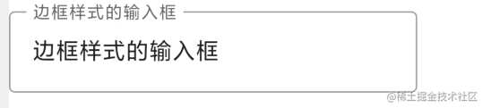

参数说明
```kotlin
@Composable
fun OutlinedTextField(
    // 输入框内容
    value: String,
    // 内容改变回回调
    onValueChange: (String) -> Unit,
    // 基础样式配置
    modifier: Modifier = Modifier,
    // 是否可编辑可聚焦
    enabled: Boolean = true,
    // 是否只读
    readOnly: Boolean = false,
    // 文字样式
    textStyle: TextStyle = LocalTextStyle.current,
    // Lable
    label: @Composable (() -> Unit)? = null,
    // 文本内容为空时占位内容
    placeholder: @Composable (() -> Unit)? = null,
    // 文本前图标
    leadingIcon: @Composable (() -> Unit)? = null,
    // 文本后图标
    trailingIcon: @Composable (() -> Unit)? = null,
    // 当前是否是错误状态
    isError: Boolean = false,
    // 文字效果应用，可实现输入密码等效果
    visualTransformation: VisualTransformation = VisualTransformation.None,
    // 可以用于配置输入框类型
    keyboardOptions: KeyboardOptions = KeyboardOptions.Default,
    // 可以用于配置输入框Enter键盘类型
    keyboardActions: KeyboardActions = KeyboardActions.Default,
    // 是否单行
    singleLine: Boolean = false,
    // 最大行
    maxLines: Int = Int.MAX_VALUE,
    // 监听组件交互变化
    interactionSource: MutableInteractionSource = remember { MutableInteractionSource() },
    // 输入框背景形状
    shape: Shape = MaterialTheme.shapes.small,
    // 输入框颜色
    colors: TextFieldColors = TextFieldDefaults.outlinedTextFieldColors()
) 
```
* 基础输入框
  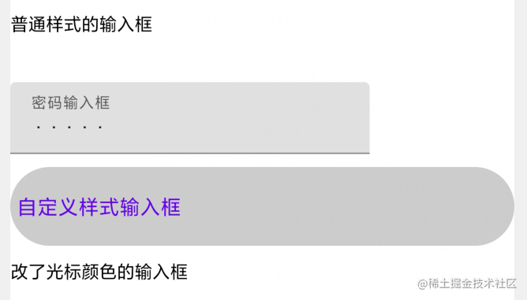

除了Material风格的输入框，Compose还提供了一个基础的输入框：BasicTextField，参数说明
```kotlin
@Composable
fun BasicTextField(
    // 输入框内容
    value: String,
    // 内容改变回调
    onValueChange: (String) -> Unit,
    // 基础样式匹配值
    modifier: Modifier = Modifier,
    // 是否可编辑聚焦
    enabled: Boolean = true,
    // 是否只读
    readOnly: Boolean = false,
    // 文字样式
    textStyle: TextStyle = TextStyle.Default,
    // 可以用于配置输入框类型
    keyboardOptions: KeyboardOptions = KeyboardOptions.Default,
    // 可以用于配置输入框Enter键盘类型
    keyboardActions: KeyboardActions = KeyboardActions.Default,
    // 是否单行
    singleLine: Boolean = false,
    // 最大行
    maxLines: Int = Int.MAX_VALUE,
    // 文字效果应用，可实现输入密码等效果
    visualTransformation: VisualTransformation = VisualTransformation.None,
    // Layout回调
    onTextLayout: (TextLayoutResult) -> Unit = {},
    // 监听组件交互变化
    interactionSource: MutableInteractionSource = remember { MutableInteractionSource() },
    // 光标配置
    cursorBrush: Brush = SolidColor(Color.Black),
    // 输入框装饰内容，内容最后必须调用innerTextField()
    decorationBox: @Composable (innerTextField: @Composable () -> Unit) -> Unit =
        @Composable { innerTextField -> innerTextField() }
)
```
举个🌰吧
```kotlin
var text5 by remember { mutableStateOf("") }
BasicTextField(
    value = text5, onValueChange = { text5 = it },
    decorationBox = { innerTextField ->
        if (text5.isEmpty()) {
            Box(contentAlignment = Alignment.CenterStart) {
                Text(
                    text = "自定义样式输入框",
                    color = MaterialTheme.colors.primary
                )
            }
        }
        // 必须回调
        innerTextField()
    },
    modifier = Modifier
        .background(Color.LightGray, CircleShape)
        .padding(5.dp, 20.dp)
        .fillMaxWidth()
)
```
结果大概就长这样

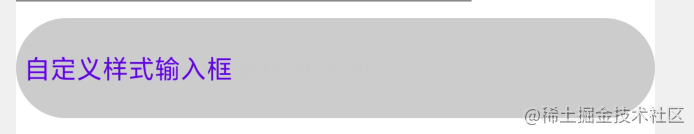


### Importante
目前貌似没有发现限制输入字数的参数，不过可以通过在onValueChange回调中判断字数来实现输入字数限制

## 图片


Compose提供了三种加载图片的组件，分别用于支持Bitmap，Vector，Painter加载图片，但是最终都是使用Painter的方式来加载的图片。
### 加载Bitmap
参数说明
```kotlin
@Composable
fun Image(
    // bitmap，注意和Bitmap不同
    bitmap: ImageBitmap,
    // ContentDescription
    contentDescription: String?,
    // 基础样式
    modifier: Modifier = Modifier,
    // 图片对齐
    alignment: Alignment = Alignment.Center
    // 图片裁剪模式
    contentScale: ContentScale = ContentScale.Fit,
    // 图片透明度
    alpha: Float = DefaultAlpha,
    // 滤色
    colorFilter: ColorFilter? = null
) 
```
Bitmap转ImageBitmap
```kotlin
bitmap.asImageBitmap()
```
ImageBitmap转Bitmap
```kotlin
bitmap.asAndroidBitmap()
```
裁剪方式支持Crop,Fit,FillHeight,FillWidth,Inside,None,FillBounds,具体效果参考Demo App。
### 加载Vector
参数说明
```kotlin
@Composable
fun Image(
    // Vector
    imageVector: ImageVector,
    contentDescription: String?,
    modifier: Modifier = Modifier,
    alignment: Alignment = Alignment.Center,
    contentScale: ContentScale = ContentScale.Fit,
    alpha: Float = DefaultAlpha,
    colorFilter: ColorFilter? = null
)
```
### 加载Painter
参数说明
```kotlin
@Composable
fun Image(
    // painter
    painter: Painter,
    contentDescription: String?,
    modifier: Modifier = Modifier,
    alignment: Alignment = Alignment.Center,
    contentScale: ContentScale = ContentScale.Fit,
    alpha: Float = DefaultAlpha,
    colorFilter: ColorFilter? = null
) 
```
How to 加载资源图片🌰
```kotlin
Image(painter = painterResource(id = R.drawable.logo), contentDescription = null)
```
### Coil加载图片
需要导入库
```kotlin
implementation("com.google.accompanist:accompanist-coil:0.13.0")
```
官网在https://google.github.io/accompanist/coil/</br>
举个🌰
```kotlin
val painter = rememberCoilPainter("URL")
Image(
    painter = painter,
    contentDescription = null,
    modifier = Modifier
        .fillMaxWidth()
        .height(300.dp),
    contentScale = ContentScale.FillWidth
)
```
### Glide加载图片
需要导入库
```kotlin
implementation("com.google.accompanist:accompanist-glide:0.14.0")
```
官网在https://google.github.io/accompanist/glide/</br>
举个🌰
```kotlin
val painter = rememberGlidePainter("URL")
Image(
    painter = painter,
    contentDescription = null,
    modifier = Modifier
        .fillMaxWidth()
        .height(300.dp),
    contentScale = ContentScale.FillWidth
)
```
### 监听加载状态
目前Compose提供了加载状态的回调，但是监听加载进度的貌似没发现，🌰
```kotlin
val painter = rememberCoilPainter("URL")
Image(
    painter = painter,
    contentDescription = null,
    modifier = Modifier
        .fillMaxWidth()
        .height(300.dp),
    contentScale = ContentScale.FillWidth
)

when (painter.loadState) {
    is ImageLoadState.Loading -> {
        // 加载中，展示个Loading
        CircularProgressIndicator(Modifier.align(Alignment.Center))
    }
    is ImageLoadState.Error -> {
        // 加载失败
    }
}
```
### 圆角与Cirle
Compose的Image并没有直接提供圆角的参数，因此需要使用其它组件辅助，Surface组件就不错</br>
加个圆角试试
```kotlin
Surface(
    // 通过设置外面这层的shape来实现加圆角
    shape = RoundedCornerShape(4.dp),
    modifier = Modifier.padding(10.dp)
) {
    Image(
        painter = rememberCoilPainter("URL", fadeIn = true),
        contentDescription = null,
        modifier = Modifier
            .background(MaterialTheme.colors.onBackground),
    )
}
```
同理实现一个圆形的图片
```kotlin
Surface(
    // 表示按照50%的比例生成圆角 
    shape = RoundedCornerShape(parent=50),
    modifier = Modifier.padding(10.dp)
) {
    Image(
        painter = rememberCoilPainter("URL", fadeIn = true),
        contentDescription = null,
        modifier = Modifier
            .background(MaterialTheme.colors.onBackground),
    )
}
```
如果UI需要其它形状的图片，可继承Shape自己定义一个，再赋给Surface。
## Canvas
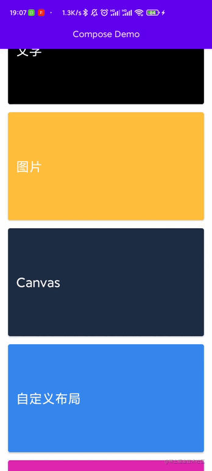


Compose Canvas基本实现了Android Canvas的功能，且使用更简单了，只需使用Canvas组件即可，参数说明
```kotlin
fun Canvas(
// 基础样式配置
modifier: Modifier, 
// 绘制的Scope,可调用一系列绘制方法
onDraw: DrawScope.() -> Unit
) 
```
### 实线
画线使用drawLine方法绘制，举个🌰
```kotlin
Canvas(modifier = Modifier.fillMaxSize()) {
    drawLine(color, Offset(0f, 20f), Offset(400f, 20f), strokeWidth = 5f)
}
```
参数说明
```kotlin
fun drawLine(
    // 线条颜色
    color: Color,
    // 起始点
    start: Offset,
    // 结束点
    end: Offset,
    // 线宽
    strokeWidth: Float = Stroke.HairlineWidth,
    // 端点样式
    cap: StrokeCap = Stroke.DefaultCap,
    // 线条效果，可用于画虚线
    pathEffect: PathEffect? = null,
    /*FloatRange(from = 0.0, to = 1.0)*/
    // 线条透明度
    alpha: Float = 1.0f,
    // 滤色风格
    colorFilter: ColorFilter? = null,
    // 混合方式，类似于xperfmode
    blendMode: BlendMode = DefaultBlendMode
)
```
### 虚线
虚线的实现就简单了，直接加个pathEffect
```kotlin
Canvas(modifier = Modifier.fillMaxSize()) {
    drawLine(color, 
    Offset(0f, 20f),
    Offset(400f, 20f), 
    strokeWidth = 5f,
    pathEffect = PathEffect.dashPathEffect(floatArrayOf(10f, 20f), 5f))
}
```
### 矩形
绘制一个矩形比较简单，举个🌰
```kotlin
Canvas(modifier = Modifier.size(100.dp)) {
    drawRect(color = color, size = size / 2f)
}
```
参数说明
```kotlin
fun drawRect(
    // 矩形颜色
    color: Color,
    // 矩形离顶部以及左边的距离
    topLeft: Offset = Offset.Zero,
    // 矩形大小
    size: Size = this.size.offsetSize(topLeft),
    /*@FloatRange(from = 0.0, to = 1.0)*/
    alpha: Float = 1.0f,
    style: DrawStyle = Fill,
    colorFilter: ColorFilter? = null,
    blendMode: BlendMode = DefaultBlendMode
)
```
### 圆
参数说明
```kotlin
fun drawCircle(
    color: Color,
    // 半径
    radius: Float = size.minDimension / 2.0f,
    // 中心点
    center: Offset = this.center,
    /*@FloatRange(from = 0.0, to = 1.0)*/
    alpha: Float = 1.0f,
    style: DrawStyle = Fill,
    colorFilter: ColorFilter? = null,
    blendMode: BlendMode = DefaultBlendMode
)
```
### Path
参数说明
```kotlin
fun drawPath(
    // path
    path: Path,
    color: Color,
    /*@FloatRange(from = 0.0, to = 1.0)*/
    alpha: Float = 1.0f,
    style: DrawStyle = Fill,
    colorFilter: ColorFilter? = null,
    blendMode: BlendMode = DefaultBlendMode
)
```
### 圆弧，扇形
参数说明
```kotlin
fun drawArc(
    color: Color,
    // 开始角度
    startAngle: Float,
    // 扫过的角度
    sweepAngle: Float,
    // 是否连接中心点，为true时为画扇形
    useCenter: Boolean,
    topLeft: Offset = Offset.Zero,
    size: Size = this.size.offsetSize(topLeft),
    /*@FloatRange(from = 0.0, to = 1.0)*/
    alpha: Float = 1.0f,
    // 绘制样式，Stroke/Fill
    style: DrawStyle = Fill,
    colorFilter: ColorFilter? = null,
    blendMode: BlendMode = DefaultBlendMode
)
```
### 椭圆
参数说明
```kotlin
fun drawOval(
    color: Color,
    topLeft: Offset = Offset.Zero,
    // 大小
    size: Size = this.size.offsetSize(topLeft),
    /*@FloatRange(from = 0.0, to = 1.0)*/
    alpha: Float = 1.0f,
    // 绘制样式，Stroke/Fill
    style: DrawStyle = Fill,
    colorFilter: ColorFilter? = null,
    blendMode: BlendMode = DefaultBlendMode
)
```
### 圆角矩形
参数说明
```kotlin
fun drawRoundRect(
    color: Color,
    topLeft: Offset = Offset.Zero,
    size: Size = this.size.offsetSize(topLeft),
    // 圆角大小
    cornerRadius: CornerRadius = CornerRadius.Zero,
    style: DrawStyle = Fill,
    /*@FloatRange(from = 0.0, to = 1.0)*/
    alpha: Float = 1.0f,
    colorFilter: ColorFilter? = null,
    blendMode: BlendMode = DefaultBlendMode
)
```
### 贝塞尔曲线
贝塞尔曲线使用Path实现
```kotlin
Canvas(modifier = Modifier.size(100.dp)) {
    val path = Path()
    path.cubicTo(0f, 100f, 100f, 0f, 200f, 100f)
    drawPath(path, color, style = Stroke(5f))
}
```
### 旋转，位移
只需要将画的东西用rotate包裹起来就行
```kotlin
Canvas(modifier = Modifier.size(100.dp)) {
    rotate(45f) {
        drawRect(
            color = color,
            topLeft = Offset(100f, 100f),
            size = size / 2f
        )
    }
}
```
同理位移一样，用translate包裹
### 多种变换
如果既要旋转又要位移怎么办呢，Compose提供了一种高效的方法，有效地避免了多重嵌套的问题
```kotlin
Canvas(modifier = Modifier.size(100.dp)) {
    withTransform({
        // 这里写需要的变换
        translate(300f)
        rotate(45f)
    }) {
        drawRect(
            color = color,
            topLeft = Offset(0f, 100f),
            size = size / 2f
        )
    }
}
```
### Bitmap
绘制Bitmap，举个🌰
```kotlin
Canvas(modifier = Modifier.size(100.dp)) {
    val bitmap = BitmapFactory.decodeResource(context.resources, R.drawable.logo)
    drawImage(bitmap.asImageBitmap())
}
```
参数说明
```kotlin
fun drawImage(
    // ImageBitmap注意不是Bitmap
    image: ImageBitmap,
    topLeft: Offset = Offset.Zero,
    /*@FloatRange(from = 0.0, to = 1.0)*/
    alpha: Float = 1.0f,
    style: DrawStyle = Fill,
    colorFilter: ColorFilter? = null,
    blendMode: BlendMode = DefaultBlendMode
)
```
### 混合方式
Compose提供了类似于Xfermode的混合方式，具体可以查看BlendMode类，Xfermode对照图

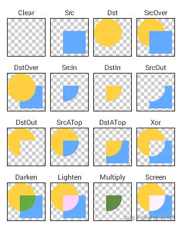

## 自定义布局


Compose支持用户自定义布局，以及自定义布局修饰符。自定义布局的绘制流程同样是measure->layout->draw。只不过Compose帮我们做了draw这一步，所以我们只需要关心measure和layout即可。

这里有几个类需要先提一下：</br>
Measurable：包含一个measure方法，用于测量布局的宽高。</br>
Constraints：用于存储父布局的尺寸配置，包含父布局最大最小宽高等参数。</br>
Placeable：用于设置布局的位置，并且存储了测量出来的布局的宽高。

测量+布局🌰
```kotlin
// 测量布局的constraints，拿到placeable
val placeable = measurable.measure(constraints)
// 设置布局的大小
layout(placeable.width, placeable.height) {
    // 设置布局左上角x，y位置
    placeable.placeRelative(xPosition, yPosition)
}
```

### 自定义布局修饰符
布局修饰符即上面提到的Modifier，Compose支持扩展Modifier类，从而实现自己的布局方式，举个扩展设置PaddingHorizontal的🌰吧
```kotlin
fun Modifier.paddingHorizontal(padding: Dp) = layout { measurable, constraints ->
    // 这里执行measure，拿到布局的宽高
    val placeable = measurable.measure(constraints.offset(-padding.roundToPx() * 2, 0))
    // 设置布局宽高
    layout(placeable.width, placeable.height) {
        // 设置布局左上角x，y位置
        placeable.placeRelative(padding.roundToPx(), 0)
    }
}
```
使用方式
```kotlin
Text(
    "这是使用自定义修饰符实现的paddingHorizontal效果，试试改变下padding值吧",
    modifier = Modifier
        .paddingHorizontal(paddingHorizontal.dp)
        .background(Color.Red)
)
```
结果大概就是这样</br>
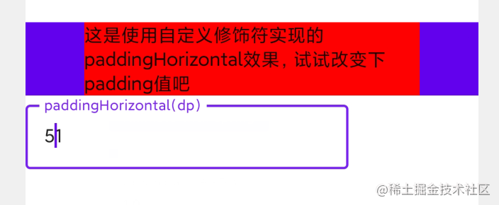  

### 自定义布局
自定义约束符只能作用于自身，如果需要约束子组件，则需要使用自定义布局的方式。</br>
一种生产开发中最常见的需求就是流式布局这种，给定一个ViewGroup，放入内容，一行放不下了就自动换行排列，那么试试用Compose来实现吧。

首先我们需要实现一个自定义的组件
```kotlin
// 默认间隔是0
val DefaultFlowBoxGap = FlowBoxGap(0.dp)

// 定义一个Item间隔数据类，存储上下左右的间隔
data class FlowBoxGap(val start: Dp, val top: Dp, val end: Dp, val bottom: Dp) {
    constructor(gap: Dp) : this(gap, gap, gap, gap)
}

@Composable
fun FlowBox(
    // 基础样式配置
    modifier: Modifier = Modifier,
    // 上下左右的间距
    itemGap: FlowBoxGap = DefaultFlowBoxGap,
    content: @Composable () -> Unit
) {
    // 自定义组件，需要传入content和measurePolicy
    Layout(
        content = content,
        measurePolicy = flowBoxMeasurePolicy(itemGap),
        modifier = modifier
    )
}
```
再来看看flowBoxMeasurePolicy是个啥
```kotlin
// 返回一个MeasurePolicy，用于告诉自定义组件怎么布局
fun flowBoxMeasurePolicy(itemGap: FlowBoxGap) = MeasurePolicy { measurables, constraints ->
    // 批量拿到子组件的信息
    val placeables = measurables.map { placeable ->
        placeable.measure(constraints = constraints)
    }

    // 存储子组件的位置
    val positions = arrayListOf<Point>()
    // 默认当前组件的X点位置
    var xPosition = 0
    // 默认当前组件的Y点位置
    var yPosition = 0
    // 当前行高度最大的组件的高度，用于换行时设置下一行的起始yPosition
    var currentLineMaxHeight = 0
    placeables.forEach { placeable ->
        // 计算间隔
        val horizontalGap = itemGap.start.roundToPx() + itemGap.end.roundToPx()
        val verticalGap = itemGap.top.roundToPx() + itemGap.bottom.roundToPx()
        // 如果当前组件的宽度加上左右间隔加上起始X位置大于了父布局的最大宽度，则换行。
        if (placeable.width + horizontalGap + xPosition > constraints.maxWidth) {
            xPosition = 0
            yPosition += currentLineMaxHeight
        }
        // 添加子组件布局位置
        positions.add(
            Point(
                xPosition + itemGap.start.roundToPx(),
                yPosition + itemGap.top.roundToPx()
            )
        )
        // 记录下一个组件的起始X位置
        xPosition += placeable.width + horizontalGap
        // 记录当前行最大高度
        currentLineMaxHeight = currentLineMaxHeight.coerceAtLeast(placeable.height + verticalGap)
    }
    // 拿到所有子组件加起来的高度
    val height = yPosition + currentLineMaxHeight

    // 设置FlowBox的宽高
    layout(constraints.maxWidth, height) {
        // 遍历位置列表，设置子组件的位置
        positions.zip(placeables).forEach { (position, placeable) ->
            placeable.placeRelative(position.x, position.y)
        }
    }
}
```
使用方式：
```kotlin
FlowBox(
    modifier = Modifier.background(Color.Red),
    itemGap = FlowBoxGap(start.dp, top.dp, end.dp, bottom.dp)
) {
    Button(onClick = { }) { Text("1111") }
    Button(onClick = { }) { Text("222") }
    Button(onClick = { }) { Text("33333") }
    Button(onClick = { }) { Text("444") }
    Button(onClick = { }) { Text("5555") }
    Button(onClick = { }) { Text("666666") }
    Button(onClick = { }) { Text("77777777") }
    Button(onClick = { }) { Text("88") }
    Button(onClick = { }) { Text("9999999") }
}
```
最后就实现了本节起始动图的效果，注释很清晰，自行观看。

注意placeable有多个方法来设置子组件位置
* placeRelative
常用方法，支持RTL（Right To Left）。
* place
同placeRelative，不支持RTL。
* placeRelativeWithLayer
同placeRelative，绘制时引入图形层，貌似性能会更高一点。
* placeWithLayer
同placeRelativeWithLayer,不支持RTL。

## 动画


Compose提供了两种级别的动画：高级别和低级别。
### 高级别动画
高级别动画的使用方式有点类似于普通的组件，只需要使用动画函数将组件包裹起来就行。
#### AnimatedVisibility
AnimatedVisibility动画作用于组件的显示和隐藏，举个🌰
```kotlin
var visible by remember{ mutableStateOf(false)}
AnimatedVisibility(
    visible = visible,
    modifier = Modifier.padding(10.dp)
) {
    Box(
        modifier = Modifier
            .background(MaterialTheme.colors.primary)
            .size(100.dp)
    )
}
```
当visible的值更改之后，会自动触发执行动画。</br>
参数说明
```kotlin
@Composable
fun AnimatedVisibility(
    // 是否显示和隐藏
    visible: Boolean,
    // 基础样式配置
    modifier: Modifier = Modifier,
    // 显示时的动画，默认渐显+展开
    enter: EnterTransition = fadeIn() + expandIn(),
    // 隐藏时的动画默认渐退+收起
    exit: ExitTransition = shrinkOut() + fadeOut(),
    // 内容
    content: @Composable() AnimatedVisibilityScope.() -> Unit
) 
```
这里要讲下动画的配置，Compose的动画默认重载了操作符，所以如果同时需要显示多个动画，只需要将动画用“+”连起来就行。</br>
入场动画继承自EnterTransition，出场动画继承自ExitTransition，如需自定义动画自己继承重写即可。</br>
附带官方提供的的动画说明，具体效果自行实践。
-   `入场动画-> EnterTransition`

    -   [`渐显-> fadeIn`](https://developer.android.com/reference/kotlin/androidx/compose/animation/package-summary#fadeIn(kotlin.Float,androidx.compose.animation.core.FiniteAnimationSpec))
    -   [`水平+垂直滑动进入-> slideIn`](https://developer.android.com/reference/kotlin/androidx/compose/animation/package-summary#slideIn(kotlin.Function1,androidx.compose.animation.core.FiniteAnimationSpec))
    -   [`水平+垂直展开进入-> expandIn`](https://developer.android.com/reference/kotlin/androidx/compose/animation/package-summary#expandIn(androidx.compose.ui.Alignment,kotlin.Function1,androidx.compose.animation.core.FiniteAnimationSpec,kotlin.Boolean))
    -   [`水平展开-> expandHorizontally`](https://developer.android.com/reference/kotlin/androidx/compose/animation/package-summary#expandHorizontally(androidx.compose.ui.Alignment.Horizontal,kotlin.Function1,androidx.compose.animation.core.FiniteAnimationSpec,kotlin.Boolean))
    -   [`垂直展开-> expandVertically`](https://developer.android.com/reference/kotlin/androidx/compose/animation/package-summary#expandVertically(androidx.compose.ui.Alignment.Vertical,kotlin.Function1,androidx.compose.animation.core.FiniteAnimationSpec,kotlin.Boolean))
    -   [`水平滑动-> slideInHorizontally`](https://developer.android.com/reference/kotlin/androidx/compose/animation/package-summary#slideInHorizontally(kotlin.Function1,androidx.compose.animation.core.FiniteAnimationSpec))
    -   [`垂直滑动-> slideInVertically`](https://developer.android.com/reference/kotlin/androidx/compose/animation/package-summary#slideInVertically(kotlin.Function1,androidx.compose.animation.core.FiniteAnimationSpec))

-   `出场动画-> ExitTransition`

    -   [`渐退-> fadeOut`](https://developer.android.com/reference/kotlin/androidx/compose/animation/package-summary#fadeOut(kotlin.Float,androidx.compose.animation.core.FiniteAnimationSpec))
    -   [`滑动退出-> slideOut`](https://developer.android.com/reference/kotlin/androidx/compose/animation/package-summary#slideOut(kotlin.Function1,androidx.compose.animation.core.FiniteAnimationSpec))
    -   [`缩减退出-> shrinkOut`](https://developer.android.com/reference/kotlin/androidx/compose/animation/package-summary#shrinkOut(androidx.compose.ui.Alignment,kotlin.Function1,androidx.compose.animation.core.FiniteAnimationSpec,kotlin.Boolean))
    -   [`水平缩减退出-> shrinkHorizontally`](https://developer.android.com/reference/kotlin/androidx/compose/animation/package-summary#shrinkHorizontally(androidx.compose.ui.Alignment.Horizontal,kotlin.Function1,androidx.compose.animation.core.FiniteAnimationSpec,kotlin.Boolean))
    -   [`垂直缩减退出-> shrinkVertically`](https://developer.android.com/reference/kotlin/androidx/compose/animation/package-summary#shrinkVertically(androidx.compose.ui.Alignment.Vertical,kotlin.Function1,androidx.compose.animation.core.FiniteAnimationSpec,kotlin.Boolean))
    -   [`水平滑动退出-> slideOutHorizontally`](https://developer.android.com/reference/kotlin/androidx/compose/animation/package-summary#shrinkHorizontally(androidx.compose.ui.Alignment.Horizontal,kotlin.Function1,androidx.compose.animation.core.FiniteAnimationSpec,kotlin.Boolean))
    -   [`垂直滑动退出-> slideOutVertically`](https://developer.android.com/reference/kotlin/androidx/compose/animation/package-summary#slideOutVertically(kotlin.Function1,androidx.compose.animation.core.FiniteAnimationSpec))
    
#### AnimateContentSize
AnimateContentSize用于在组件宽高改变时显示动画效果，只需要给组件的Modifier添加一个animateContentSize()即可，举个🌰
```kotlin
Box(
    modifier = Modifier
        .background(MaterialTheme.colors.primary)
        .animateContentSize()
        .padding(10.dp)
        .size(size)
)
```
当Box的宽高改变时，将会出现动画效果。
#### CrossFade
CrossFade用于多个状态切换时显示过渡动画，通常可以用在页面跳转等场景，举个🌰
```kotlin
var currentPage by remember { mutableStateOf("A") }
Crossfade(targetState = currentPage) { screen ->
    when (screen) {
        "A" -> {
            Box(
                modifier = Modifier
                    .background(MaterialTheme.colors.primary)
                    .padding(10.dp)
                    .size(100.dp)
            )
        }
        "B" -> Box(
            modifier = Modifier
                .background(MaterialTheme.colors.onBackground)
                .padding(10.dp)
                .size(100.dp)
        )
    }
}
```
当currentPage从A切换到B时，就能看到过渡的效果了。</br>
参数说明
```kotlin
@Composable
fun <T> Crossfade(
    // 目标状态
    targetState: T,
    // 基础样式
    modifier: Modifier = Modifier,
    // 动画规范，设定动画的执行速率，插值器等
    animationSpec: FiniteAnimationSpec<Float> = tween(),
    // 内容，传入了targetState，需要根据targetState渲染不同的组件
    content: @Composable (T) -> Unit
)
```

### 低级别动画
高级别动画都是使用低级别动画实现的。低级别动画使用相对更加灵活，通过直接设置组件的属性实现。
#### AnimateFloatAsState
有点类似于ValueAnimator,给定相应的值即可，举个🌰
```kotlin
var enabled by remember { mutableStateOf(false) }
val scale: Float by animateFloatAsState(if (enabled) 1f else 0.5f)
Box(
    Modifier
        .size(100.dp)
        // 将scale赋给Box
        .graphicsLayer(scaleX = scale, scaleY = scale)
        .background(MaterialTheme.colors.primary)
)
```
当scale的值改变了之后，就会触发缩放的动画。</br>
参数说明
```kotlin
@Composable
fun animateFloatAsState(
    // 目标值，设定之后会从当前值过渡到目标值
    targetValue: Float,
    // 动画配置
    animationSpec: AnimationSpec<Float> = defaultAnimation,
    // 动画阈值，决定动画何时接近targetValue，比如targetValue=1f,那么当前值达到了0.99f则认为动画完成了。
    visibilityThreshold: Float = 0.01f,
    // 动画结束时的监听
    finishedListener: ((Float) -> Unit)? = null
)
```
除此之外，Compose还提供了一系列类似于animateFloatAsState的动画：</br>

-   `Dp值动画->animateDpAsState`
-   `Size动画->animateSizeAsState`
-   `Offset动画->animateOffsetAsState`
-   `Rect动画->animateRectAsState`
-   `Int动画->animateIntAsState`
-   `IntOffset动画->animateIntOffsetAsState`
-   `IntSize动画->animateIntSizeAsState`
-   `自定义的类型的动画->animateValueAsState`
它们的使用方式和animateFloatAsState都是类似的。

#### Animatable
Animatable是一种只需要设定初始值，之后根据状态改变动态设置targetValue的动画，举个🌰
```kotlin
var enabledAnimatable by remember { mutableStateOf(false) }
val translationX = remember { Animatable(0f) }
// 修改Animatable的值需要使用LaunchedEffect，作用是当动画正在播放时，状态改变了，取消之前的动画并执行新的动画。
LaunchedEffect(enabledAnimatable) {
    if (enabledAnimatable) translationX.animateTo(100f) else translationX.animateTo(0f)
}
Box(
    Modifier
        .size(100.dp)
        .offset(translationX.value.dp, 0.dp)
        .background(MaterialTheme.colors.primary)
)
```
LaunchedEffect需要传入一个key，当key改变时就会触发相应的效果。这种效果被官方称之为副作用，Compose还提供了其它的一些副作用，用于辅助实现一些特殊的效果，可以参考[这里](https://developer.android.com/jetpack/compose/side-effects?hl=zh-cn#state-effect-use-cases)。
#### updateTransition
updateTransition 用于同时执行多个动画，举个🌰
```kotlin
var state by remember { mutableStateOf(false) }
val transition = updateTransition(state, label = "")
val color by transition.animateColor {
    if (it) Color.Red else MaterialTheme.colors.primary
}
val offset by transition.animateIntOffset {
    if (it) IntOffset(100, 100) else IntOffset(0, 0)
}
// 状态更改时同时更改位移和背景色
Box(
    Modifier
        .size(100.dp)
        .offset { offset }
        .background(color)
)
```
只需要定义一个transition，然后使用transition去构造动画即可。使用方式同animateFloatAsState。
#### RememberInfiniteTransition
RememberInfiniteTransition用于构造重复执行的的动画，举个🌰
```kotlin
val infiniteTransition = rememberInfiniteTransition()
val color by infiniteTransition.animateColor(
    // 初始值
    initialValue = Color.Red,
    // 结束值
    targetValue = Color.Green,
    // 动画效果
    animationSpec = infiniteRepeatable(
        // 线性，duration=1000
        animation = tween(1000, easing = LinearEasing),
        // 重复执行
        repeatMode = RepeatMode.Reverse
    )
)
val offset by infiniteTransition.animateFloat(
    initialValue = 0f,
    targetValue = 100f,
    animationSpec = infiniteRepeatable(
        animation = tween(1000, easing = LinearEasing),
        repeatMode = RepeatMode.Reverse
    )
)

Box(
    Modifier
        .size(100.dp)
        .offset(offset.dp, 0.dp)
        .background(color)
)
```
### 动画效果
Compose提供了多种动画效果，通过animationSpec设置，大体可以分为Spring类型和Tween类型。
#### Spring
Spring类型的动画具有弹性的效果，词如其名，动画会有一个弹跳的效果，参考官方给的效果图


Spring可以设置两个参数：dampingRatio和stiffness。</br>
假如Spring类型的动画是一根弹簧，那么dampingRatio就是弹簧的弹性，而stiffness是弹簧的软硬程度。dampingRatio决定动画弹性，stiffness决定动画执行时间。

#### Tween 
除了Spring，Tween类型的动画更加常用，先看下参数：
```kotlin
@Stable
fun <T> tween(
    // 动画时间
    durationMillis: Int = DefaultDurationMillis,
    // 动画延时时间，可以设置让动画延时开始
    delayMillis: Int = 0,
    // 插值器
    easing: Easing = FastOutSlowInEasing
)
```
常用插值器有
-   `线性-> LinearEasing`
-   `慢进快出-> FastOutSlowInEasing`
-   `慢进线性出-> LinearOutSlowInEasing`
-   `线性进快速出-> FastOutLinearInEasing`
-   `自定义插值器-> CubicBezierEasing`
自定义插值器需要传递四个锚点，类似于Android的PathInterpolator。
```kotlin
class CubicBezierEasing(
    private val a: Float,
    private val b: Float,
    private val c: Float,
    private val d: Float
) 
```
## 手势


### 点击监听
点击监听有两种方式，一种是组件自带有点击回调，🌰
```kotlin
var clickCount by remember { mutableStateOf(0) }
Button(onClick = { clickCount++ }) {
    Text("Clicked $clickCount")
}
```
另外一种则是通过Modifier.clickable来添加点击监听，通常用于没有点击回调的组件，🌰
```kotlin
var clickCount by remember { mutableStateOf(0) }
Box(modifier = Modifier.clickable { clickCount++ }) {
    Text("Clicked $clickCount")
}
```
Compose还提供了一种高级的点击监听，可以监听到按下，单击，双击，长按等手势，🌰
```kotlin
Box(
    modifier = Modifier
        .size(100.dp)
        .background(MaterialTheme.colors.primary)
        .pointerInput(Unit) {
            // 监听点击事件
            detectTapGestures(
                onPress = {
                    Toast
                        .makeText(context, "按下", Toast.LENGTH_SHORT)
                        .show()
                },
                onDoubleTap = {
                    Toast
                        .makeText(context, "双击", Toast.LENGTH_SHORT)
                        .show()
                },
                onLongPress = {
                    Toast
                        .makeText(context, "长按", Toast.LENGTH_SHORT)
                        .show()
                },
                onTap = {
                    Toast
                        .makeText(context, "单击", Toast.LENGTH_SHORT)
                        .show()
                }
            )
        }) 
```
上面的pointerInput用于触摸事件的监听，通过在Scope中执行不同的detect，可以拿到不同类型的触摸数据。</br>
目前貌似没有提供监听多次点击的方法，不过应该可以通过监听按下次数来判断。
### 滑动监听
Compose提供了三种监听滑动的方式，用于监听横向滑动，竖直滑动以及任意滑动。
* 横向滑动
通过Modifier.dragable的方式实现，🌰
```kotlin
Box(
    modifier = Modifier
        .size(100.dp)
        .offset { IntOffset(offsetX.roundToInt(), 0) }
        .background(MaterialTheme.colors.primary)
        .draggable(
            // 设置orientation为横向
            orientation = Orientation.Horizontal,
            state = rememberDraggableState { delta ->
                // 得到相比于上次改变的位移
                offsetX += delta
            })
)
```
* 竖直滑动
同理也是通过Modifier.dragable的方式实现，🌰
```kotlin
Box(
    modifier = Modifier
        .size(100.dp)
        .offset { IntOffset(offsetX.roundToInt(), 0) }
        .background(MaterialTheme.colors.primary)
        .draggable(
            // 设置orientation竖直
            orientation = Orientation.Vertical,
            state = rememberDraggableState { delta ->
                // 得到相比于上次改变的位移
                offsetX += delta
            })
)
```
* 任意滑动
通过pointerInput实现，detecte为detectDragGestures，🌰
```kotlin
Box(
    modifier = Modifier
        .fillMaxWidth()
        .height(500.dp),
    contentAlignment = Alignment.Center
) {
    Box(
        modifier = Modifier
            .size(100.dp)
            .offset { IntOffset(offsetX.roundToInt(), offsetY.roundToInt()) }
            .background(MaterialTheme.colors.primary)
            .pointerInput(Unit) {
                detectDragGestures { change, dragAmount ->
                    // 提交更改，得到位置
                    change.consumeAllChanges()
                    // 得到相比于上次改变的x,y
                    offsetX += dragAmount.x
                    offsetY += dragAmount.y
                }
            }
    )
}
```

使用detectDragGestures也可以监听到当前触摸的x,y位置，🌰
```kotlin
Box(
    modifier = Modifier
        .fillMaxWidth()
        .height(300.dp)
        .pointerInput(Unit) {
            detectDragGestures { change, dragAmount ->
                change.consumeAllChanges()
                
                // 当前触摸的x,y位置
                touchedX = change.position.x
                touchedY = change.position.y
            }
        }, contentAlignment = Alignment.Center
) 
```

### swipeable
官方还提供了一种swipeable方式的滑动监听，可以实现类似于开关的效果，即滑动到指定阈值时，松手后自动滚动到相应的位置，目前来看这个功能很强大，可以用于实现下拉刷新，ViewPager，轮播图等功能，不过仍需自己定义，官方还没有给轮子。</br>
swipable的使用🌰
```kotlin
val width = 96.dp
val squareSize = 48.dp

//创建一个swipeable
val swipeableState = rememberSwipeableState(0)
val sizePx = with(LocalDensity.current) { squareSize.toPx() }
// 创建锚点位置map
val anchors = mapOf(0f to 0, sizePx to 1) 

Box(
    modifier = Modifier
        .width(width)
        // 使用swipeable监听滑动
        .swipeable(
            // 滑动状态
            state = swipeableState,
            // 锚点
            anchors = anchors,
            // 阈值设置
            thresholds = { _, _ ->
                // 表示向右滑动30%松手则会自动滚动到最右边
                FractionalThreshold(0.3f)
            },
            // 滑动方向
            orientation = Orientation.Horizontal
        )
        .background(MaterialTheme.colors.secondary)
) {
    Box(
        Modifier
            .offset { IntOffset(swipeableState.offset.value.roundToInt(), 0) }
            .size(squareSize)
            .background(MaterialTheme.colors.primary)
    )
}
```
最后实现的效果就是一个简单的开关，参考本节开始的动图。

### 缩放，平移，旋转
监听手势最常见的目标就是实现组件的缩放，平移和旋转，这在图片预览等界面十分常见，Compose直接提供了一种高级方法，可以直接监听到这些手势，🌰
```kotlin
Box(
    Modifier
        .graphicsLayer(
            scaleX = scale,
            scaleY = scale,
            rotationZ = rotation,
            translationX = offset.x,
            translationY = offset.y
        )
        .pointerInput(Unit) {
            detectTransformGestures { _, pan, zoom, rotationChanged ->
                // 缩放
                scale *= zoom
                // 旋转
                rotation += rotationChanged
                // 位移
                offset += pan
            }
            detectDragGestures { change, dragAmount ->
                change.consumeAllChanges()
                // detectTransformGestures只能监听到双指拖动，因此这里配和了detectDragGestures来监听单指拖动。
                offset = Offset(dragAmount.x, dragAmount.y)
            }
        }
        .background(MaterialTheme.colors.primary)
        .size(100.dp)
```
但是目前来看效果貌似不太理想，放大后再拖动组件，会出现迟钝的现象。s
