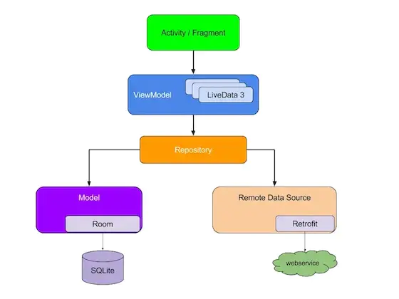

#Kotlin Flow

Flow 库是在 Kotlin Coroutines 1.3.2 发布之后新增的库，也叫做异步流，类似 RxJava 的 Observable 、
 Flowable 等等，所以很多人都用 Flow 与 RxJava 做对比。

**能解决的问题**
>LiveData 是一个生命周期感知组件，最好在 View 和 ViewModel 层中使用它，如果在 Repositories 或者 DataSource 中使用会有几个问题

    >>它不支持线程切换，其次不支持背压，也就是在一段时间内发送数据的速度 > 接受数据的速度，LiveData 无法正确的处理这些请求
    
    >>使用 LiveData 的最大问题是所有数据转换都将在主线程上完成

>RxJava 虽然支持线程切换和背压，但是 RxJava 那么多傻傻分不清楚的操作符，实际上在项目中常用的可能只有几个例如 Observable 、 Flowable 、 Single 等等，如果我们不去了解背后的原理，造成内存泄露是很正常的事

>RxJava 入门的门槛很高，学习过的朋友们，我相信能够体会到从入门到放弃是什么感觉

>解决回调地狱的问题

**Flow优点**
>Flow 支持线程切换、背压

>Flow 入门的门槛很低，没有那么多傻傻分不清楚的操作符

>简单的数据转换与操作符，如 map 等等

>Flow 是对 Kotlin 协程的扩展，让我们可以像运行同步代码一样运行异步代码，使得代码更加简洁，提高了代码的可读性
 易于做单元测试

#Kotlin Flow 如何在 MVVM 中使用
View + DataBinding + ViewModel + Model 

**Kotlin Flow 在数据源中的使用**

Flow 是协程的扩展，如果要在 Room 和 Retrofit 中使用，Room 和 Retrofit 需要支持协程才可以，
在 Retrofit >= 2.6.0 和 Room >= 2.1 版本都支持协程，我们来看一下 Room 和 Retrofit 数据源的配置。

Room:

    @Query("SELECT * FROM PokemonInfoEntity where name = :name")
    suspend fun getPokemon(name: String): PokemonInfoEntity?
    
    //或者直接返回 Flow<PokemonInfoEntity>
    @Query("SELECT * FROM PokemonInfoEntity where name = :name")
    fun getPokemon(name: String): Flow<PokemonInfoEntity>
Retrofit::

    @GET("pokemon/{name}")
    suspend fun fetchPokemonInfo(@Path("name") name: String): NetWorkPokemonInfo

>suspend 进行了修饰，只有被 suspend 修饰的方法，才可以在协程中调用。

Repositories :

    flow {
        val pokemonDao = db.pokemonInfoDao()
        // 查询数据库是否存在，如果不存在请求网络
        var infoModel = pokemonDao.getPokemon(name)
        if (infoModel == null) {
            // 网络请求
            val netWorkPokemonInfo = api.fetchPokemonInfo(name)
            // 将网路请求的数据，换转成的数据库的 model，之后插入数据库
            infoModel = netWorkPokemonInfo.let {
                PokemonInfoEntity(
                    name = it.name,
                    height = it.height,
                    weight = it.weight,
                    experience = it.experience
                )
            }
            // 插入更新数据库
            pokemonDao.insertPokemon(infoModel)
        }
        // 将数据源的 model 转换成上层用到的 model，
        // ui 不能直接持有数据源，防止数据源的变化，影响上层的 ui
        val model = mapper2InfoModel.map(infoModel)
        // 更新数据，将数据发送给 ViewModel
        emit(model)
    }.flowOn(Dispatchers.IO) // 通过 flowOn 切换到 IO 线程

    //简化代码,将耗时操作放到 flow { ... } 里面，通过 
    //flowOn(Dispatchers.IO) 切换到 IO 线程，最后通过 emit() 
    //方法将数据发送给 ViewModel，接下来我们来看一下如何在 ViewModel 中接受 Flow 发送的数据

将上面的代码简化如下所示：

    flow {
        // 进行网络或者数据库操作
        emit(model)
    }.flowOn(Dispatchers.IO) // 通过 flowOn 切换到 IO 线程

>将耗时操作放到 flow { ... } 里面，通过 flowOn(Dispatchers.IO) 切换到 IO 线程，最后通过 emit() 
方法将数据发送给 ViewModel，接下来我们来看一下如何在 ViewModel 中接受 Flow 发送的数据。
>

**Kotlin Flow 在 ViewModel 中的使用**

方法一: LifeCycle 2.2.0 之前
    
    // 私有的 MutableLiveData 可变的，对内访问
    private val _pokemon = MutableLiveData<PokemonInfoModel>()
    
    // 对外暴露不可变的 LiveData，只能查询
    val pokemon: LiveData<PokemonInfoModel> = _pokemon
    
    viewModelScope.launch {
        polemonRepository.featchPokemonInfo(name)
            .onStart {
                // 在调用 flow 请求数据之前，做一些准备工作，例如显示正在加载数据的进度条
            }
            .catch {
                // 捕获上游出现的异常
            }
            .onCompletion {
                // 请求完成
            }
            .collectLatest {
                // 将数据提供给 Activity 或者 Fragment
                _pokemon.postValue(it)
            }
    }

方法二:   在 LifeCycle 2.2.0 之后

    @OptIn(ExperimentalCoroutinesApi::class)
    fun fectchPokemonInfo(name: String) = liveData<PokemonInfoModel> {
        polemonRepository.featchPokemonInfo(name)
            .onStart { // 在调用 flow 请求数据之前，做一些准备工作，例如显示正在加载数据的进度条 }
            .catch { // 捕获上游出现的异常 }
            .onCompletion { // 请求完成 }
            .collectLatest {
                // 更新 LiveData 的数据
                emit(it)
            }
    }

>liveData{ ... } 协程构造方法提供了一个协程代码块，产生的是一个不可变的 LiveData，emit() 方法则用来更新 LiveData 的数据

>collectLatest 是末端操作符，收集 Flow 在 Repositories 层发射出来的数据，在一段时间内发送多次数据，只会接受最新的一次发射过来的数据

方法三：调用 Flow 的扩展方法 asLiveData() 返回一个不可变的 LiveData，供 Activity 或者 Fragment 调用。

    @OptIn(ExperimentalCoroutinesApi::class)
    suspend fun fectchPokemonInfo3(name: String) =
        polemonRepository.featchPokemonInfo(name)
            .onStart {
                // 在调用 flow 请求数据之前，做一些准备工作，例如显示正在加载数据的按钮
            }
            .catch {
                // 捕获上游出现的异常
            }
            .onCompletion {
                // 请求完成
            }.asLiveData()

>polemonRepository.featchPokemonInfo(name) 是一个用 suspend 修饰的方法，所以在 ViewModel 中调用也需要使用 suspend 来修饰。

>asLiveData() 方法其实就是对 方法二 中的 liveData{ ... } 的封装

>asLiveData 是 Flow 的扩展函数，返回值是一个 LiveData

> liveData{ ... } 协程构造方法提供了一个协程代码块，在 liveData{ ... } 中执行协程代码

> collect 是末端操作符，收集 Flow 在 Repositories 层发射出来的数据 最后调用 LiveData 中的 emit() 方法更新 LiveData 的数据

**DataBinding（数据绑定）**

    <layout xmlns:android="http://schemas.android.com/apk/res/android"
        xmlns:app="http://schemas.android.com/apk/res-auto"
        xmlns:tools="http://schemas.android.com/tools">
    
        <data>
            <variable
                name="viewModel"
                type="com.hi.dhl.pokemon.ui.detail.DetailViewModel" />
    
        </data>
    
        ......
        <androidx.appcompat.widget.AppCompatTextView
            android:id="@+id/weight"
            android:text="@{viewModel.pokemon.getWeightString}"/>
        ......
    
    </layout>

​    
**处理 ViewModel**

    // 方法一  使用两个 LiveData，一个是可变的，一个是不可变的，在 Activity 或者 Fragment 中调用对外暴露不可变的 LiveData 即可，如下所示：
    mViewModel.pokemon.observe(this, Observer {
        // 将数据显示在页面上
    })
    // 方法二 使用 LiveData 协程构造方法 (coroutine builder) 提供的协程代码块，产生的是一个不可变的 LiveData，处理方式 同方法一
    mViewModel.fectchPokemonInfo2(mPokemonModel.name).observe(this, Observer {
        // 将数据显示在页面上
    })
    // 方法三 调用 Flow 的扩展方法 asLiveData() 返回一个不可变的 LiveData，在 Activity 或者 Fragment 调用这个不可变的 LiveData 即可，如下所示：
    lifecycleScope.launch {
        mViewModel.apply {
            fectchPokemonInfo3(mPokemonModel.name).observe(this@DetailActivity, Observer {
                // 将数据显示在页面上
            })
        }
    }