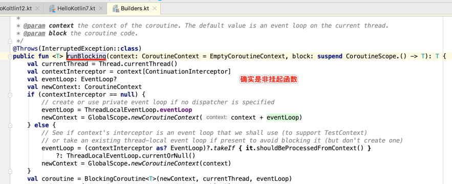
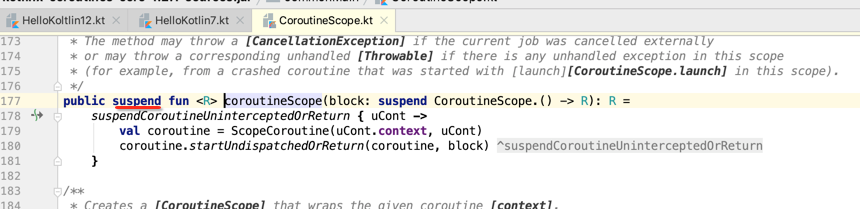

#####第一个协程程序

      import kotlinx.coroutines.*
      
      fun main() {
         GlobalScope.launch { // 在后台启动一个新的协程并继续
            delay(1000L) // 非阻塞的等待 1 秒钟（默认时间单位是毫秒）
            println("World!") // 在延迟后打印输出
         }
         println("Hello,") // 协程已在等待时主线程还在继续
         Thread.sleep(2000L) // 阻塞主线程 2 秒钟来保证 JVM 存活
      }
>本质上，协程是轻量级的线程,它们在某些 CoroutineScope 上下文中与 launch 协程构建器 一起启动。 
这里我们在 GlobalScope 中启动了一个新的协程，这意味着新协程的生命周期只受整个应用程序的生命周期限制。

#####阻塞与非阻塞的
      
      import kotlinx.coroutines.*
      
      fun main() {
         GlobalScope.launch { // 在后台启动一个新的协程并继续
            delay(1000L)
            println("World!")
         }
         println("Hello,") // 主线程中的代码会立即执行
         runBlocking {     // 但是这个表达式阻塞了主线程
            delay(2000L)  // ……我们延迟 2 秒来保证 JVM 的存活
         }
      }
>delay 是一个特殊的 挂起函数

      import kotlinx.coroutines.*
      
      fun main() = runBlocking<Unit> { // 开始执行主协程
         GlobalScope.launch { // 在后台启动一个新的协程并继续
            delay(1000L)
            println("World!")
         }
         println("Hello,") // 主协程在这里会立即执行
         delay(2000L)      // 延迟 2 秒来保证 JVM 存活
      }
>这里的 runBlocking<Unit> { …… } 作为用来启动顶层主协程的适配器。
> 我们显式指定了其返回类型 Unit，因为在 Kotlin 中 main 函数必须返回 Unit 类型。

####Waiting for a job

      val job = GlobalScope.launch { // 启动一个新协程并保持对这个job的引用
         delay(1000L)
         println("World!")
      }
      println("Hello,")
      job.join() // 等待直到子协程执行结束
>延迟一段时间来等待另一个协程运行并不是一个好方式。让我们显式（以非阻塞方式）等待所启动的后台 Job 执行结束：

####结构化的并发

协程实际使用还是有一些问题需要改进,当我们使用GlobalScope.launch时,我们会创建一个顶级协程,虽然他很轻量,但它运行时
仍然会消耗一些内存资源,如果我们延迟了太长时间,内存不足,如果手动引用并join很容易出错,
有一个更好的解决办法,我们可以在代码中使用并发,我们可以在执行操作所在的指定作用域内启动协程,而不要在GlobalScope中启动
      
      import kotlinx.coroutines.*
      
      fun main() = runBlocking { // this: CoroutineScope
         launch { // 在 runBlocking 作用域中启动一个新协程
            delay(1000L)
            println("World!")
         }
         println("Hello,")
      }
>runBlocking协程会等待内部子协程结束后结束

####挂起函数:coroutineScope delay 非挂起函数: runBlocking 
1、runBlocking并非挂起函数；也就是说，调用它的线程会一直位于该函数中，直到协程执行完毕为止。

2、coroutineScope是挂起函数；也就是说，如果其中的协程挂起，那么coroutineScope函数也会挂起。这样，
创建coroutineScope的外层函数就可以继续在同一个线程中执行了，该线程会【逃离】coroutineScope之外，并且可以做其他一些事情。

####Scope builder

      fun main() = runBlocking { // this: CoroutineScope
         launch {
            delay(200L)
            println("Task from runBlocking")
         }
         
          coroutineScope { // 创建一个协程作用域
              launch {
                  delay(500L) 
                  println("Task from nested launch")
              }
          
              delay(100L)
              println("Task from coroutine scope") // 这一行会在内嵌 launch 之前输出
          }
             
          println("Coroutine scope is over") // 这一行在内嵌 launch 执行完毕后才输出
      }

>coroutineScope在等待所有子协程完成其任务时并不会阻塞当前的线程，而runBlocking会阻塞当前线程。。

