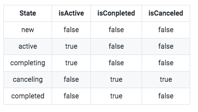

**第一步：引入库，Android 需要引入如下两个库**
    
    implementation "org.jetbrains.kotlinx:kotlinx-coroutines-core:1.3.2"
    implementation "org.jetbrains.kotlinx:kotlinx-coroutines-android:1.3.2"

**第二步：声明协程作用域CoroutineScope**

    这里建议有生命周期的类继承 CoroutineSocpe ,这样就能让全部协程跟着生命周期结束
    
    如在activity里面使用
    
    MainActivity : AppCompatActivity(), CoroutineScope by MainScope(){
        override fun onDestroy(){
            super.onDestory()
            cancel()
         }
    }  
    
    在UI逻辑类里面使用：
    
    class MainActivityFacede : CoroutineScope {
        private val job = Job()
    
        override val coroutineContext: CoroutineContext
            get() = Dispatchers.Main + job
    
        fun destroy() {
            job.cancel()
        }
    }

**第三步：运行协程**

    aunch 没有返回值，或者说返回只是 job ，能够知道任务的状态，却不能携带返回结果。 所以， launch 可以用来运行不需要操作结果的协程（如文件删除，创建等），
    async 有返回值，也就是返回的是 Deferred ,它是继承的 job ，所有job有的，它都有，还具备了job没有的携带数据回来的能力。async 可以用来运行异步耗时任务并且需要返回值的任务（网络请求，数据库操作，文件读写等）。

 Job 和 Deferred 的生命周期和状态表:
   

**下面介绍一下使用方式：**

方式一:

    private suspend fun getWebTime(): Long = withContext(Dispatchers.IO) {
        var result = RequeastTest.getInstance().start()
        val name = Thread.currentThread().name
        if (!coroutines.contains(name)) {
            coroutines.add(name)
        }
        result
    }
    
    launch() {
        //do sth
        var time = getWebTime()
        //update UI
    }
    launch {
        var deferred = async() {
            //发起网络请求..
            getWebTime()
        }
        //do sth ...
        var value = deferred.await()
        //do sth...
    }

方式二:

    private suspend fun getWebTime(): Long {
        var result = RequeastTest.getInstance().start()
        val name = Thread.currentThread().name
        if (!coroutines.contains(name)) {
            coroutines.add(name)
        }
        return result
    }
    
    launch() {
        //do sth
        var time = withContext(Dispather.IO){
            getWebTime()
        }
        //update UI
        
    }
    launch {
        var deferred = async(Dispather.IO) {
            //发起网络请求..
            getWebTime()
        }
        //do sth ...
        var value = deferred.await()
        //do sth...
    }

>Dispather :协程调度器，它是用来调度协程跑在哪个线程城里面的，
>
>withContext(Dispather.**):用来切换线程
>
>Suspend :是协程里面唯一一个修饰符，用来修改函数的，表明函数是一个挂起函数，协程编译器会在编译期间进行CPS变换，用 suspend 修饰的函数，只能在协程体和同样使用 suspend 修饰的函数中调用。
>

多个接口数据需要一起拿到数据场景:

    launch {
        var userInfoDeferred = async {
            //获取用户基本信息
            getUserInfo(aid)
        }
    
        var userTeamsDeferred = async{
            //获取用户团队..
            getUserTeams(aid)
        }
        
        var userOrgsDeferred =  async {
            //获取用户组织机构
            getUserOrgs(aid)
        }
        
        var userInfo = userInfoDeferred.await()
        var userTeams = userTeamsDeferred.await()
        var userOrgsDeferred = userOrgsDeferred.await()
        //渲染UI 
    }