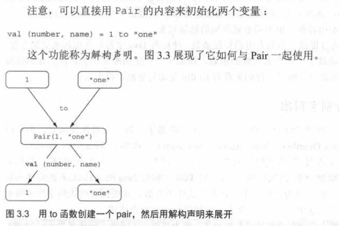

第三章：函数的定义与调用

1. Kotlin没有采用自己的集合类，而是采用标准的Java集合类；

2. **命名参数** ：调用一个Kotlin定义的函数时，可以显示地表明一些参数的名称（如果指明了一个参数的名称，为了避免混淆，那它之后的所有参数都要表明名称）

   

3. **默认参数值**：在声明函数的时候，可以指定参数的默认值，避免创建重载的函数。（可以用所有参数来调用这个函数或者省略掉部分参数）

4. **顶层函数与属性** ：放在代码文件(.kt）中

5. **常量**： 放在文件中的属性 **const val**  适用于所有的基本数据类型以及String类

6. **扩展函数与属性**： 扩展函数就是**类的成员函数** 且是**静态**的，不能被之类重写（若在基类与之类中出现同名函数，由该变量的静态类型所决定；如果一个类的成员函数与扩展函数有相同的签名，成员函数往往会被优先使用）

   

   注意：扩展函数并不允许打破它的封装性，扩展函数不能访问私有的或者是受保护的成员；

   **扩展属性的声明必须定义getter函数（无支持字段保存其值）** 如果是var变量，可以定义setter方法；

7. **可变参数**：**vararg** 让函数支持任意数量的参数；

8. 展开运算符： 可以让每个数组元素在函数中能作为单独的参数来调用，在参数前加上***** 

   

9. **键值对的处理**：

   * 中缀调用与解构声明

     关键字：**to** ；允许中缀符号调用函数需要使用**infix**关键字来修饰

     

     

     使用解构声明：

     1. 使用map的key，value来初始化变量

     2. Pair使用

     3. 循环

        

10. 字符串与正则表达式

    * 可以使用**toRegex** 将字符串转换为正则表达式；

    * 提供名为split方法具有不同参数的重载的扩展函数，用来承载正则表达式的值需要一个Regex类型而不是String。确保当字符串传递给这个函数时，不会被当成正则表达式；

      

    * 包含可以用来获取在给定分隔符第一次或者是最后一次出现前或者后的子字符串的函数

      substringBeforeLast, substringAfterLast...

    * 三重引号的字符串：不需要对任何字符进行转义；使用美元符：必须使用嵌入式表达式：“${ '$' }”

11. **局部函数：函数中在声明函数；局部函数可以访问所在函数中的所有参数与变量；** 
