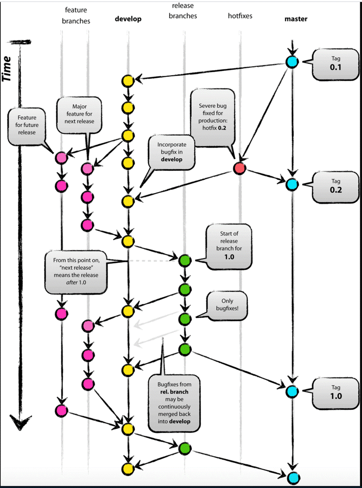
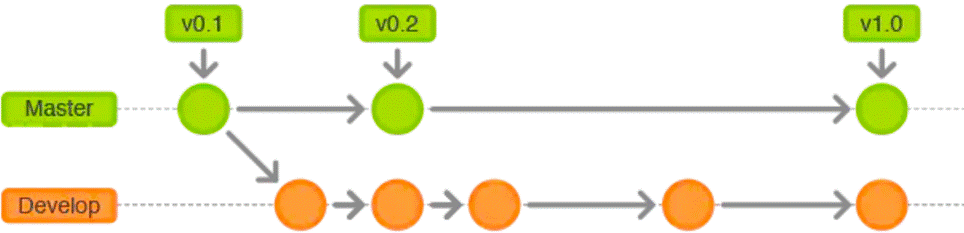
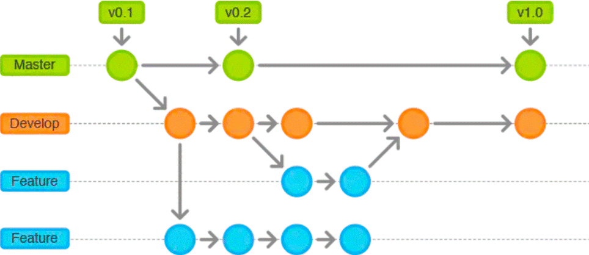
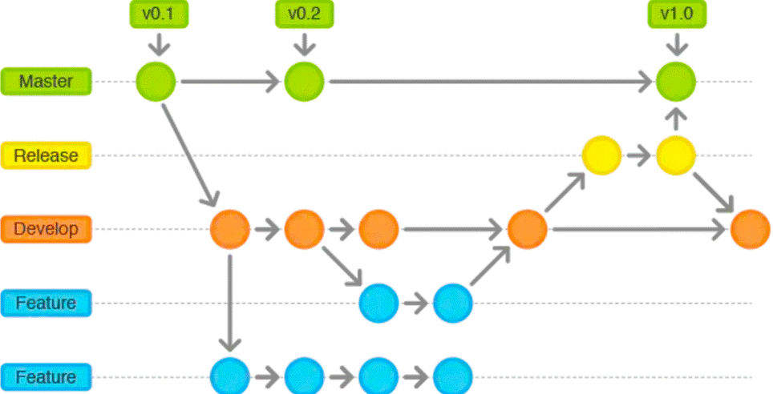
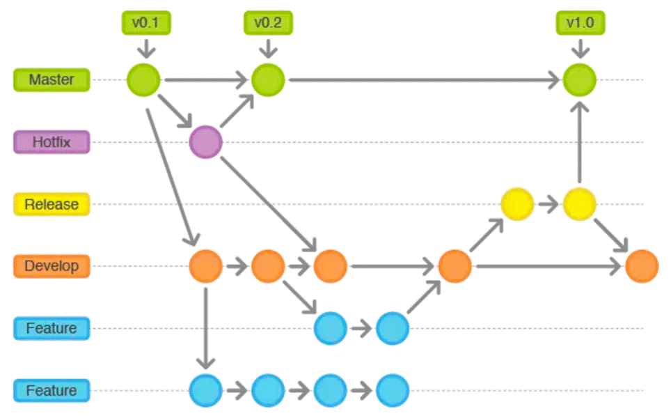
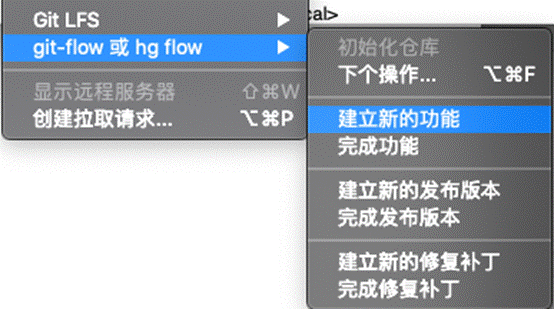
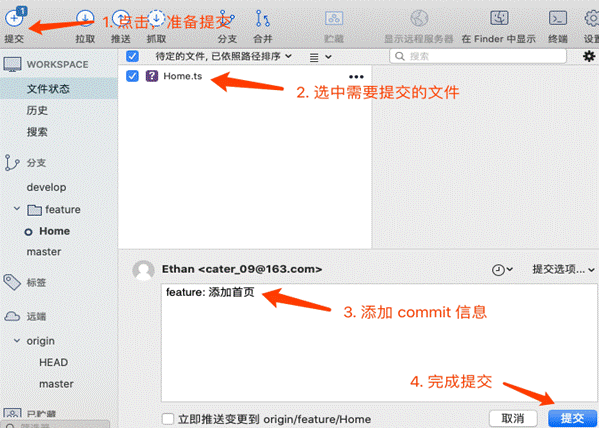
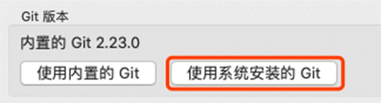
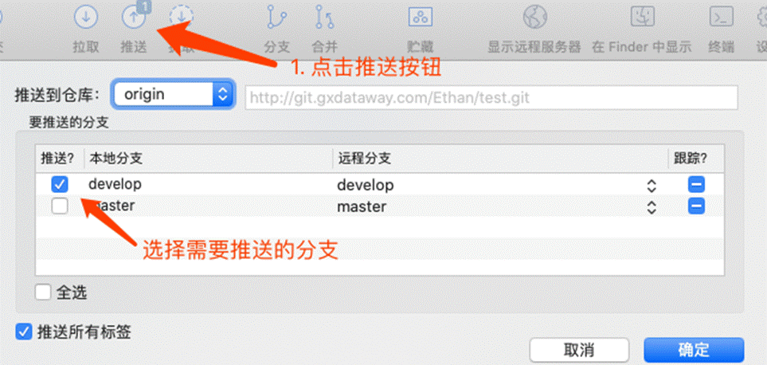
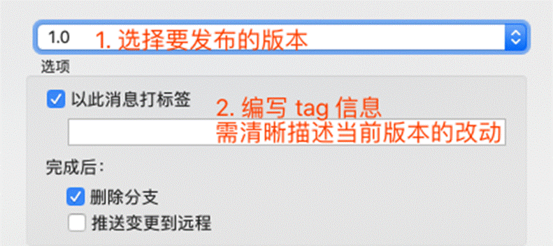

**Git Folw** **说明及操作规范**

[TOC]
#### **1.  **Git Flow原理介绍**

 

|      |                                   |
| ---- | --------------------------------- |
|      |  |

在使用Git的过程中如果没有清晰流程和规划，否则,每个人都提交一堆杂乱无章的commit,项目很快就会变得难以协调和维护。
   Git版本管理同样需要一个清晰的流程和规范，Vincent Driessen 为了解决这个问题提出了 [A Successful Git Branching Model](https://links.jianshu.com/go?to=http%3A%2F%2Fnvie.com%2Fposts%2Fa-successful-git-branching-model%2F)
   以下是基于Vincent Driessen提出的Git Flow 流程图：

 

 

#### **2.** **Git的常用分支介绍**

##### **2.1** **Production** **分支**

也就是我们经常使用的Master分支，这个分支最近发布到生产环境的代码，最近发布的Release， 这个分支只能从其他分支合并，不能在这个分支直接修改。

##### **2.2** **Develop** **分支**

这个分支是我们是我们的主开发分支，包含所有要发布到下一个Release的代码，这个主要合并与其他分支，比如Feature分支。

##### **2.3** **Feature** **分支**

这个分支主要是用来开发一个新的功能，一旦开发完成，我们合并回Develop分支进入下一个Release。

##### **2.4** **Release****分支**

当你需要一个发布一个新Release的时候，我们基于Develop分支创建一个Release分支，完成Release后，我们合并到Master和Develop分支。

##### **2.5** **Hotfix****分支**

当我们在Production发现新的Bug时候，我们需要创建一个Hotfix, 完成Hotfix后，我们合并回Master和Develop分支，所以Hotfix的改动会进入下一个Release。

 

#### **3.** **Git Flow** **各分支操作原理示意**

**3.1** **Master/Develop** **分支**

所有在Master分支上的Commit应该打上Tag，一般情况下Master不存在Commit，Develop分支基于Master分支创建。

 

 

|      |                                   |
| ---- | --------------------------------- |
|      |  |

 

 

##### **3.2** **Feature** **分支**

 

|      |                                   |
| ---- | --------------------------------- |
|      |  |

Feature分支做完后，必须合并回Develop分支, 合并完分支后一般会删点这个Feature分支，毕竟保留下来意义也不大。

 

##### **3.3** **Release** **分支**

 

|      |                                   |
| ---- | --------------------------------- |
|      |  |

Release分支基于Develop分支创建，打完Release分支之后，我们可以在这个Release分支上测试，修改Bug等。同时，其它开发人员可以基于Develop分支新建Feature (记住：一旦打了Release分支之后不要从Develop分支上合并新的改动到Release分支)发布Release分支时，合并Release到Master和Develop， 同时在Master分支上打个Tag记住Release版本号，然后可以删除Release分支了。

##### **3.4** **Hotfix** **分支**

 

|      |                                   |
| ---- | --------------------------------- |
|      |  |

hotfix分支基于Master分支创建，开发完后需要合并回Master和Develop分支，同时在Master上打一个tag。

 

 

 

 

 

 

 

 

 

 

 

 

#### **4.** **Git Flow 命令示例**

##### **4.1** **Develop****相关**

l 创建develop

git branch develop 

git push -u origin develop

##### **4.2** **Feature****相关**

l 开始Feature

\# 通过develop新建feaeure分支

git checkout -b feature develop

\# 或者, 推送至远程服务器:

git push -u origin feature  

 

\# 修改md文件  

git status

git add .

git commit  

 

l 完成 Feature

git pull origin develop

git checkout develop 

 

\#--no-ff：不使用fast-forward方式合并，保留分支的commit历史

\#--squash：使用squash方式合并，把多次分支commit历史压缩为一次

 

git merge --no-ff feature

git push origin develop

 

git branch -d some-feature

 

\# 如果需要删除远程feature分支:

git push origin --delete feature  

##### **4.3** **Release****相关**

l 开始 Feature

git checkout -b release-0.1.0 develop

 

l 完成 Feature

git checkout master

git merge --no-ff release-0.1.0

git push

 

git checkout develop

git merge --no-ff release-0.1.0

git push

 

 

git branch -d release-0.1.0

git push origin --delete release-0.1.0  

 

\# 合并master/develop分支之后，打上tag 

git tag -a v0.1.0 master

git push --tags

##### **4.4** **Hotfix****相关**

l 开始Hotfix

git checkout -b hotfix-0.1.1 master 

 

l 完成Hotfix

git checkout master

git merge --no-ff hotfix-0.1.1

git push

 

 

git checkout develop

git merge --no-ff hotfix-0.1.1

git push

 

git branch -d hotfix-0.1.1

git push origin --delete hotfix-0.1.1 

 

 

git tag -a v0.1.1 master

git push --tags

 

 

 

 

 

 

 

 

 

 

 

 

 

 

 

 

 

 

 

 

 

 

 

**5.** **Source Tree使用示例****（建议使用）**

示例背景：

clone 远程仓库，使用 git flow 初始化

**5.1** **Feature****相关**

 

l 功能描述：

项目新功能开发。

 

l 操作步骤：

\1)  基于develop分支创建 feature 分支： 

仓库—> git-flow 或 hg flow —>建立新功能，填写功能名称（一般与Jira任务名称和编号保持一致）。

 

 

 

 

 

 

 

 

 

 

 

 

 

 

\2)  根据需要选择是否将分支推送至远程仓库。

\3)  开发完成后，在 feature分支上进行提交（commit 信息用feature：描述信息的格式，描述信息要清晰描述本次提交内容），

 

​     

​    

 

\4)  然后合并、删除 feature 分支：仓库—> git-flow 或 hg flow —> 完成功能。(选中删除分支会将远程仓库feature分支一块删除。Mac下使用 sourceTree可能会有 could not read Username的错误，可以用 ssh 替换 http 方式解决，或者 在偏好设置中改为使用系统安装的 git)

 

 

​     

 

 

\5)  将 develop 分支 推送至远程仓库。

 

 

**5.2** **Release****相关**

l 功能描述：

开发完成，准备提测。

 

l 操作步骤

\1)  基于develop分支创建 release 分支： 仓库—> git-flow 或 hg flow —> 建立新的发布版本，填写发布版本号。（版本号一般和线上项目的版本号对应）

\2)  release 版本中若有新的提交，在 完成发布版本 的时候会自动合并至 develop 分支。

\3)  测试完成后，将 release 分支合并至 develop & master 分支，并打上 tag ：仓库—> git-flow 或 hg flow —> 完成发布版本，选择要发布的版本，填写 tag 信息（必填）。

 

​    

 

 

 

\4)  将 develop & master 分支 及 tag 推送至远程仓库。

 

**5.3** **Hotfix****相关**

l 功能描述：

用作紧急处理线上bug。

 

l 操作步骤：

 

\1)  基于 master 分支创建 hotfix 分支： 仓库—> git-flow 或 hg flow —> 建立新的修复补丁，填写 修复补丁版本（如：当前版本为 1.0，下个迭代版本为1.1。hotfix 基于1.0版本，是1.0下的一个小版本。因此版本号应该是1.0.1，以此类推。）。

\2)  在 hotfix 分支上进行修复，完成后进行 commit 操作（commit 信息根据 fix bug 和 feature等不同场景使用不同格式，如：fix bug：描述信息，描述信息要清晰描述本次提交内容）。

\3)  将 hotfix 分支合并至 develop & master 分支，并打上 tag: 仓库—> git-flow 或 hg flow —> 完成修复补丁，选择 hotfix 版本，填写 tag 信息（tag 信息描述要清晰）。

\4)  将 develop & master 分支上的新 commit 及 tag 推送至远程仓库。