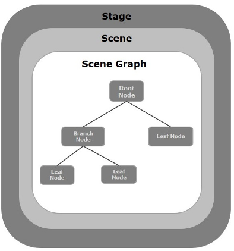

##### JavaFX应用程序结构

#stage
就是一个窗口对象,包含JavaFX应用程序的所有对象。
它由包javafx.stage的Stage类表示。 主Stage由平台本身创建。
创建的stage对象作为参数传递给Application类的start()方法

    stage有两个参数确定其位置，即Width和Height 。
    它分为内容区域和装饰（标题栏和边框）。
    
    五种类型的Stage -
    Decorated
    Undecorated
    Transparent
    Unified
    Utility

您必须调用show()方法来显示Stage的内容。

#Scene

Scene表示JavaFX应用程序的物理内容。 它包含Scene图的所有内容。 
包javafx.scene的类Scene表示Scene对象。 在一个实例中，Scene对象仅添加到一个阶段。

您可以通过实例化Scene类来创建Scene。 您可以通过将其尺寸（高度和宽度）
以及root node给其构造函数来选择Scene的大小。