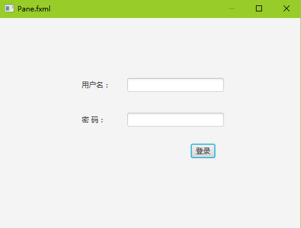
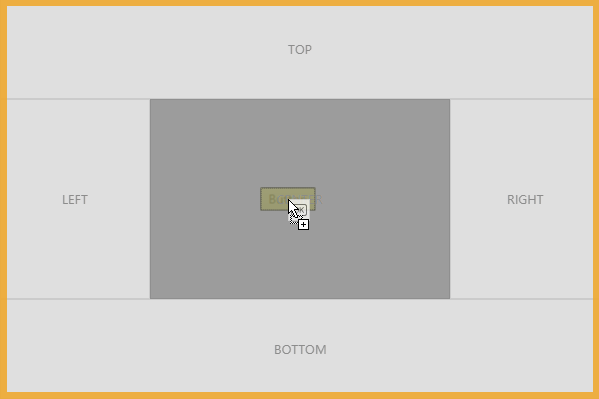
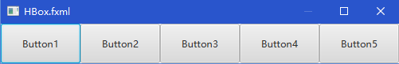
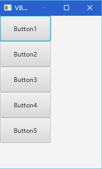
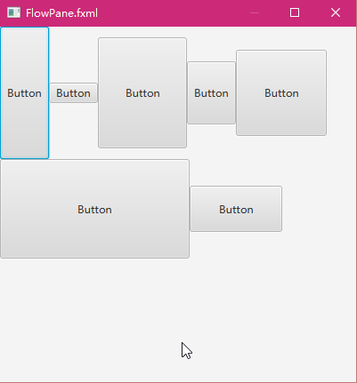
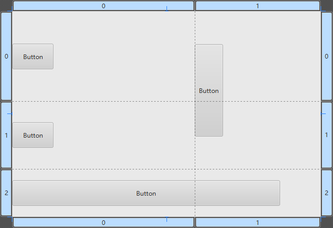
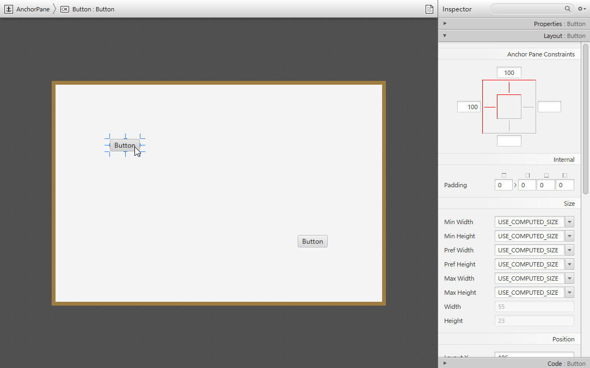
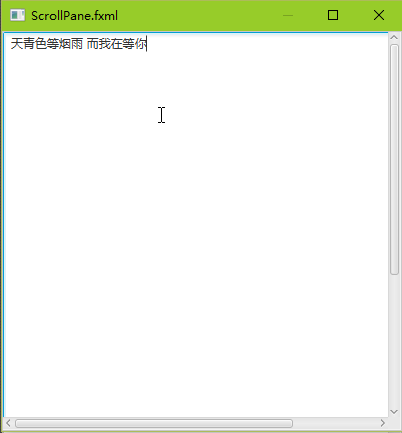

# Pane

Pane是其它布局控件类的父类，我们可以将Pane看成一个绝对布局控件， 当我们将某个控件放置在Pane当中的时候， 我们需要指定它的位置坐标（layoutX和layoutY）。
当我们将一个控件拖拽到Pane中的时候，会自动生成layoutX和layoutY坐标。 如图是使用Pane为父容器设计的一个简单界面：

# BorderPane

BorderPane将界面分割上上下左右中5部分，我们可以将控件放置在其中。常见的一个用例场景就是，软件主界面的上面是菜单栏和工具条，左边和右边可能是文档或者内容列表或者常用的工具集合，然后中间是主要内容显示区，下面是状态栏。
在SceneBuilder中我们将一个控件拖拽到BorderPane的时候，会有上下左右中的区域显示。

# HBox

HBox可以水平排列控件，不换行。如图：

# VBox

VBox类似的，垂直排列控件，不换列。如图：

# FlowPane

FlowPane感觉像HBox和VBox的综合体，FlowPane可以设置一个方向水平或者垂直。默认方向为水平，那么放入FlowPane中的控件会先水平排列，如果第一行满了以后进入下一行继续水平排列。
垂直方向类似的，先垂直排列，如果第一列满了以后进入第二列继续垂直排列。如图：

# GridPane

GridPane有点像HTML中的Table布局，属于比较灵活的布局方式。默认情况下，控件均匀分布在Grid或者说Table中。但是我们可以指定一个控件所占的行列，让其跨行和列分布。当我们将一个元素拖拽到GridPane中的时候可以看到SceneBuilder为我们虚拟除了行和列的分割线：

# AnchorPane

AnchorPane可以设置一个控件的Anchor位置，感觉NET的GUI控件中最早提供这种控件的。比如说我们要将一个Button放置在左下角，离右边100px，离下边100px的位置，我们便可以使用AnchorPane控件。当窗口放大缩小的时候，该Button始终在左下角离右边100px，离下边100px的位置。通俗地说，AnchorPane可以将控件锚定到布局面板的某个位置。
在SceneBuilder中我们可以很容易在右边的属性面板中设置锚定的方位和距离：

#ScrollPane
ScrollPane顾名思义就是可以显示滚动条的容器控件了。
我们在ScrollPane中放置一个TextArea文本域控件，并且设置TextArea的大小大于ScrollPane的大小，这样就可以显示出水平和垂直滚动条了。如下图：
